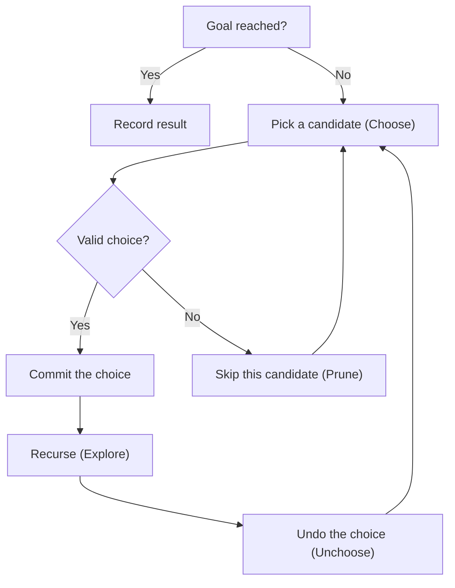

## Overview

Backtracking is an algorithmic technique that **systematically explores all possibilities while pruning branches that cannot lead to valid solutions**. Built on top of DFS, it repeats the cycle of "choose → explore → unchoose" to efficiently traverse the solution space.

Unlike brute force, backtracking applies **pruning** to cut off clearly invalid branches early, often reducing runtime significantly.

## Core Idea

1. **Choose**: Pick one option from the candidates
2. **Explore**: Recursively proceed to the next decision under that choice
3. **Unchoose**: After returning from recursion, undo the choice



## Template

```go
func backtrack(result *[][]int, path []int, choices []int, start int) {
    if goalReached(path) {
        // copy path to avoid mutation
        tmp := make([]int, len(path))
        copy(tmp, path)
        *result = append(*result, tmp)
        return
    }
    for i := start; i < len(choices); i++ {
        if !isValid(choices[i]) {
            continue // pruning
        }
        // choose
        path = append(path, choices[i])
        // explore
        backtrack(result, path, choices, i) // or i+1 depending on problem
        // unchoose
        path = path[:len(path)-1]
    }
}
```

**Key points:**
- Since `path` is a slice, you must **always copy** it before recording the result. Otherwise subsequent operations will mutate the stored value
- The `start` parameter controls duplicates. Use `i` (allow element reuse) or `i+1` (each element used at most once) depending on the problem

## Patterns

### Subsets (Power Set)

Enumerate all subsets of $n$ elements. Each element is either included or excluded.

- Number of solutions: $2^n$
- At each recursion level, decide whether to include the current element or skip it

### Permutations

Enumerate all orderings of $n$ elements. Place an unused element at each position.

- Number of solutions: $n!$
- Track used elements with a `used` boolean array

### Combinations / Combination Sum

Choose $k$ from $n$, or find combinations summing to a target value.

- The `start` index guarantees no duplicate combinations
- In Combination Sum, the same element can be reused, so pass `start = i` (not `i+1`)

### Constraint Satisfaction

N-Queens, Sudoku, etc. Validate constraints at each step and prune immediately on violation.

- The constraint-checking function acts as the pruning mechanism
- Try all possibilities until a valid placement is found

## Complexity

Backtracking complexity depends on the problem structure:

| Pattern | Time | Space |
|---|---|---|
| Subsets | $O(2^n)$ | $O(n)$ (recursion depth) |
| Permutations | $O(n!)$ | $O(n)$ |
| Combinations ($n$ choose $k$) | $O(\binom{n}{k})$ | $O(k)$ |
| N-Queens | $O(n!)$ | $O(n)$ |

**Why exponential or factorial:**
- Each step creates multiple branches, and the number of branches multiplies
- Subsets: 2 choices per element (include/exclude) → $2 \times 2 \times \cdots = 2^n$
- Permutations: $n$ choices for the first position, $n-1$ for the second, … → $n \times (n-1) \times \cdots = n!$
- Pruning reduces the actual search count, but worst-case complexity remains the same

## Applied Problems

### [78. Subsets](https://leetcode.com/problems/subsets/)

Return all subsets of an integer array.

```go
func subsets(nums []int) [][]int {
    result := [][]int{}
    var backtrack func(start int, path []int)
    backtrack = func(start int, path []int) {
        // record every path as a valid subset
        tmp := make([]int, len(path))
        copy(tmp, path)
        result = append(result, tmp)

        for i := start; i < len(nums); i++ {
            path = append(path, nums[i])
            backtrack(i+1, path)
            path = path[:len(path)-1]
        }
    }
    backtrack(0, []int{})
    return result
}
```

### [46. Permutations](https://leetcode.com/problems/permutations/)

Return all permutations of an array of distinct integers.

```go
func permute(nums []int) [][]int {
    result := [][]int{}
    used := make([]bool, len(nums))

    var backtrack func(path []int)
    backtrack = func(path []int) {
        if len(path) == len(nums) {
            tmp := make([]int, len(path))
            copy(tmp, path)
            result = append(result, tmp)
            return
        }
        for i := 0; i < len(nums); i++ {
            if used[i] {
                continue
            }
            used[i] = true
            path = append(path, nums[i])
            backtrack(path)
            path = path[:len(path)-1]
            used[i] = false
        }
    }
    backtrack([]int{})
    return result
}
```

### [39. Combination Sum](https://leetcode.com/problems/combination-sum/)

Return all unique combinations from a candidate array where the chosen numbers sum to `target`. The same number may be used unlimited times.

```go
func combinationSum(candidates []int, target int) [][]int {
    result := [][]int{}

    var backtrack func(start, remaining int, path []int)
    backtrack = func(start, remaining int, path []int) {
        if remaining == 0 {
            tmp := make([]int, len(path))
            copy(tmp, path)
            result = append(result, tmp)
            return
        }
        for i := start; i < len(candidates); i++ {
            if candidates[i] > remaining {
                continue // pruning: skip candidates exceeding remainder
            }
            path = append(path, candidates[i])
            // pass i (not i+1) to allow reuse of the same element
            backtrack(i, remaining-candidates[i], path)
            path = path[:len(path)-1]
        }
    }
    backtrack(0, target, []int{})
    return result
}
```

## How to Recognize

Look for these signals in the problem statement:

- "Find **all possible** …" / "enumerate all …"
- "Find **all combinations** …"
- "Generate **all permutations** …"
- "Find a valid **placement** / **arrangement**" (N-Queens, Sudoku)
- "**Partition**" / "**split** into groups"

## Backtracking vs DFS vs DP

| | Backtracking | DFS | DP |
|---|---|---|---|
| Goal | Enumerate **all valid solutions** | **Traverse** a graph/tree | Find **optimal value** (max/min/count) |
| State reversal | **Yes** (choose / unchoose) | No (visited stays visited) | No (memoized and stored) |
| Pruning | Explicit | Visited check acts as implicit pruning | Exploits overlapping subproblems |
| Typical problems | Permutations, combinations, N-Queens | Number of islands, connected components | Knapsack, longest subsequence |

**Decision guide:**
- "Enumerate all solutions" → **Backtracking**
- "Is it reachable / connected?" → **DFS**
- "Maximum / minimum / how many ways" → **DP** (when subproblems overlap)

## Common Mistakes

1. **Forgetting to unchoose**: If you don't restore state after returning from recursion, subsequent branches produce incorrect results. Always undo with `path[:len(path)-1]` after `append`
2. **Duplicate results**: Not sorting the input or not passing the `start` index correctly leads to the same combination appearing multiple times. Clarify whether `[1,2]` and `[2,1]` are distinct
3. **Incorrect pruning**: Over-pruning misses valid solutions; under-pruning causes TLE (Time Limit Exceeded). Design pruning conditions carefully
4. **Forgetting to copy the path**: Go slices are reference types. Without `copy` before appending to the result, all entries will share the final state

## Related

- [DFS (Depth-First Search)](/en/wiki/algorithms/dfs/) — The traversal technique that backtracking builds upon
- [Greedy](/en/wiki/algorithms/greedy/) — Greedy commits to local optima without backtracking — the opposite strategy
- [Binary Search](/en/wiki/algorithms/binary-search/) — Halves the search space at each step
