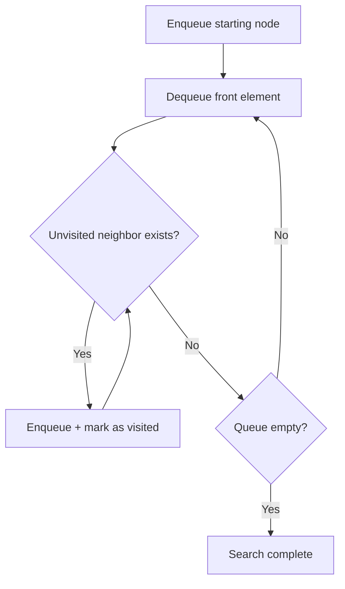

## Overview

BFS (Breadth-First Search) is a traversal technique that explores a graph or grid **level by level, from nearest to farthest**. Implemented using a queue.

It is the only basic search algorithm that **guarantees shortest paths** in unweighted graphs. When a problem asks for "minimum steps" or "shortest distance", BFS should be the first approach to consider.

## Core Idea

1. Enqueue the starting node and mark it as visited
2. Dequeue the front element
3. Enqueue all unvisited neighbors, marking them as visited
4. Repeat until the queue is empty



## Template (Grid)

```go
type point struct{ i, j int }
dirs := [][2]int{{-1,0},{1,0},{0,-1},{0,1}}

queue := []point{{startI, startJ}}
visited := map[point]bool{{startI, startJ}: true}
steps := 0

for len(queue) > 0 {
    size := len(queue) // current level size
    for k := 0; k < size; k++ {
        p := queue[0]
        queue = queue[1:]
        // process p (e.g., check if goal)
        for _, d := range dirs {
            np := point{p.i + d[0], p.j + d[1]}
            if np.i >= 0 && np.i < rows && np.j >= 0 && np.j < cols &&
                !visited[np] && grid[np.i][np.j] != wall {
                visited[np] = true
                queue = append(queue, np)
            }
        }
    }
    steps++ // one level completed
}
```

**Key point:** `size := len(queue)` enables level-by-level processing. When finding shortest distance, level = number of steps.

## Why BFS Guarantees Shortest Path

BFS explores nodes in order of distance. All nodes at distance $d$ are processed before any node at distance $d+1$. Therefore, the step count when a node is first reached is the shortest distance.

**Caveat:** This only holds for **unweighted** edges. For weighted graphs, use Dijkstra's algorithm.

## DFS vs BFS (Recap)

| | [DFS](/en/wiki/algorithms/dfs/) | BFS |
|---|---|---|
| Data structure | Stack (or recursion) | Queue |
| Traversal order | Go deep, then backtrack | Expand level by level |
| Shortest path | Not guaranteed | **Guaranteed** (unweighted) |
| Memory | $O(h)$ (depth) | $O(w)$ (width) |

## Complexity

For a grid ($m \times n$):

| Time | Space |
|---|---|
| $O(m \times n)$ | $O(\min(m, n))$ |

Each cell is visited at most once. The maximum queue size is proportional to the wavefront along the grid's diagonal, which is $O(\min(m, n))$.

## Common Problem Patterns

### Shortest Steps

The most fundamental BFS application — finding the minimum number of steps in a grid or graph.

- [994. Rotting Oranges](https://leetcode.com/problems/rotting-oranges/) — Multi-source BFS + minimum steps
- [1091. Shortest Path in Binary Matrix](https://leetcode.com/problems/shortest-path-in-binary-matrix/) — 8-directional BFS
- [127. Word Ladder](https://leetcode.com/problems/word-ladder/) — Shortest transformation on a graph

### Multi-source BFS

> Find the distance from each `0` to the nearest `1` in a grid ([542. 01 Matrix](https://leetcode.com/problems/01-matrix/))

Enqueue all starting points first, then run BFS. Shortest distance to every cell is computed in a single pass.

### Level-order Traversal

> Output a binary tree grouped by level ([102. Binary Tree Level Order Traversal](https://leetcode.com/problems/binary-tree-level-order-traversal/))

The `size := len(queue)` technique groups nodes by their level.

## How to Recognize

- **Shortest** distance / minimum steps
- **Level-order** traversal
- Distance from all nodes to the **nearest** special node
- "Simultaneously spreading" (rotting oranges, fire propagation, etc.)

If "shortest" is not required, [DFS](/en/wiki/algorithms/dfs/) is often shorter to write.

## Common Mistakes

1. **When to mark visited**: Mark when **enqueuing**, not when dequeuing. Dequeue-time marking causes the same node to be enqueued multiple times, leading to TLE
2. **Forgetting level boundaries**: When counting steps, always use `size := len(queue)` to separate levels. Otherwise distance tracking is inaccurate
3. **Misuse on weighted graphs**: BFS only guarantees shortest path when all edges have equal weight

## Related

- [DFS (Depth-First Search)](/en/wiki/algorithms/dfs/) — Depth-first traversal. Better for connected components and backtracking
- [Sliding Window](/en/wiki/algorithms/sliding-window/) — A different exploration pattern for arrays
