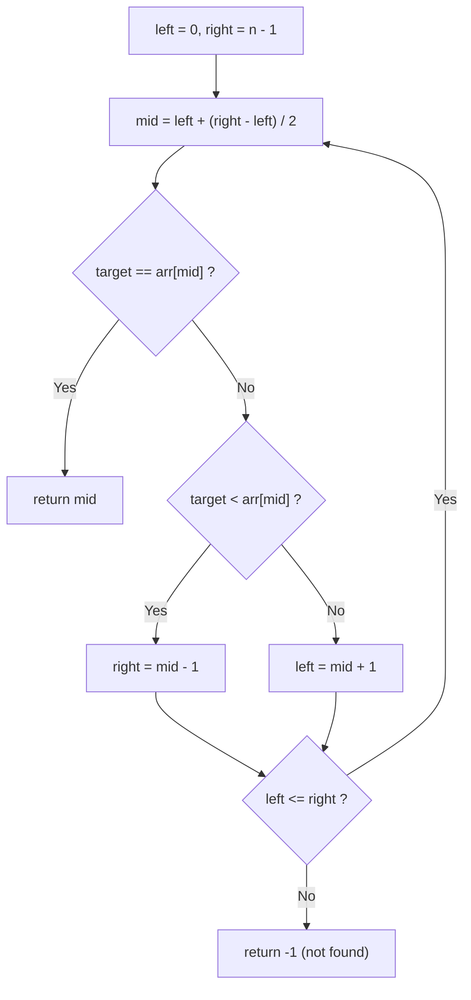

## Overview

Binary Search is a technique that finds a solution in $O(\log n)$ by repeatedly halving the search range in a **sorted array** or **monotonic search space**.

Compared to linear search $O(n)$, it is dramatically faster. While it is a fundamental algorithm in coding interviews, it has a wide range of application patterns that make it an essential tool to master.

## Core Idea

1. Define the search range `[left, right]`
2. Compute the midpoint `mid`
3. Based on the value at `mid`, narrow the search range to the left or right half
4. Repeat until the range is empty or the answer is found

Since the search range halves at each step, the overall complexity is $O(\log n)$.

```moonmaid
array { [1, 3, 5, 7, 9, 11, 13] highlight(3, color=red, label="mid") highlight(0, color=blue, label="left") highlight(6, color=blue, label="right") }
```



## Template

The standard binary search template. Searches for `target` in a sorted array.

```go
func binarySearch(nums []int, target int) int {
    left, right := 0, len(nums)-1
    for left <= right {
        mid := left + (right-left)/2 // prevent overflow
        if nums[mid] == target {
            return mid
        } else if nums[mid] < target {
            left = mid + 1
        } else {
            right = mid - 1
        }
    }
    return -1
}
```

## Patterns

### Standard Search in Sorted Array

The most basic pattern. If the array is sorted, you can locate `target` in $O(\log n)$.

**Use cases**: "Search for a value in a sorted array", "Find insertion position", etc.

### Binary Search on Answer

Perform binary search over a range of candidate answers `[lo, hi]`. Used to find "the minimum (or maximum) value satisfying a condition".

**Use cases**: "Minimize the maximum", "Can we achieve X?", "Minimum k satisfying condition", etc.

**Template:**

```go
func binarySearchOnAnswer(lo, hi int, canAchieve func(int) bool) int {
    for lo < hi {
        mid := lo + (hi-lo)/2
        if canAchieve(mid) {
            hi = mid // mid is a valid answer, try smaller
        } else {
            lo = mid + 1 // mid is too small
        }
    }
    return lo
}
```

**Key point:** The predicate `canAchieve` must be monotonic (always `true` above some threshold, always `false` below it).

### Search in Rotated Sorted Array

When a sorted array has been rotated. When splitting at `mid`, at least one of the two halves is always sorted. Exploit this property.

**Use cases**: Finding a value in a rotated array, as in LeetCode 33.

## Complexity

| | Time | Space |
|---|---|---|
| Standard binary search | $O(\log n)$ | $O(1)$ |
| Binary search on answer | $O(\log n \times f(n))$ | $O(1)$ |

**Why $O(\log n)$:** The search range halves each time, so at most $\log_2 n$ comparisons are needed for $n$ elements. For binary search on answer, the cost of the predicate function $f(n)$ is added at each step.

## Applied Problems

### [704. Binary Search](https://leetcode.com/problems/binary-search/) — Basic

Search for `target` in a sorted array and return its index. Return `-1` if not found.

**Key insight:** Direct application of the template. Watch for overflow prevention in the `mid` calculation.

```go
func search(nums []int, target int) int {
    left, right := 0, len(nums)-1
    for left <= right {
        mid := left + (right-left)/2
        if nums[mid] == target {
            return mid
        } else if nums[mid] < target {
            left = mid + 1
        } else {
            right = mid - 1
        }
    }
    return -1
}
```

### [33. Search in Rotated Sorted Array](https://leetcode.com/problems/search-in-rotated-sorted-array/)

Search for `target` in a rotated sorted array (e.g., `[4,5,6,7,0,1,2]`).

**Key insight:** When splitting at `mid`, either the left half `[left, mid]` or the right half `[mid, right]` is always sorted. Determine whether `target` falls within the sorted half to narrow the range.

```go
func search(nums []int, target int) int {
    left, right := 0, len(nums)-1
    for left <= right {
        mid := left + (right-left)/2
        if nums[mid] == target {
            return mid
        }
        if nums[left] <= nums[mid] {
            // left half is sorted
            if nums[left] <= target && target < nums[mid] {
                right = mid - 1
            } else {
                left = mid + 1
            }
        } else {
            // right half is sorted
            if nums[mid] < target && target <= nums[right] {
                left = mid + 1
            } else {
                right = mid - 1
            }
        }
    }
    return -1
}
```

### [875. Koko Eating Bananas](https://leetcode.com/problems/koko-eating-bananas/) — Binary Search on Answer

Koko wants to eat all bananas within `h` hours. Find the minimum eating speed `k` per hour.

**Key insight:** Binary search over the candidate speed `k`. If `k` is large enough, she can finish in time (monotonic property). The predicate checks "can she finish all piles at speed `k` within `h` hours?"

```go
func minEatingSpeed(piles []int, h int) int {
    lo, hi := 1, 0
    for _, p := range piles {
        if p > hi {
            hi = p
        }
    }

    for lo < hi {
        mid := lo + (hi-lo)/2
        if canFinish(piles, mid, h) {
            hi = mid
        } else {
            lo = mid + 1
        }
    }
    return lo
}

func canFinish(piles []int, speed, h int) bool {
    hours := 0
    for _, p := range piles {
        hours += (p + speed - 1) / speed // ceiling division
    }
    return hours <= h
}
```

## How to Recognize

Look for these signals in problem statements:

- Search in a **sorted** array
- **Minimize** / **maximize** + condition check (binary search on answer)
- Repeated "**Can we achieve X?**" yes/no predicate structure
- **Rotated sorted** array
- $O(\log n)$ complexity requirement

## Common Mistakes

1. **Overflow in `mid` calculation**: `(left + right) / 2` can overflow when `left + right` exceeds the integer limit. Use `left + (right - left) / 2` instead
2. **Infinite loop**: In a `lo < hi` loop, setting `lo = mid` (without `+ 1`) causes the loop to stall when `lo == mid`. Use ceiling division `lo + (hi - lo + 1) / 2` or ensure `lo = mid + 1`
3. **Wrong boundary update**: Confusing `left <= right` with `left < right` leads to either missing elements or infinite loops
4. **Equality in rotated arrays**: Using `<` instead of `<=` in `nums[left] <= nums[mid]` causes incorrect evaluation when `left == mid`

## Related

- [Sliding Window](/en/wiki/algorithms/sliding-window/) — An efficient technique for searching contiguous subsequences
- [DFS (Depth-First Search)](/en/wiki/algorithms/dfs/) — A fundamental graph/grid traversal technique
- [BFS (Breadth-First Search)](/en/wiki/algorithms/bfs/) — A fundamental shortest-path traversal technique
- [Greedy](/en/wiki/algorithms/greedy/) — A greedy approach that accumulates locally optimal choices
