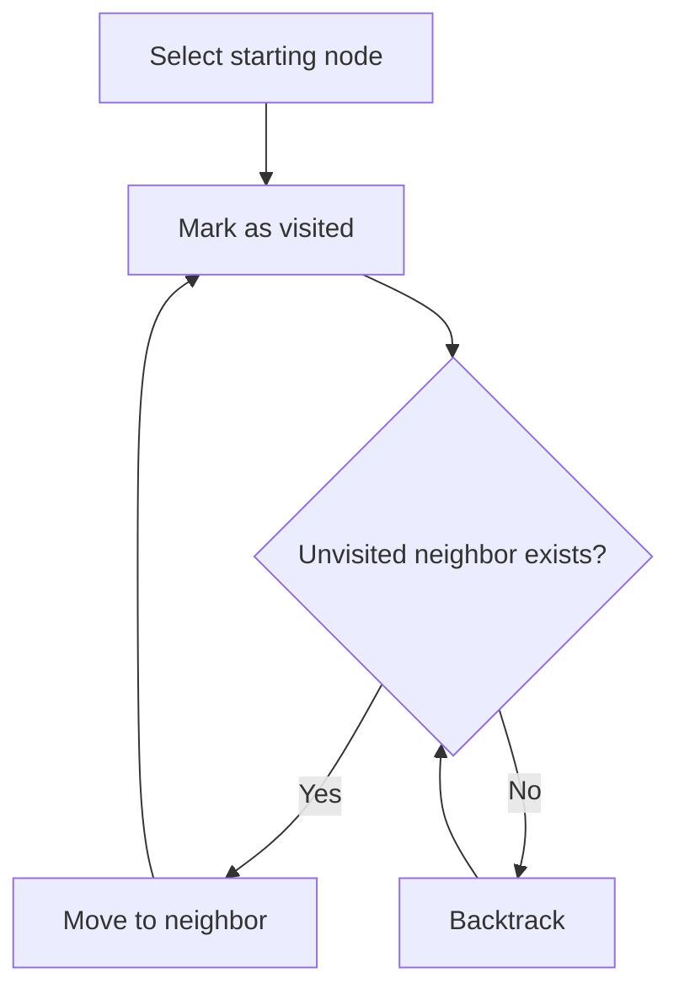
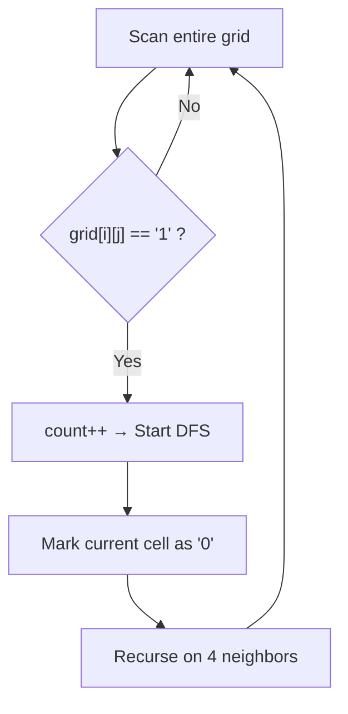

## Overview

DFS (Depth-First Search) is a traversal technique that **explores as deep as possible along each branch before backtracking**. Implemented via recursion or an explicit stack.

In grid problems, it appears frequently as the **Flood Fill** pattern — counting connected components, filling regions, etc.

## Core Idea

1. Mark the starting node as visited
2. Recursively explore unvisited adjacent nodes
3. When all neighbors are visited, backtrack to the previous node
4. Repeat until all nodes are visited



## Recursion vs Stack

| | Recursion | Explicit Stack |
|---|---|---|
| Code length | Short | Slightly longer |
| Readability | Intuitive | Somewhat complex |
| Stack overflow | Risk on large grids[^1] | Safe |
| Speed | Function call overhead | Slightly faster |

[^1]: Go's default stack grows dynamically, making it more resilient than C/C++ or Java. Python's default recursion limit is 1000, often requiring `sys.setrecursionlimit`.

**Recursion template (grid):**

```go
var dfs func(i, j int)
dfs = func(i, j int) {
    if i < 0 || i >= rows || j < 0 || j >= cols || grid[i][j] == visited {
        return
    }
    grid[i][j] = visited
    dfs(i-1, j) // up
    dfs(i+1, j) // down
    dfs(i, j-1) // left
    dfs(i, j+1) // right
}
```

**Stack template (grid):**

```go
stack := [][]int{{startI, startJ}}
grid[startI][startJ] = visited
for len(stack) > 0 {
    top := stack[len(stack)-1]
    stack = stack[:len(stack)-1]
    i, j := top[0], top[1]
    for _, d := range [][2]int{{-1,0},{1,0},{0,-1},{0,1}} {
        ni, nj := i+d[0], j+d[1]
        if ni >= 0 && ni < rows && nj >= 0 && nj < cols && grid[ni][nj] != visited {
            grid[ni][nj] = visited
            stack = append(stack, []int{ni, nj})
        }
    }
}
```

## DFS vs BFS

| | DFS | BFS |
|---|---|---|
| Data structure | Stack (or recursion) | Queue |
| Traversal order | Go deep, then backtrack | Expand level by level |
| Shortest path | Not guaranteed | **Guaranteed** (unweighted graphs) |
| Memory | $O(h)$ (depth) | $O(w)$ (width = max nodes in a level) |
| Use cases | Connected components, path existence, backtracking | Shortest distance, level-order traversal |

**Decision guide:**
- "Shortest" is asked → **BFS**
- "Exhaustive search", "count components", "does a path exist" → **DFS** is easier to write
- Many problems can be solved with either. When in doubt, DFS (shorter code)

## Complexity

For a grid ($m \times n$):

| | Time | Space |
|---|---|---|
| DFS | $O(m \times n)$ | $O(m \times n)$ (worst case: recursion depth) |
| BFS | $O(m \times n)$ | $O(\min(m, n))$ (max queue size) |

Each cell is visited at most once, so time is $O(m \times n)$. DFS space hits $O(m \times n)$ in the worst case when all cells form a single path. BFS queue size is proportional to the shorter dimension of the grid.

## Applied Problems

### [200. Number of Islands](https://leetcode.com/problems/number-of-islands/) — Flood Fill

Count the number of islands in a grid of `'1'` (land) and `'0'` (water). Adjacent `'1'`s (up/down/left/right) form a single island.

**Key insight:** Scan the grid. Each time we find a `'1'`, increment the count and use DFS to mark all connected `'1'`s as `'0'` (acting as a visited marker).



```go
func numIslands(grid [][]byte) int {
    land := byte('1')
    water := byte('0')

    y := len(grid)
    if y == 0 {
        return 0
    }
    x := len(grid[0])
    islandsCount := 0

    var dfs func(i, j int)
    dfs = func(i, j int) {
        if i < 0 || i >= y || j < 0 || j >= x || grid[i][j] == water {
            return
        }
        grid[i][j] = water
        dfs(i-1, j)
        dfs(i+1, j)
        dfs(i, j-1)
        dfs(i, j+1)
    }

    for i := 0; i < y; i++ {
        for j := 0; j < x; j++ {
            if grid[i][j] == land {
                islandsCount++
                dfs(i, j)
            }
        }
    }
    return islandsCount
}
```

**Notes:**
- Instead of maintaining a separate `visited` array, the original grid is overwritten with `'0'`. Space-efficient — $O(1)$ (excluding recursion stack)
- Go's closure `dfs = func(i, j int)` captures `grid`, `y`, `x`, keeping the function signature simple

## How to Recognize

- Traversal on a **grid** (2D array with up/down/left/right movement)
- Counting **connected components**
- **Filling** or **replacing** a region
- **Path existence** (can we reach the goal?)
- Problems requiring **backtracking** (permutations, combinations)

## Common Mistakes

1. **Visited check placement**: Check at the **top** of the recursive function to avoid infinite loops. Checking at the call site also works but is more error-prone
2. **Mutating the input grid**: Number of Islands allows it, but not all problems do. Read the problem statement carefully
3. **Missing directions**: 4-directional (up/down/left/right) vs 8-directional (including diagonals). Check what "adjacent" means in the problem

## Related

- [BFS (Breadth-First Search)](/en/wiki/algorithms/bfs/) — Breadth-first traversal. Best for shortest paths and level-order traversal
- [Sliding Window](/en/wiki/algorithms/sliding-window/) — A different exploration pattern for arrays
