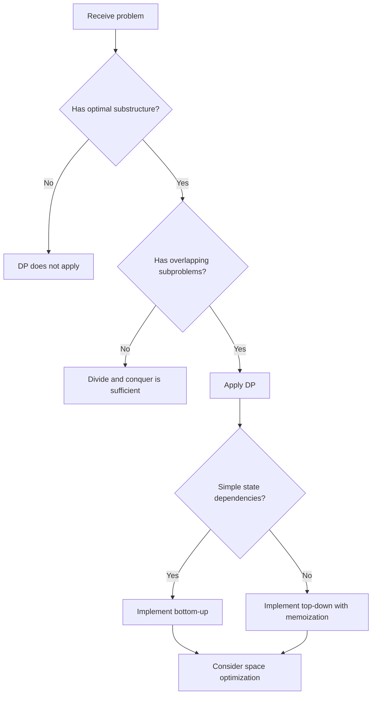

## Overview

Dynamic Programming (DP) is a technique that breaks a problem into **overlapping subproblems**, stores the result of each subproblem, and reuses it to reduce exponential search to polynomial time.

Problems suitable for DP have two properties:

1. **Optimal Substructure**: The optimal solution to the problem can be constructed from optimal solutions of its subproblems
2. **Overlapping Subproblems**: The same subproblems are solved repeatedly

There are two DP approaches:

- **Top-down (Memoization)**: Solve subproblems recursively and cache results
- **Bottom-up (Tabulation)**: Solve subproblems from smallest to largest, filling a table iteratively

## Core Idea

Ask: "Can I express this problem in terms of answers to smaller versions of itself?" If yes, DP applies.



## Top-down vs Bottom-up

| | Top-down (Memoization) | Bottom-up (Tabulation) |
|---|---|---|
| Implementation | Recursion + cache | Loop + table |
| Subproblem computation | Only computes what is needed | Computes all subproblems |
| Stack | Depends on recursion depth (stack overflow risk) | None |
| Space optimization | Difficult | Easy (can keep only previous states) |
| Debugging | Hard to trace recursion | Relatively easy with loops |

**When to use which:**
- If all states are needed, **bottom-up** is faster and more memory-efficient
- If the state space is large but few states are actually visited, **top-down** is advantageous
- In interviews, try bottom-up first and fall back to top-down if transitions are complex

## Patterns

### Linear DP

The most basic pattern: compute the current state from previous states on a 1D array.

**Fibonacci sequence:** $f(n) = f(n-1) + f(n-2)$

**Climbing Stairs:** Count the number of ways to climb a staircase taking 1 or 2 steps at a time. Same recurrence as Fibonacci.

```go
// Climbing Stairs: dp[i] = dp[i-1] + dp[i-2]
func climbStairs(n int) int {
	if n <= 2 {
		return n
	}
	prev2, prev1 := 1, 2
	for i := 3; i <= n; i++ {
		prev2, prev1 = prev1, prev2+prev1
	}
	return prev1
}
```

### Decision DP

For each element, decide "take or skip." Taking an element may impose constraints such as skipping adjacent elements.

**House Robber:** Maximize the amount stolen given that adjacent houses cannot both be robbed.

Recurrence: $dp[i] = \max(dp[i-1],\ dp[i-2] + nums[i])$

- $dp[i-1]$: **skip** house $i$ (carry forward the previous maximum)
- $dp[i-2] + nums[i]$: **take** house $i$ (skip the previous one)

### String DP

Problems that compare or transform two strings. Typically uses a 2D table.

- **Edit Distance**: Minimum insertions, deletions, and substitutions to transform string A into B
- **Longest Common Subsequence (LCS)**: The longest subsequence common to two strings

Recurrence (LCS):
$$
dp[i][j] = \begin{cases}
dp[i-1][j-1] + 1 & \text{if } s1[i] = s2[j] \\
\max(dp[i-1][j],\ dp[i][j-1]) & \text{otherwise}
\end{cases}
$$

### Grid DP

Count paths or compute costs on a 2D grid. The classic case allows movement only right and down.

**Unique Paths:** Count the number of paths from the top-left to the bottom-right of an $m \times n$ grid.

Recurrence: $dp[i][j] = dp[i-1][j] + dp[i][j-1]$

## Template

Basic bottom-up 1D DP structure:

```go
func solve(nums []int) int {
	n := len(nums)
	if n == 0 {
		return 0
	}

	// Define DP table
	dp := make([]int, n)

	// Base case
	dp[0] = nums[0]

	// Fill table from small to large
	for i := 1; i < n; i++ {
		// State transition: dp[i] depends on dp[i-1], dp[i-2], etc.
		dp[i] = max(dp[i-1], dp[i-2]+nums[i])
	}

	return dp[n-1]
}
```

**Space optimization:** When the current state depends only on the previous 1-2 states, the table can be replaced with variables ($O(n) \rightarrow O(1)$).

## Complexity

DP complexity is determined by:

$$\text{Complexity} = \text{Number of states} \times \text{Transition cost per state}$$

| Pattern | States | Transition | Time | Space (optimized) |
|---|---|---|---|---|
| Linear DP | $O(n)$ | $O(1)$ | $O(n)$ | $O(1)$ |
| Decision DP | $O(n)$ | $O(1)$ | $O(n)$ | $O(1)$ |
| Coin Change | $O(n \times m)$ | $O(1)$ | $O(n \times m)$ | $O(n)$ |
| Grid DP | $O(n \times m)$ | $O(1)$ | $O(n \times m)$ | $O(m)$ |
| String DP | $O(n \times m)$ | $O(1)$ | $O(n \times m)$ | $O(m)$ |

## Applied Problems

### [70. Climbing Stairs](https://leetcode.com/problems/climbing-stairs/) — Basic 1D DP

Find the number of ways to reach the top of an $n$-step staircase, taking 1 or 2 steps at a time.

**Key insight:** To reach step $n$, you either come from step $n-1$ (take 1 step) or step $n-2$ (take 2 steps).

```go
func climbStairs(n int) int {
	if n <= 2 {
		return n
	}
	prev2, prev1 := 1, 2
	for i := 3; i <= n; i++ {
		prev2, prev1 = prev1, prev2+prev1
	}
	return prev1
}
```

**Note:** Two variables are sufficient for $O(1)$ space. No need to maintain a full table.

### [198. House Robber](https://leetcode.com/problems/house-robber/) — Decision DP

Find the maximum amount that can be robbed given that adjacent houses cannot both be robbed.

**Key insight:** For each house, choose the larger of "skip (previous maximum)" and "rob (two-back maximum + current value)."

```go
func rob(nums []int) int {
	n := len(nums)
	if n == 1 {
		return nums[0]
	}

	prev2, prev1 := 0, nums[0]
	for i := 1; i < n; i++ {
		prev2, prev1 = prev1, max(prev1, prev2+nums[i])
	}
	return prev1
}
```

**Note:** `prev2` holds "maximum up to two houses back" and `prev1` holds "maximum up to the previous house." Go's multiple assignment updates both simultaneously.

### [322. Coin Change](https://leetcode.com/problems/coin-change/) — Unbounded Knapsack

Given coin denominations, find the minimum number of coins to make `amount`. Each coin can be used unlimited times.

**Key insight:** $dp[i]$ = minimum coins to make amount $i$. For each coin: $dp[i] = \min(dp[i],\ dp[i - coin] + 1)$.

```go
func coinChange(coins []int, amount int) int {
	dp := make([]int, amount+1)
	// Initialize with a value larger than any valid answer
	for i := 1; i <= amount; i++ {
		dp[i] = amount + 1
	}
	dp[0] = 0

	for i := 1; i <= amount; i++ {
		for _, coin := range coins {
			if coin <= i && dp[i-coin]+1 < dp[i] {
				dp[i] = dp[i-coin] + 1
			}
		}
	}

	if dp[amount] > amount {
		return -1
	}
	return dp[amount]
}
```

**Note:** Initializing with `amount + 1` represents "unreachable." Using `math.MaxInt` risks integer overflow when adding 1.

## How to Recognize

Look for these signals in problem statements:

- **Minimum cost** / **minimum number of** operations
- **Number of ways** to achieve something
- **Can you reach** / **is it possible** to reach a target
- **Maximize** / **minimize** a value
- Choices with **constraints** that require exploring all options

**Check for optimal substructure:** "If I solve a smaller version of this problem, can I build the answer to the original?"

## DP vs Greedy

| Criterion | DP | Greedy |
|---|---|---|
| Local optimum leads to global optimum | Not guaranteed — use DP | Guaranteed — use greedy |
| Exploring all options | Required | Not needed |
| Complexity | Often $O(n^2)$ or more | $O(n)$ to $O(n \log n)$ |

**When greedy fails:** For Coin Change with `coins = [1, 3, 4]` and `amount = 6`, greedy picks `4 + 1 + 1 = 3 coins`, but the optimal answer is `3 + 3 = 2 coins`. Greedily choosing the largest coin does not guarantee the optimal solution.

## Common Mistakes

1. **Vague state definition**: Starting implementation without clearly defining what $dp[i]$ represents. Always verbalize the state definition first
2. **Missing base case**: Forgetting to initialize $dp[0]$ or $dp[1]$. Always verify behavior for empty input and single-element input
3. **Off-by-one in transitions**: Getting loop start indices or boundaries wrong. If accessing $dp[i-2]$, ensure $i \geq 2$
4. **Initialization overflow**: Initializing with `math.MaxInt` causes overflow when adding. Use a safe sentinel like `amount + 1` that is larger than any valid answer

## Related

- [Greedy](/en/wiki/algorithms/greedy/) — A technique for when local optimum directly leads to global optimum
- [BFS (Breadth-First Search)](/en/wiki/algorithms/bfs/) — A fundamental shortest-path traversal technique
- [DFS (Depth-First Search)](/en/wiki/algorithms/dfs/) — A fundamental graph/grid traversal technique
- [Sliding Window](/en/wiki/algorithms/sliding-window/) — An efficient technique for searching contiguous subsequences
