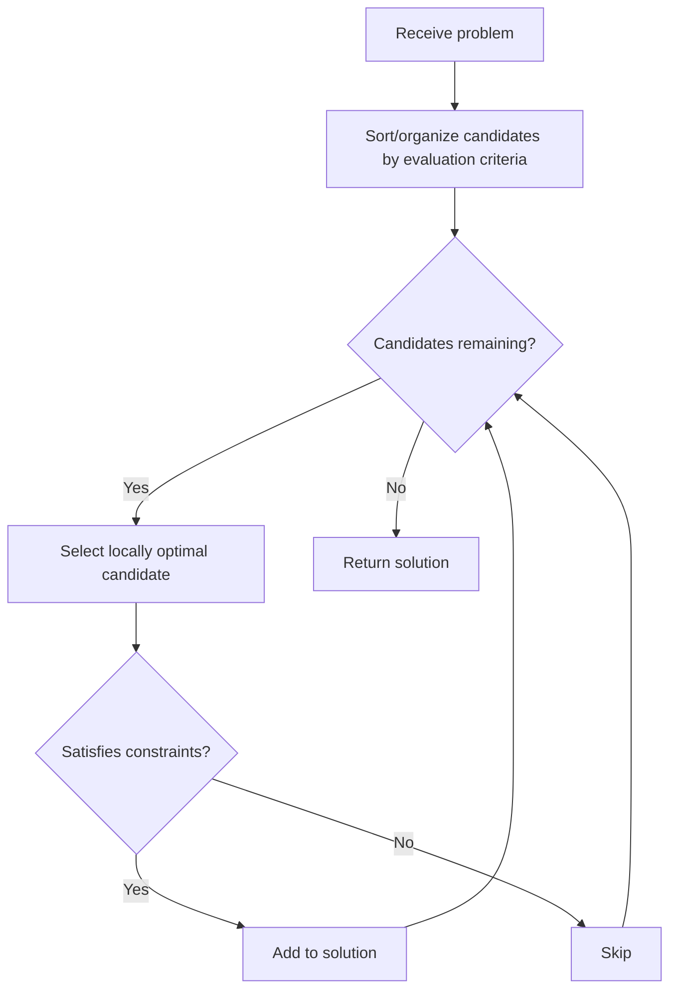
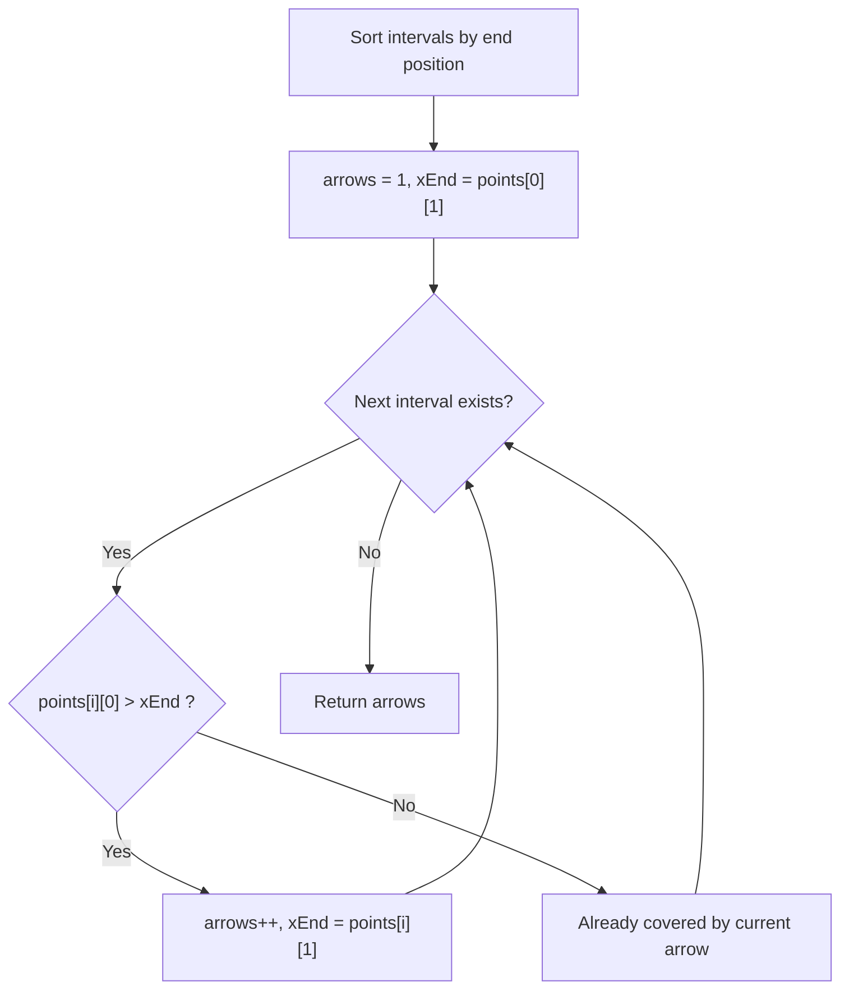

## Overview

Greedy is a technique that makes the **locally optimal choice** at each step, accumulating these choices to reach the global optimum. Compared to DP (Dynamic Programming), greedy solutions are typically simpler to implement and have better time complexity.

In interviews, many candidates know DP but tend to solve greedy-eligible problems with DP unnecessarily. The difficulty of greedy lies in proving that the local optimum truly leads to the global optimum. Building intuition for correctness is essential.

## Core Idea

At each step, choose the **best option available right now** and never reconsider past decisions. Decisions are made based solely on current information, without considering future consequences.



## When Greedy Works

For greedy to produce correct results, two properties are required:

1. **Greedy-choice property**: A locally optimal choice is part of the globally optimal solution. In other words, "choosing the best move now does not prevent us from reaching the overall optimal solution."
2. **Optimal substructure**: The optimal solution to the problem contains optimal solutions to subproblems.

**Contrast with DP:**

| | Greedy | DP |
|---|---|---|
| Choices | Once made, never reconsidered | Explores all subproblems |
| Complexity | Typically $O(n)$ to $O(n \log n)$ | Typically $O(n^2)$ or more |
| Correctness | Requires proof | Always guarantees optimal |

## Common Patterns

### Interval Scheduling

Select the maximum number of non-overlapping intervals from a set (or cover all intervals with minimum resources). **Sort by end time** and greedily select.

### State Change Tracking

Track the current state and only perform operations (flips, toggles) when the state differs from the target. Eliminating unnecessary operations achieves the minimum count.

### Pick Smallest First

Iterate elements in ascending order and greedily accumulate while constraints allow. Choosing smaller elements first allows selecting more elements in total.

## Complexity

| | Time | Space |
|---|---|---|
| With sorting | $O(n \log n)$ | $O(1)$ to $O(n)$ |
| Without sorting | $O(n)$ | $O(1)$ to $O(n)$ |

In most cases, the bottleneck is sorting at $O(n \log n)$, while the greedy selection itself is a linear $O(n)$ scan.

## Applied Problems

### [452. Minimum Number of Arrows to Burst Balloons](https://leetcode.com/problems/minimum-number-of-arrows-to-burst-balloons/) — Interval Scheduling

Balloons are represented as intervals `[start, end]` on the x-axis. Find the minimum number of vertical arrows to burst all balloons.

**Key insight:** Sort by end position and track the current arrow position. If the next balloon's start is beyond the current arrow, a new arrow is needed.



```go
func findMinArrowShots(points [][]int) int {
	sort.Slice(points, func(i, j int) bool {
		return points[i][1] < points[j][1]
	})
	result := 1
	xEnd := points[0][1]
	for i := 1; i < len(points); i++ {
		if points[i][0] > xEnd {
			result++
			xEnd = points[i][1]
		}
	}
	return result
}
```

**Note:** Sorting by end position is the key. Sorting by start position causes long intervals to unnecessarily block shorter subsequent intervals.

### [1529. Minimum Suffix Flips](https://leetcode.com/problems/minimum-suffix-flips/) — State Change Tracking

Find the minimum number of flips to convert an all-`'0'` string into `target`. Each flip inverts all bits from position i to the end.

**Key insight:** Track the current state as `'0'` and only flip when the target differs from the current state.

```go
func minFlips(target string) int {
	flips := 0
	current := byte('0')
	for i := 0; i < len(target); i++ {
		if target[i] != current {
			flips++
			current = target[i]
		}
	}
	return flips
}
```

**Note:** The complexity of flipping an entire suffix can be misleading. Simply scanning left to right and toggling when the current state differs from the target yields the minimum count.

### [2554. Maximum Number of Integers to Choose From a Range I](https://leetcode.com/problems/maximum-number-of-integers-to-choose-from-a-range-i/) — Pick Smallest First

Choose the maximum count of integers from `1` to `n`, avoiding a banned list, such that the sum does not exceed `maxSum`.

**Key insight:** Choosing smaller numbers first allows selecting more numbers under the same sum constraint.

```go
func maxCount(banned []int, n int, maxSum int) int {
	mc := 0
	bannedSet := make(map[int]struct{})
	for _, b := range banned {
		bannedSet[b] = struct{}{}
	}
	sum := 0
	for i := 1; i <= n; i++ {
		_, banned := bannedSet[i]
		if !banned && sum+i <= maxSum {
			sum += i
			mc++
		}
	}
	return mc
}
```

**Note:** Since we iterate from 1 to n in ascending order, no explicit sorting is needed. A Set is used for $O(1)$ banned list lookups.

## How to Recognize

Look for these signals in problem statements:

- **Minimum number of** (arrows, operations, flips)
- **Maximum number of** (items to select)
- **Intervals** / **scheduling** problems
- Cases where a more efficient solution than DP clearly exists ("Can you do better than DP?")

## Greedy vs DP

| Criterion | Greedy | DP |
|---|---|---|
| Local optimum leads to global optimum | Use greedy | — |
| Local optimum does not reach global optimum | — | Use DP |
| Complexity requirements | $O(n)$ to $O(n \log n)$ | $O(n^2)$ or more acceptable |

**Principle:** If greedy works, prefer it. The implementation is simpler and faster. However, never skip verifying correctness.

## Common Mistakes

1. **Skipping correctness proof**: Assuming greedy produces the optimal solution without verification. Build a habit of checking with counterexamples
2. **Wrong sort key**: Confusing whether to sort by start or end position in interval problems. For interval scheduling, sort by **end position**
3. **Off-by-one in overlap check**: Mixing up `>` and `>=` for interval overlap. Whether `points[i][0] > xEnd` (strictly greater) or `>=` (greater or equal) depends on the problem definition

## Related

- [Dynamic Programming](/en/wiki/algorithms/dynamic-programming/) — A technique that reuses overlapping subproblems to find optimal solutions
- [Sliding Window](/en/wiki/algorithms/sliding-window/) — An efficient technique for searching contiguous subsequences
- [DFS (Depth-First Search)](/en/wiki/algorithms/dfs/) — A fundamental graph/grid traversal technique
- [BFS (Breadth-First Search)](/en/wiki/algorithms/bfs/) — A fundamental shortest-path traversal technique
