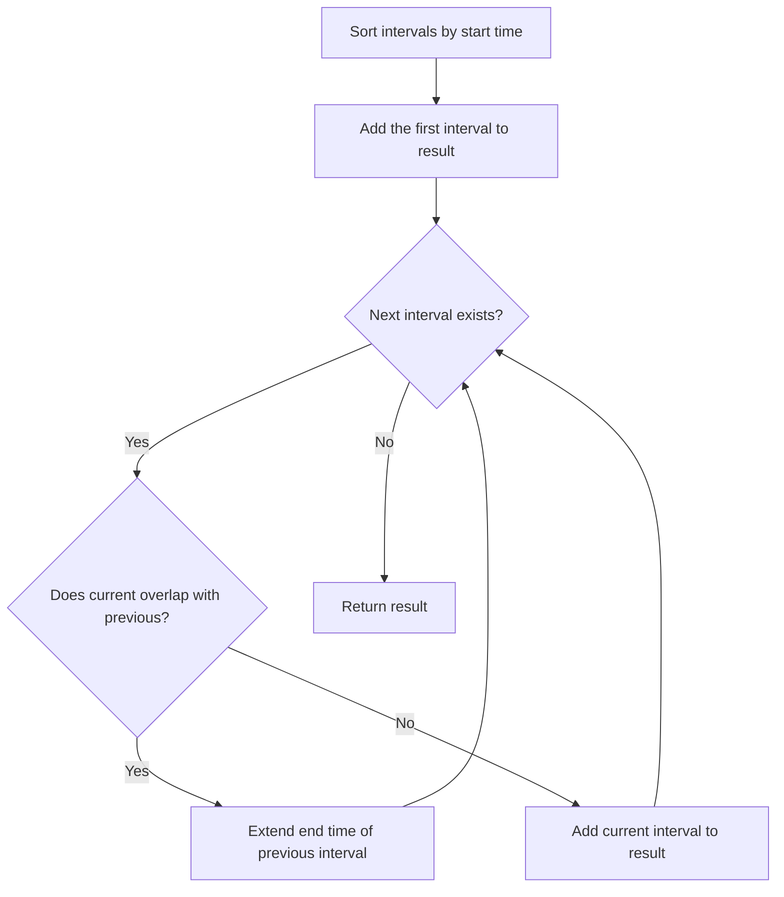

## Overview

Interval problems are a frequently tested category in algorithm interviews. They map directly to real-world scenarios — meeting room scheduling, time range consolidation, and resource conflict detection. The core technique is **sort + sweep**, and mastering it covers the majority of interval problems.

## Core Idea

Sort intervals by **start time**, then sweep from left to right, detecting and handling overlaps. Compare the end time of the previous interval with the start time of the current interval to determine overlap.



## Patterns

### Merge Overlapping Intervals

Sweep sorted intervals and merge when overlap is detected by updating the end time with `max`. The most fundamental pattern.

### Insert into Sorted Intervals

Insert a new interval at the correct position and merge any overlapping intervals. Process in three phases: before the overlap, the overlapping region, and after the overlap.

### Remove Minimum Intervals for Non-Overlap (Greedy)

Find the minimum number of intervals to remove so that no two intervals overlap. **Sort by end time** and greedily keep non-overlapping intervals. This is a classic application of the [Greedy](/en/wiki/algorithms/greedy/) pattern.

## Template

Basic template for the merge pattern:

```go
func merge(intervals [][]int) [][]int {
	sort.Slice(intervals, func(i, j int) bool {
		return intervals[i][0] < intervals[j][0]
	})
	merged := [][]int{intervals[0]}
	for i := 1; i < len(intervals); i++ {
		last := merged[len(merged)-1]
		if intervals[i][0] <= last[1] {
			// Overlapping — extend the end time
			last[1] = max(last[1], intervals[i][1])
		} else {
			merged = append(merged, intervals[i])
		}
	}
	return merged
}
```

## Complexity

| | Time | Space |
|---|---|---|
| Merge | $O(n \log n)$ | $O(n)$ |
| Insert | $O(n)$ (if already sorted) | $O(n)$ |
| Min removal | $O(n \log n)$ | $O(1)$ |

In most interval problems, **sorting at $O(n \log n)$** is the bottleneck, while the sweep itself is $O(n)$.

## Applied Problems

### [56. Merge Intervals](https://leetcode.com/problems/merge-intervals/)

Merge all overlapping intervals and return an array of non-overlapping intervals.

**Key insight:** Sort by start time. If the previous interval's end $\geq$ the current interval's start, they overlap.

```go
func merge(intervals [][]int) [][]int {
	sort.Slice(intervals, func(i, j int) bool {
		return intervals[i][0] < intervals[j][0]
	})
	merged := [][]int{intervals[0]}
	for i := 1; i < len(intervals); i++ {
		last := merged[len(merged)-1]
		if intervals[i][0] <= last[1] {
			last[1] = max(last[1], intervals[i][1])
		} else {
			merged = append(merged, intervals[i])
		}
	}
	return merged
}
```

### [57. Insert Interval](https://leetcode.com/problems/insert-interval/)

Insert a new interval into a sorted, non-overlapping interval list and merge if necessary.

**Key insight:** Split into three phases — (1) add intervals that end before the new one starts, (2) merge overlapping intervals, (3) add intervals that start after the new one ends.

```go
func insert(intervals [][]int, newInterval []int) [][]int {
	result := [][]int{}
	i := 0
	n := len(intervals)

	// Phase 1: add intervals that end before newInterval starts
	for i < n && intervals[i][1] < newInterval[0] {
		result = append(result, intervals[i])
		i++
	}

	// Phase 2: merge overlapping intervals
	for i < n && intervals[i][0] <= newInterval[1] {
		newInterval[0] = min(newInterval[0], intervals[i][0])
		newInterval[1] = max(newInterval[1], intervals[i][1])
		i++
	}
	result = append(result, newInterval)

	// Phase 3: add remaining intervals
	for i < n {
		result = append(result, intervals[i])
		i++
	}

	return result
}
```

### [435. Non-overlapping Intervals](https://leetcode.com/problems/non-overlapping-intervals/)

Find the minimum number of intervals to remove so that the remaining intervals do not overlap.

**Key insight:** Sort by end time and greedily keep intervals that finish earliest. This is the inverse of the interval scheduling problem — find the maximum number of non-overlapping intervals, then subtract from the total.

```go
func eraseOverlapIntervals(intervals [][]int) int {
	sort.Slice(intervals, func(i, j int) bool {
		return intervals[i][1] < intervals[j][1]
	})
	keep := 1
	end := intervals[0][1]
	for i := 1; i < len(intervals); i++ {
		if intervals[i][0] >= end {
			keep++
			end = intervals[i][1]
		}
	}
	return len(intervals) - keep
}
```

**Note:** Sort by **end time**, not start time. Prioritizing intervals that finish earlier minimizes conflicts with subsequent intervals.

## How to Recognize

Look for these signals in problem statements:

- **Intervals** / **ranges**
- **Overlapping** / **overlap**
- **Meetings** / **meeting rooms**
- **Merge** / **consolidate**
- **Schedule** / **scheduling**
- Input is an array of `[start, end]` pairs

## Common Mistakes

1. **Confusing sort keys**: Merge uses start time; minimum removal uses end time. Choose based on the problem
2. **Boundary condition `<` vs `<=`**: Do `[1,3]` and `[3,5]` overlap? Check the problem definition. Problem 56 treats them as overlapping (`<=`), while Problem 435 treats them as non-overlapping (`>=`)
3. **Mutating the original array**: When merging, note that `last[1] = max(...)` modifies the slice in the result array directly. In Go, slices are reference types, so this works correctly
4. **Missing empty array handling**: Forgetting the edge case when `intervals` is empty

## Related

- [Greedy](/en/wiki/algorithms/greedy/) — Minimum interval removal is a classic greedy problem
- [Sliding Window](/en/wiki/algorithms/sliding-window/) — An efficient sweep technique for contiguous subsequences
- [Binary Search](/en/wiki/algorithms/binary-search/) — Applicable for finding insertion positions in sorted intervals
