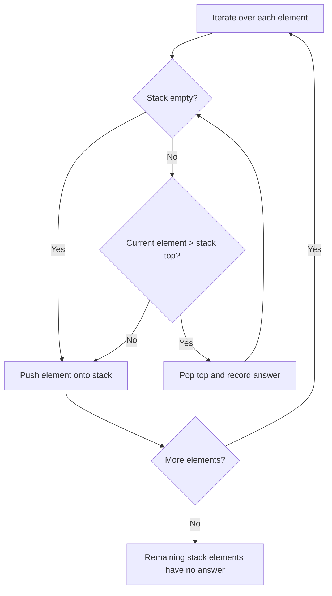

## Overview

A Monotonic Stack maintains its elements in **monotonically increasing** or **monotonically decreasing** order, enabling efficient computation of "next greater element", "previous smaller element", and similar queries for each element in an array.

A naive approach that linearly scans rightward for each element costs $O(n^2)$. The monotonic stack reduces this to $O(n)$.

It is one of the most frequently asked patterns in coding interviews and contests.

```moonmaid
array { [2, 1, 5, 6, 2, 3] }
```

## Core Idea

1. Iterate through the array from left to right, pushing each element onto the stack
2. When a new element **violates the monotonic order** of the stack top, pop until the invariant is restored
3. For each popped element, the current element is its "next greater (or smaller) element"
4. After popping, push the current element onto the stack

Each element is **pushed at most once and popped at most once**, yielding $O(n)$ total operations.



> The above shows the flow for a monotonic decreasing stack (Next Greater Element).

## Monotonic Decreasing vs Increasing

| Type | Stack Order | Use Case |
|------|------------|----------|
| **Monotonic Decreasing** | Top is smallest (bottom to top: large to small) | Next Greater Element, Daily Temperatures |
| **Monotonic Increasing** | Top is largest (bottom to top: small to large) | Next Smaller Element, Largest Rectangle in Histogram |

**Rule of thumb**: To find the next **greater** element, use a **decreasing** stack. To find the next **smaller** element, use an **increasing** stack.

## Template

Generic template for the Next Greater Element pattern:

```go
// nextGreaterElements returns the next greater element for each index.
// If none exists, the value is -1.
func nextGreaterElements(nums []int) []int {
 n := len(nums)
 result := make([]int, n)
 for i := range result {
  result[i] = -1
 }

 stack := []int{} // stores indices

 for i := 0; i < n; i++ {
  // Pop while current element is greater than stack top
  for len(stack) > 0 && nums[i] > nums[stack[len(stack)-1]] {
   top := stack[len(stack)-1]
   stack = stack[:len(stack)-1]
   result[top] = nums[i]
  }
  stack = append(stack, i)
 }

 return result
}
```

## Complexity

| | Complexity | Explanation |
|---|---|---|
| **Time** | $O(n)$ | Each element is pushed at most once and popped at most once |
| **Space** | $O(n)$ | The stack holds at most $n$ elements |

## Applied Problems

### 496. Next Greater Element I

[496. Next Greater Element I](https://leetcode.com/problems/next-greater-element-i/)

Given `nums1` as a subset of `nums2`, find the next greater element in `nums2` for each element in `nums1`.

```go
func nextGreaterElement(nums1, nums2 []int) []int {
 // Precompute next greater for every element in nums2
 nge := map[int]int{}
 stack := []int{}

 for _, num := range nums2 {
  for len(stack) > 0 && num > stack[len(stack)-1] {
   nge[stack[len(stack)-1]] = num
   stack = stack[:len(stack)-1]
  }
  stack = append(stack, num)
 }

 result := make([]int, len(nums1))
 for i, num := range nums1 {
  if v, ok := nge[num]; ok {
   result[i] = v
  } else {
   result[i] = -1
  }
 }
 return result
}
```

### 739. Daily Temperatures

[739. Daily Temperatures](https://leetcode.com/problems/daily-temperatures/)

For each day's temperature, find how many days until a warmer temperature occurs.

```go
func dailyTemperatures(temperatures []int) []int {
 n := len(temperatures)
 answer := make([]int, n)
 stack := []int{} // stores indices

 for i := 0; i < n; i++ {
  for len(stack) > 0 && temperatures[i] > temperatures[stack[len(stack)-1]] {
   prev := stack[len(stack)-1]
   stack = stack[:len(stack)-1]
   answer[prev] = i - prev
  }
  stack = append(stack, i)
 }

 return answer
}
```

### 84. Largest Rectangle in Histogram

[84. Largest Rectangle in Histogram](https://leetcode.com/problems/largest-rectangle-in-histogram/)

Given an array of bar heights, find the area of the largest rectangle contained in the histogram. A classic Hard problem.

Use a monotonic **increasing** stack. When a bar is popped, compute the width of the rectangle using that bar's height.

```go
func largestRectangleArea(heights []int) int {
 stack := []int{}
 maxArea := 0
 n := len(heights)

 for i := 0; i <= n; i++ {
  // Use 0 as sentinel for the final flush
  h := 0
  if i < n {
   h = heights[i]
  }

  for len(stack) > 0 && h < heights[stack[len(stack)-1]] {
   top := stack[len(stack)-1]
   stack = stack[:len(stack)-1]

   width := i
   if len(stack) > 0 {
    width = i - stack[len(stack)-1] - 1
   }
   area := heights[top] * width
   if area > maxArea {
    maxArea = area
   }
  }
  stack = append(stack, i)
 }

 return maxArea
}
```

## How to Recognize

Look for these signals in the problem statement:

- "Next greater / smaller element"
- "Nearest greater / smaller element"
- Time-series data (temperatures, stock prices) asking "next day that exceeds X"
- Problems involving **height ranges** such as histograms or building skylines
- Situations where a stack + array combination can achieve $O(n)$

## Common Mistakes

1. **Storing values instead of indices**: Always store **indices** on the stack. Values alone cannot compute distances or widths
2. **Strict vs non-strict comparison**: `>` vs `>=` produces different results. Be especially careful with duplicates
3. **Forgetting remaining elements**: Elements left on the stack after traversal have no answer (typically -1). Using a sentinel value unifies this handling
4. **Reversing the monotonic direction**: Using an increasing stack when you need "next greater". Carefully verify the pop condition

## Related

- [Sliding Window](/en/wiki/algorithms/sliding-window/) - Efficient contiguous subsequence search
- [Binary Search](/en/wiki/algorithms/binary-search/) - Search in sorted data
- [Greedy](/en/wiki/algorithms/greedy/) - Building global optima from local optima
