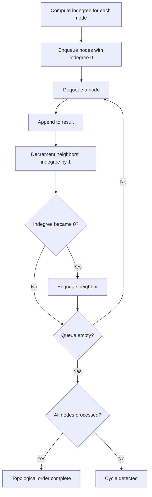

## Overview

Topological sort is an operation that **arranges the vertices of a Directed Acyclic Graph (DAG) into a linear order such that every edge goes from an earlier vertex to a later one**.

It is used wherever **elements with dependencies must be processed in the correct order** — task scheduling, build system dependency resolution, course prerequisite planning, and more.

**Prerequisite:** The graph must contain no cycles. If a cycle exists, no topological ordering is possible. Conversely, failure to complete a topological sort implies a cycle — making this a cycle detection tool as well.

## Core Idea

There are two main approaches.

### Kahn's Algorithm (BFS + Indegree)

1. Compute the indegree of every node
2. Enqueue all nodes with indegree 0
3. Dequeue a node and append it to the result
4. Remove its outgoing edges — decrement each neighbor's indegree by 1
5. If a neighbor's indegree becomes 0, enqueue it
6. Repeat until the queue is empty

If all nodes are processed, a valid topological order is found. If some nodes remain, a cycle exists.



### DFS-Based

1. Run DFS from each unvisited node
2. Push nodes onto a stack in postorder (after all descendants are processed)
3. Reverse the stack to get the topological order

During DFS, revisiting a node that is currently on the call stack indicates a cycle.

## Templates

### Kahn's Algorithm (BFS)

```go
func kahnTopologicalSort(numNodes int, edges [][]int) ([]int, bool) {
 graph := make([][]int, numNodes)
 indegree := make([]int, numNodes)
 for _, e := range edges {
  from, to := e[0], e[1]
  graph[from] = append(graph[from], to)
  indegree[to]++
 }

 // Enqueue all nodes with indegree 0
 queue := []int{}
 for i := 0; i < numNodes; i++ {
  if indegree[i] == 0 {
   queue = append(queue, i)
  }
 }

 order := []int{}
 for len(queue) > 0 {
  node := queue[0]
  queue = queue[1:]
  order = append(order, node)
  for _, neighbor := range graph[node] {
   indegree[neighbor]--
   if indegree[neighbor] == 0 {
    queue = append(queue, neighbor)
   }
  }
 }

 // If not all nodes are processed, a cycle exists
 if len(order) != numNodes {
  return nil, false
 }
 return order, true
}
```

### DFS-Based

```go
func dfsTopologicalSort(numNodes int, edges [][]int) ([]int, bool) {
 graph := make([][]int, numNodes)
 for _, e := range edges {
  from, to := e[0], e[1]
  graph[from] = append(graph[from], to)
 }

 const (
  unvisited = 0
  visiting  = 1 // currently in DFS stack (cycle detection)
  visited   = 2
 )
 state := make([]int, numNodes)
 result := make([]int, 0, numNodes)
 hasCycle := false

 var dfs func(node int)
 dfs = func(node int) {
  if hasCycle {
   return
  }
  state[node] = visiting
  for _, neighbor := range graph[node] {
   switch state[neighbor] {
   case visiting:
    hasCycle = true
    return
   case unvisited:
    dfs(neighbor)
   }
  }
  state[node] = visited
  result = append(result, node)
 }

 for i := 0; i < numNodes; i++ {
  if state[i] == unvisited {
   dfs(i)
  }
 }

 if hasCycle {
  return nil, false
 }

 // Reverse the result (postorder -> topological order)
 for l, r := 0, len(result)-1; l < r; l, r = l+1, r-1 {
  result[l], result[r] = result[r], result[l]
 }
 return result, true
}
```

## Complexity

| | Time | Space |
|---|---|---|
| Kahn's (BFS) | $O(V + E)$ | $O(V + E)$ |
| DFS-Based | $O(V + E)$ | $O(V + E)$ |

**Time:** Each node is processed once ($O(V)$) and each edge is traversed once ($O(E)$), giving $O(V + E)$ total.

**Space:** The adjacency list takes $O(V + E)$. Kahn's uses a queue holding up to $O(V)$ nodes; DFS uses a recursion stack up to $O(V)$ deep.

## Applied Problems

### [207. Course Schedule](https://leetcode.com/problems/course-schedule/)

Given $n$ courses and a list of prerequisites, determine whether it is possible to finish all courses. This is essentially **checking whether the dependency graph is a DAG** (i.e., has no cycle).

**Key insight:** Run Kahn's algorithm and check whether all nodes were processed.

```go
func canFinish(numCourses int, prerequisites [][]int) bool {
 graph := make([][]int, numCourses)
 indegree := make([]int, numCourses)
 for _, p := range prerequisites {
  course, prereq := p[0], p[1]
  graph[prereq] = append(graph[prereq], course)
  indegree[course]++
 }

 queue := []int{}
 for i := 0; i < numCourses; i++ {
  if indegree[i] == 0 {
   queue = append(queue, i)
  }
 }

 processed := 0
 for len(queue) > 0 {
  node := queue[0]
  queue = queue[1:]
  processed++
  for _, neighbor := range graph[node] {
   indegree[neighbor]--
   if indegree[neighbor] == 0 {
    queue = append(queue, neighbor)
   }
  }
 }

 return processed == numCourses
}
```

### [210. Course Schedule II](https://leetcode.com/problems/course-schedule-ii/)

Same setup as 207, but **return the ordering** itself. The answer is the topological sort result directly.

```go
func findOrder(numCourses int, prerequisites [][]int) []int {
 graph := make([][]int, numCourses)
 indegree := make([]int, numCourses)
 for _, p := range prerequisites {
  course, prereq := p[0], p[1]
  graph[prereq] = append(graph[prereq], course)
  indegree[course]++
 }

 queue := []int{}
 for i := 0; i < numCourses; i++ {
  if indegree[i] == 0 {
   queue = append(queue, i)
  }
 }

 order := []int{}
 for len(queue) > 0 {
  node := queue[0]
  queue = queue[1:]
  order = append(order, node)
  for _, neighbor := range graph[node] {
   indegree[neighbor]--
   if indegree[neighbor] == 0 {
    queue = append(queue, neighbor)
   }
  }
 }

 if len(order) != numCourses {
  return []int{}
 }
 return order
}
```

### [269. Alien Dictionary](https://leetcode.com/problems/alien-dictionary/) (Premium)

Given a sorted list of words in an alien language, reconstruct the alphabet order. Extract ordering constraints (edges) from adjacent word pairs, then run topological sort to determine the full ordering.

## How to Recognize

- **Prerequisites** or **dependencies** between items
- **Determining an order** (ordering, scheduling)
- The graph is explicitly or implicitly a **DAG**
- **Cycle detection** is required
- Build order, compilation order, task execution order

## Common Mistakes

1. **Forgetting cycle detection**: Topological sort only works on DAGs. Failing to handle cycles leads to incorrect results
2. **Reversing edge direction**: In `[course, prereq]`, does the edge go `prereq -> course` or `course -> prereq`? Read the problem statement carefully
3. **Missing isolated nodes**: Nodes that do not appear in any edge must still be included in the result. The indegree-0 initialization handles this, but it is easy to overlook
4. **Incorrect DFS state management**: A simple `visited` boolean is not enough for cycle detection. You need three states — `unvisited`, `visiting` (on current DFS stack), and `visited`

## Related

- [DFS (Depth-First Search)](/en/wiki/algorithms/dfs/) — Foundation for the DFS-based topological sort approach
- [BFS (Breadth-First Search)](/en/wiki/algorithms/bfs/) — Kahn's algorithm is an application of BFS
- [Dynamic Programming](/en/wiki/algorithms/dynamic-programming/) — DP on DAGs follows topological order
