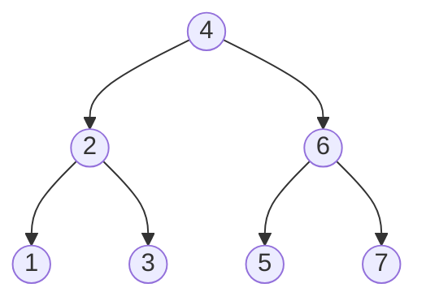

## Overview

A **Binary Tree** is a tree structure where each node has at most two children (left and right). A **Binary Search Tree (BST)** adds the invariant: all values in the left subtree < node's value < all values in the right subtree.

Key terminology:

| Term | Description |
|---|---|
| Root | The topmost node with no parent |
| Leaf | A node with no children |
| Height | Number of edges from a node to its farthest leaf. Tree height = root's height |
| Depth | Number of edges from the root to a given node |

Binary trees are a staple of coding interviews, testing recursive divide-and-conquer thinking.

```moonmaid
tree bst { insert(4, 2, 6, 1, 3, 5, 7) }
```

```go
type TreeNode struct {
    Val         int
    Left, Right *TreeNode
}
```

## Traversal

Consider the following sample tree:



| Traversal | Order | Result | Use case |
|---|---|---|---|
| Inorder | Left, Root, Right | 1, 2, 3, 4, 5, 6, 7 | Yields sorted order for BST |
| Preorder | Root, Left, Right | 4, 2, 1, 3, 6, 5, 7 | Tree serialization |
| Postorder | Left, Right, Root | 1, 3, 2, 5, 7, 6, 4 | Subtree deletion / aggregation |
| Level-order | BFS | 4, 2, 6, 1, 3, 5, 7 | See [BFS](/en/wiki/algorithms/bfs/) |

> Preorder, Inorder, and Postorder are all forms of [DFS](/en/wiki/algorithms/dfs/) — they differ only in when the node is processed. Level-order is the only [BFS](/en/wiki/algorithms/bfs/) traversal.

## Template

### Recursive (Inorder)

```go
func inorder(root *TreeNode) []int {
    if root == nil {
        return nil
    }
    var result []int
    result = append(result, inorder(root.Left)...)
    result = append(result, root.Val)
    result = append(result, inorder(root.Right)...)
    return result
}
```

### Iterative — Stack-based Inorder

```go
func inorderIterative(root *TreeNode) []int {
    var result []int
    var stack []*TreeNode
    curr := root
    for curr != nil || len(stack) > 0 {
        // go as far left as possible
        for curr != nil {
            stack = append(stack, curr)
            curr = curr.Left
        }
        curr = stack[len(stack)-1]
        stack = stack[:len(stack)-1]
        result = append(result, curr.Val)
        curr = curr.Right
    }
    return result
}
```

:::tip
For preorder, simply push children onto the stack in **right then left** order. For postorder, the simplest approach is to reverse a modified preorder (root, right, left).
:::

## Patterns

### Height / Depth Calculation

Tree height can be computed in $O(n)$ with a simple recursion.

```go
func maxDepth(root *TreeNode) int {
    if root == nil {
        return 0
    }
    left := maxDepth(root.Left)
    right := maxDepth(root.Right)
    return max(left, right) + 1
}
```

### LCA (Lowest Common Ancestor)

In a BST, you can find the LCA in $O(h)$ by comparing values. In a general binary tree, recursively search both subtrees — the node where both sides return non-nil is the LCA.

```go
// LCA for a general binary tree
func lowestCommonAncestor(root, p, q *TreeNode) *TreeNode {
    if root == nil || root == p || root == q {
        return root
    }
    left := lowestCommonAncestor(root.Left, p, q)
    right := lowestCommonAncestor(root.Right, p, q)
    if left != nil && right != nil {
        return root // current node is the LCA
    }
    if left != nil {
        return left
    }
    return right
}
```

### Path Sum Problems

Pass the cumulative sum as a parameter while recursing from the root. When backtracking is needed, remember to pop the last element from the path slice.

### BST Validation

Either verify that an inorder traversal is sorted, or propagate a valid range $(min, max)$ to each node recursively.

```go
func isValidBST(root *TreeNode) bool {
    return validate(root, math.MinInt64, math.MaxInt64)
}

func validate(node *TreeNode, lo, hi int) bool {
    if node == nil {
        return true
    }
    if node.Val <= lo || node.Val >= hi {
        return false
    }
    return validate(node.Left, lo, node.Val) &&
        validate(node.Right, node.Val, hi)
}
```

## Complexity

| Operation | Time | Space |
|---|---|---|
| Traversal (visit all nodes) | $O(n)$ | $O(h)$ (recursion stack) |
| BST search / insert / delete | Average $O(\log n)$, worst $O(n)$ | $O(h)$ |
| BST with balance guarantee | $O(\log n)$ | $O(\log n)$ |

Here $h$ is the tree height. For a balanced tree $h = O(\log n)$; for a skewed tree $h = O(n)$.

## Applied Problems

### [104. Maximum Depth of Binary Tree](https://leetcode.com/problems/maximum-depth-of-binary-tree/) — Easy

Find the maximum depth of a binary tree.

**Key insight**: Return the max of left and right subtree depths + 1. Base case: `nil` returns 0.

```go
func maxDepth(root *TreeNode) int {
    if root == nil {
        return 0
    }
    return max(maxDepth(root.Left), maxDepth(root.Right)) + 1
}
```

---

### [226. Invert Binary Tree](https://leetcode.com/problems/invert-binary-tree/) — Easy

Invert a binary tree (mirror it).

**Key insight**: Swap left and right children at each node, then recursively invert both subtrees.

```go
func invertTree(root *TreeNode) *TreeNode {
    if root == nil {
        return nil
    }
    root.Left, root.Right = root.Right, root.Left
    invertTree(root.Left)
    invertTree(root.Right)
    return root
}
```

---

### [98. Validate Binary Search Tree](https://leetcode.com/problems/validate-binary-search-tree/) — Medium

Determine whether a given binary tree is a valid BST.

**Key insight**: Propagate a valid range $(lo, hi)$ to each node. Pass the current value as the new upper bound to the left child and as the new lower bound to the right child.

```go
func isValidBST(root *TreeNode) bool {
    return validate(root, math.MinInt64, math.MaxInt64)
}

func validate(node *TreeNode, lo, hi int) bool {
    if node == nil {
        return true
    }
    if node.Val <= lo || node.Val >= hi {
        return false
    }
    return validate(node.Left, lo, node.Val) &&
        validate(node.Right, node.Val, hi)
}
```

**Key points:**

- Use `<=` / `>=` to exclude the boundary values (BST requires strict inequality)
- Initialize with `math.MinInt64` / `math.MaxInt64` to cover the full int range

## How to Recognize

- "Find the height / depth of a tree"
- "Check if the tree is symmetric"
- "Path sum" problems
- "Validate or convert a BST"
- "Serialize / deserialize a binary tree"
- Structures where recursive divide-and-conquer applies naturally

## Common Mistakes

1. **Missing base case**: Forgetting the `root == nil` check causes nil pointer panics
2. **Local-only BST validation**: Checking only "left child < parent < right child" is insufficient. The constraint must propagate across the entire subtree
3. **Ignoring recursive return values**: Returning only one side's result instead of combining left and right
4. **Stack mismanagement in iterative traversal**: Incorrect `curr` / `stack` state transitions lead to infinite loops or missing elements

## Related

- [DFS](/en/wiki/algorithms/dfs/) — Depth-first search. Tree traversal is a special case of DFS
- [BFS](/en/wiki/algorithms/bfs/) — Used for level-order traversal
- [Heap / Priority Queue](/en/wiki/data-structures/heap/) — Heap based on a complete binary tree
