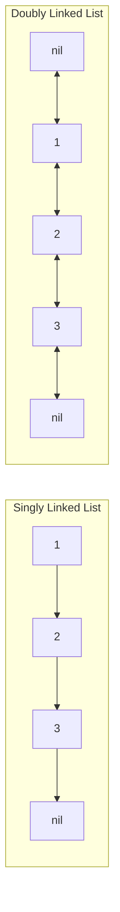
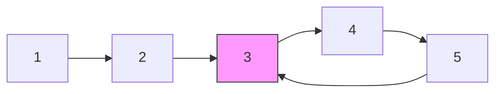

## Overview

A Linked List is a linear data structure where each node holds data and a pointer to the next node. Unlike arrays, nodes need not be contiguous in memory, enabling **$O(1)$ insertion and deletion at known positions**.

| Property | Array | Singly Linked List | Doubly Linked List |
|---|---|---|---|
| Index access | $O(1)$ | $O(n)$ | $O(n)$ |
| Insert/delete at head | $O(n)$ | $O(1)$ | $O(1)$ |
| Insert/delete at tail | $O(1)$ (amortized) | $O(n)$ / $O(1)$[^1] | $O(1)$ |
| Insert/delete at arbitrary position | $O(n)$ | $O(1)$ (with ref) | $O(1)$ (with ref) |
| Memory | Contiguous | Non-contiguous | Non-contiguous |

[^1]: Tail insertion is $O(1)$ if a tail pointer is maintained, but tail deletion remains $O(n)$ since the previous node must be found.

**When to use**: Linked lists excel when random access is unnecessary and frequent insertions/deletions are required (queues, LRU Cache, etc.).

## Core Idea

Linked list problems revolve around pointer manipulation. By rewiring links between nodes, you can transform the structure without extra memory.



The four most common interview patterns are **reversal**, **fast & slow pointers**, **merge**, and **dummy head**.

## Patterns

### Reversal

Rewire each node's `Next` pointer to point in the opposite direction.

**Iterative:**

```go
func reverseList(head *ListNode) *ListNode {
    var prev *ListNode
    curr := head
    for curr != nil {
        next := curr.Next   // save next
        curr.Next = prev     // reverse link
        prev = curr          // advance prev
        curr = next          // advance curr
    }
    return prev
}
```

**Recursive:**

```go
func reverseList(head *ListNode) *ListNode {
    if head == nil || head.Next == nil {
        return head
    }
    newHead := reverseList(head.Next)
    head.Next.Next = head  // reverse link
    head.Next = nil        // break old link
    return newHead
}
```

**Key point:** The iterative version uses $O(1)$ space while the recursive version uses $O(n)$ stack space. Interviewers typically expect the iterative approach.

### Two-Pointer / Fast & Slow

Use two pointers moving at different speeds: slow advances 1 step, fast advances 2 steps.

**Cycle detection (Floyd's Algorithm):**



If a cycle exists, fast and slow will eventually meet. If not, fast reaches `nil`.

**Finding the middle node:** When fast reaches the end of the list, slow points to the middle node.

### Merging Two Sorted Lists

Combine two sorted lists into a single sorted list. A dummy head simplifies the code.

### Dummy Head Technique

When an operation might change the head node (deletion, merge, etc.), create a dummy node and return `dummy.Next` as the final head. This eliminates special-case handling for the head.

```go
dummy := &ListNode{}
curr := dummy
// ... build or modify list using curr ...
return dummy.Next
```

## Applied Problems

### [206. Reverse Linked List](https://leetcode.com/problems/reverse-linked-list/)

Reverse a singly linked list.

```go
// iterative approach: O(n) time, O(1) space
func reverseList(head *ListNode) *ListNode {
    var prev *ListNode
    curr := head
    for curr != nil {
        next := curr.Next
        curr.Next = prev
        prev = curr
        curr = next
    }
    return prev
}
```

### [21. Merge Two Sorted Lists](https://leetcode.com/problems/merge-two-sorted-lists/)

Merge two sorted linked lists into one sorted list.

```go
func mergeTwoLists(list1 *ListNode, list2 *ListNode) *ListNode {
    dummy := &ListNode{}
    curr := dummy
    for list1 != nil && list2 != nil {
        if list1.Val <= list2.Val {
            curr.Next = list1
            list1 = list1.Next
        } else {
            curr.Next = list2
            list2 = list2.Next
        }
        curr = curr.Next
    }
    // attach remaining nodes
    if list1 != nil {
        curr.Next = list1
    } else {
        curr.Next = list2
    }
    return dummy.Next
}
```

### [141. Linked List Cycle](https://leetcode.com/problems/linked-list-cycle/)

Determine whether a linked list contains a cycle. Uses Floyd's Cycle Detection.

```go
func hasCycle(head *ListNode) bool {
    slow, fast := head, head
    for fast != nil && fast.Next != nil {
        slow = slow.Next
        fast = fast.Next.Next
        if slow == fast {
            return true
        }
    }
    return false
}
```

**Extension: [142. Linked List Cycle II](https://leetcode.com/problems/linked-list-cycle-ii/)** — Find the node where the cycle begins. After slow and fast meet, reset one pointer to head and advance both one step at a time; they will meet at the cycle start.

```go
func detectCycle(head *ListNode) *ListNode {
    slow, fast := head, head
    for fast != nil && fast.Next != nil {
        slow = slow.Next
        fast = fast.Next.Next
        if slow == fast {
            // reset one pointer to head
            slow = head
            for slow != fast {
                slow = slow.Next
                fast = fast.Next
            }
            return slow
        }
    }
    return nil
}
```

## How to Recognize

- "Reverse a linked list" or "merge lists"
- "Detect a cycle" or "find the cycle start"
- "Find the middle node of a list"
- Operations that may change the head node — consider a dummy head
- $O(1)$ space, in-place manipulation required

## Common Mistakes

1. **Missing `nil` checks**: Accessing `curr.Next` without verifying `curr != nil` causes a panic
2. **Wrong pointer update order**: Overwriting `curr.Next` before saving `next` loses the rest of the list
3. **Not using a dummy head**: Head deletion or merge without a dummy requires special-case code, increasing complexity
4. **Fast pointer boundary**: Failing to check both `fast != nil && fast.Next != nil` causes a panic on odd-length lists
5. **Misunderstanding cycle start math**: Understand the proof of why resetting one pointer to head and walking one step at a time finds the cycle entry point

## Related

- [LRU Cache](/en/wiki/data-structures/lru-cache/) — $O(1)$ cache using doubly linked list + HashMap
- [Heap](/en/wiki/data-structures/heap/) — Priority queue
- [Two Pointers](/en/wiki/algorithms/two-pointers/) — Two-pointer technique on arrays and lists
