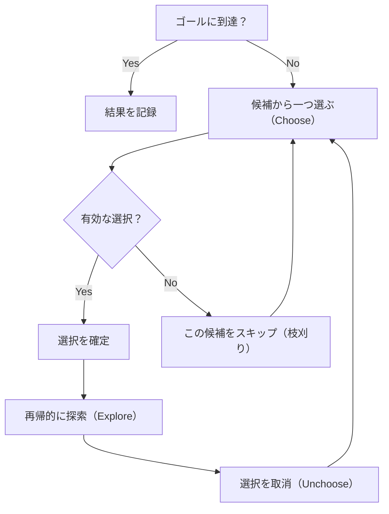

## 概要

バックトラッキングは、**すべての可能性を体系的に探索し、条件を満たさない枝を早期に刈り取る**アルゴリズム手法。DFS をベースに「選択 → 探索 → 取消」のサイクルを繰り返すことで、解空間を効率的に走査する。

素朴な全探索（Brute Force）と異なり、**枝刈り（pruning）** によって明らかに無効な分岐を早期に打ち切るため、実行時間を大幅に削減できるケースが多い。

## 核となるアイデア

1. **選択（Choose）**: 候補の中から一つを選ぶ
2. **探索（Explore）**: その選択のもとで再帰的に次の選択へ進む
3. **取消（Unchoose）**: 再帰から戻ったら選択を元に戻す



## テンプレート

```go
func backtrack(result *[][]int, path []int, choices []int, start int) {
    if goalReached(path) {
        // copy path to avoid mutation
        tmp := make([]int, len(path))
        copy(tmp, path)
        *result = append(*result, tmp)
        return
    }
    for i := start; i < len(choices); i++ {
        if !isValid(choices[i]) {
            continue // pruning
        }
        // choose
        path = append(path, choices[i])
        // explore
        backtrack(result, path, choices, i) // or i+1 depending on problem
        // unchoose
        path = path[:len(path)-1]
    }
}
```

**ポイント:**
- `path` はスライスなので、結果に記録する際は **必ずコピー** する。そうしないと後続の操作で内容が書き換わる
- `start` パラメータで重複を制御する。`i`（同じ要素を再利用可）と `i+1`（各要素は一度だけ）を問題に応じて使い分ける

## パターン

### 部分集合（Power Set）

$n$ 個の要素から全ての部分集合を列挙する。各要素について「含む/含まない」の2択。

- 解の数: $2^n$
- 再帰の各段階で「この要素を含める」か「スキップする」かを決める

### 順列（Permutations）

$n$ 個の要素の全順列を列挙する。各位置に未使用の要素を配置する。

- 解の数: $n!$
- `used` 配列で使用済みの要素を追跡する

### 組み合わせ / 組み合わせの和（Combinations / Combination Sum）

$n$ 個から $k$ 個を選ぶ、または合計が目標値になる組み合わせを求める。

- `start` インデックスで重複なしの組み合わせを保証
- Combination Sum では同じ要素を繰り返し使えるため `start = i`（`i+1` ではない）

### 制約充足（Constraint Satisfaction）

N-Queens、数独など。各ステップで制約を検証し、違反したら即座に枝刈り。

- 制約チェック関数が枝刈りの役割を果たす
- 有効な配置が見つかるまで全ての可能性を試す

## 計算量

バックトラッキングの計算量は問題の構造に依存する:

| パターン | 時間計算量 | 空間計算量 |
|---|---|---|
| 部分集合 | $O(2^n)$ | $O(n)$（再帰の深さ） |
| 順列 | $O(n!)$ | $O(n)$ |
| 組み合わせ ($n$ choose $k$) | $O(\binom{n}{k})$ | $O(k)$ |
| N-Queens | $O(n!)$ | $O(n)$ |

**なぜ指数・階乗になるのか:**
- 各ステップで複数の分岐が生まれ、分岐の数が掛け算で増えていく
- 部分集合: 各要素に対して「含む/含まない」の2択 → $2 \times 2 \times \cdots = 2^n$
- 順列: 最初の位置に $n$ 通り、次に $n-1$ 通り、… → $n \times (n-1) \times \cdots = n!$
- 枝刈りにより実際の探索数はこれより少なくなるが、最悪計算量は変わらない

## 実問題での適用

### [78. Subsets](https://leetcode.com/problems/subsets/)

整数配列の全ての部分集合を返す。

```go
func subsets(nums []int) [][]int {
    result := [][]int{}
    var backtrack func(start int, path []int)
    backtrack = func(start int, path []int) {
        // record every path as a valid subset
        tmp := make([]int, len(path))
        copy(tmp, path)
        result = append(result, tmp)

        for i := start; i < len(nums); i++ {
            path = append(path, nums[i])
            backtrack(i+1, path)
            path = path[:len(path)-1]
        }
    }
    backtrack(0, []int{})
    return result
}
```

### [46. Permutations](https://leetcode.com/problems/permutations/)

重複のない整数配列の全順列を返す。

```go
func permute(nums []int) [][]int {
    result := [][]int{}
    used := make([]bool, len(nums))

    var backtrack func(path []int)
    backtrack = func(path []int) {
        if len(path) == len(nums) {
            tmp := make([]int, len(path))
            copy(tmp, path)
            result = append(result, tmp)
            return
        }
        for i := 0; i < len(nums); i++ {
            if used[i] {
                continue
            }
            used[i] = true
            path = append(path, nums[i])
            backtrack(path)
            path = path[:len(path)-1]
            used[i] = false
        }
    }
    backtrack([]int{})
    return result
}
```

### [39. Combination Sum](https://leetcode.com/problems/combination-sum/)

候補の整数配列から、合計が `target` になる全ての組み合わせを返す。同じ数字を繰り返し使える。

```go
func combinationSum(candidates []int, target int) [][]int {
    result := [][]int{}

    var backtrack func(start, remaining int, path []int)
    backtrack = func(start, remaining int, path []int) {
        if remaining == 0 {
            tmp := make([]int, len(path))
            copy(tmp, path)
            result = append(result, tmp)
            return
        }
        for i := start; i < len(candidates); i++ {
            if candidates[i] > remaining {
                continue // pruning: skip candidates exceeding remainder
            }
            path = append(path, candidates[i])
            // pass i (not i+1) to allow reuse of the same element
            backtrack(i, remaining-candidates[i], path)
            path = path[:len(path)-1]
        }
    }
    backtrack(0, target, []int{})
    return result
}
```

## 見極めるためのシグナル

以下のキーワードが問題文に含まれたらバックトラッキングを疑う:

- 「**全ての可能な**〜を列挙せよ」("all possible")
- 「**全ての組み合わせ**を求めよ」("find all combinations")
- 「**全ての順列**を生成せよ」("generate all permutations")
- 「**条件を満たす配置**を求めよ」（N-Queens, Sudoku）
- 「**パーティション**」「**分割**」

## Backtracking vs DFS vs DP

| | Backtracking | DFS | DP |
|---|---|---|---|
| 目的 | 条件を満たす**全ての解**を列挙 | グラフ/ツリーの**走査** | **最適値**（最大/最小/数え上げ） |
| 状態の取消 | **する**（choose / unchoose） | しない（訪問済みは戻さない） | しない（メモ化で保存） |
| 枝刈り | 明示的に行う | 訪問済みチェックが暗黙の枝刈り | 部分問題の重複を利用 |
| 典型問題 | 順列、組み合わせ、N-Queens | 島の数、連結成分 | ナップサック、最長部分列 |

**使い分けの指針:**
- 「全ての解を列挙」→ **Backtracking**
- 「到達可能か / 連結か」→ **DFS**
- 「最大値 / 最小値 / 何通りあるか」→ **DP**（部分問題に重複がある場合）

## よくある間違い

1. **取消（Unchoose）の忘れ**: 再帰から戻った後に状態を元に戻さないと、後続の探索で不正な結果になる。`append` した要素を `path[:len(path)-1]` で戻すこと
2. **重複する結果**: ソートしていない、または `start` インデックスを正しく渡していないと、同じ組み合わせが複数回出現する。`[1,2]` と `[2,1]` を別物として扱うか否かを確認
3. **不適切な枝刈り**: 刈りすぎると有効な解を見落とし、枝刈りが不足すると TLE（Time Limit Exceeded）になる。枝刈り条件は慎重に設計する
4. **パスのコピー忘れ**: Go のスライスは参照型。結果に追加する際に `copy` しないと、全ての結果が最後の状態を共有してしまう

## 関連

- [DFS (Depth-First Search)](/wiki/algorithms/dfs/) — バックトラッキングの基盤となる探索手法
- [Greedy](/wiki/algorithms/greedy/) — 局所最適を積み重ねる手法。バックトラッキングと対照的
- [Binary Search](/wiki/algorithms/binary-search/) — 探索空間を半分に絞る手法
