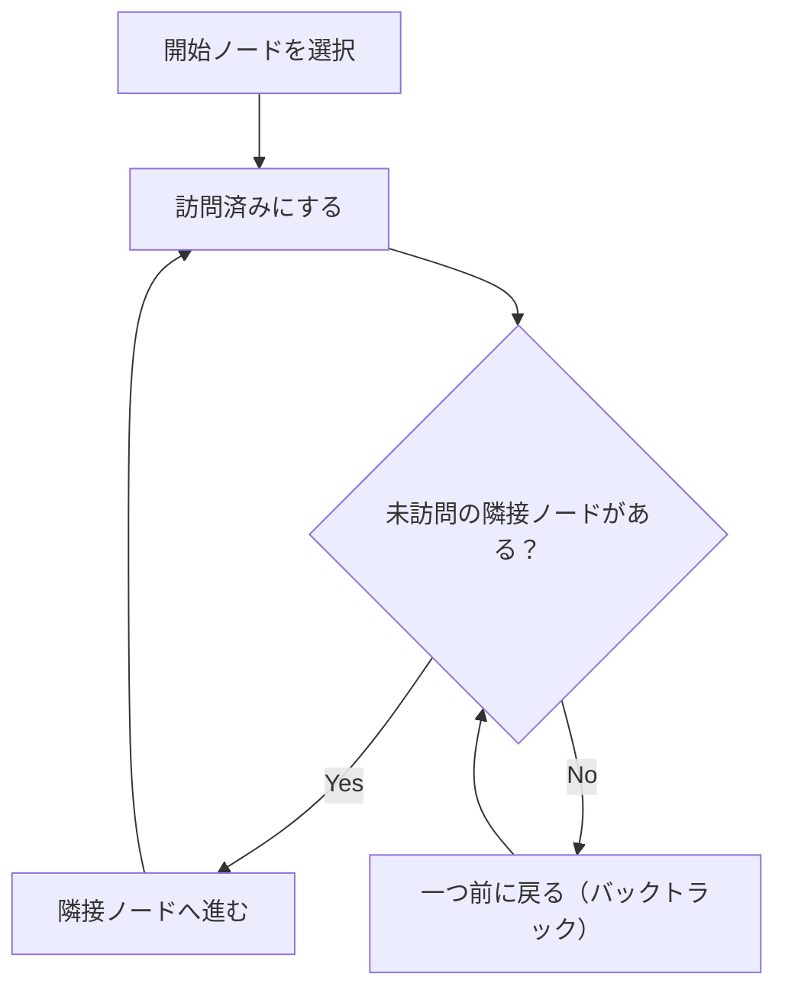
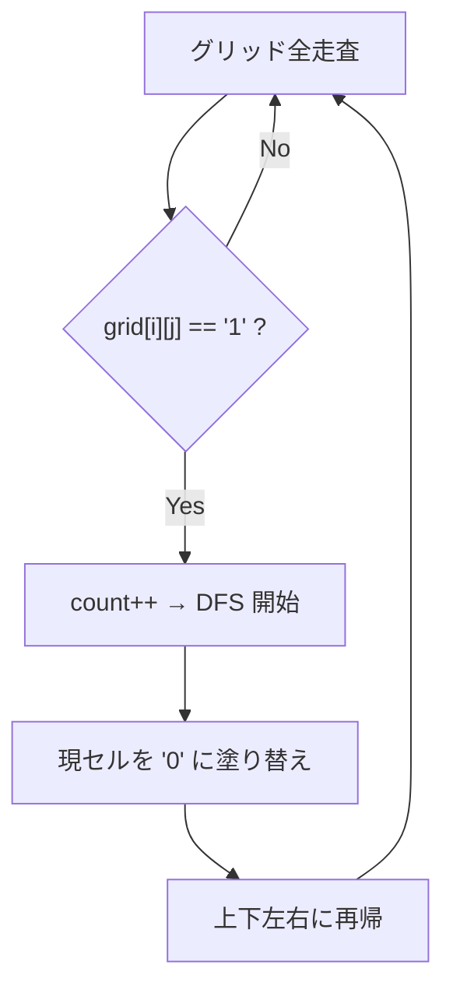

## 概要

DFS（深さ優先探索）は、グラフやグリッドを**一方向に深く掘り進み、行き止まりで戻る**という探索手法。再帰またはスタックで実装する。

グリッド問題では **Flood Fill**（塗りつぶし）パターンとして頻出し、「連結成分の数を数える」「領域を塗り替える」等に使われる。

## 核となるアイデア

1. 開始ノードを訪問済みにする
2. 隣接ノードのうち未訪問のものに再帰的に進む
3. 全隣接ノードが訪問済みなら一つ前に戻る（バックトラック）
4. 全ノードを訪問するまで繰り返す



## 再帰 vs スタック

| | 再帰 | 明示的スタック |
|---|---|---|
| コード量 | 短い | やや長い |
| 可読性 | 直感的 | やや複雑 |
| スタックオーバーフロー | グリッドが大きいと危険[^1] | 安全 |
| 速度 | 関数呼び出しのオーバーヘッド | わずかに速い |

[^1]: Go のデフォルトスタックは動的に拡張されるため、C/C++ や Java より耐性がある。Python はデフォルト再帰上限が 1000 なので、`sys.setrecursionlimit` が必要になることが多い。

**再帰テンプレート（グリッド）:**

```go
var dfs func(i, j int)
dfs = func(i, j int) {
    if i < 0 || i >= rows || j < 0 || j >= cols || grid[i][j] == visited {
        return
    }
    grid[i][j] = visited
    dfs(i-1, j) // up
    dfs(i+1, j) // down
    dfs(i, j-1) // left
    dfs(i, j+1) // right
}
```

**スタックテンプレート（グリッド）:**

```go
stack := [][]int{{startI, startJ}}
grid[startI][startJ] = visited
for len(stack) > 0 {
    top := stack[len(stack)-1]
    stack = stack[:len(stack)-1]
    i, j := top[0], top[1]
    for _, d := range [][2]int{{-1,0},{1,0},{0,-1},{0,1}} {
        ni, nj := i+d[0], j+d[1]
        if ni >= 0 && ni < rows && nj >= 0 && nj < cols && grid[ni][nj] != visited {
            grid[ni][nj] = visited
            stack = append(stack, []int{ni, nj})
        }
    }
}
```

## DFS vs BFS

| | DFS | BFS |
|---|---|---|
| データ構造 | スタック（or 再帰） | キュー |
| 探索順 | 深く掘ってから戻る | 近い順に広がる |
| 最短経路 | 保証しない | **保証する**（重みなしグラフ） |
| メモリ | $O(h)$（深さ） | $O(w)$（幅＝最大の層のノード数） |
| 用途 | 連結成分、パス存在判定、バックトラック | 最短距離、レベル順走査 |

**使い分けの指針:**
- 「最短」が問われたら → **BFS**
- 「全探索」「連結成分の数」「パスが存在するか」→ **DFS** が書きやすい
- どちらでも解ける問題は多い。迷ったら DFS（コードが短い）

## 計算量

グリッド（$m \times n$）の場合:

| | 時間 | 空間 |
|---|---|---|
| DFS | $O(m \times n)$ | $O(m \times n)$（最悪：再帰の深さ） |
| BFS | $O(m \times n)$ | $O(\min(m, n))$（キューの最大サイズ） |

各セルを最大1回訪問するため、時間は $O(m \times n)$。DFS の空間は全セルが一直線に繋がった最悪ケースで再帰が $O(m \times n)$ まで深くなる。BFS のキューサイズはグリッドの短辺に比例する。

## 実問題での適用

### [200. Number of Islands](https://leetcode.com/problems/number-of-islands/) — Flood Fill

`'1'`（陸）と `'0'`（水）からなるグリッドで、島の数を数える。上下左右に隣接する `'1'` は同一の島。

**着眼点:** グリッドを走査し、`'1'` を見つけるたびにカウント +1 し、DFS で連結する全ての `'1'` を `'0'` に塗り替える（visited の代わり）。



```go
func numIslands(grid [][]byte) int {
    land := byte('1')
    water := byte('0')

    y := len(grid)
    if y == 0 {
        return 0
    }
    x := len(grid[0])
    islandsCount := 0

    var dfs func(i, j int)
    dfs = func(i, j int) {
        if i < 0 || i >= y || j < 0 || j >= x || grid[i][j] == water {
            return
        }
        grid[i][j] = water
        dfs(i-1, j)
        dfs(i+1, j)
        dfs(i, j-1)
        dfs(i, j+1)
    }

    for i := 0; i < y; i++ {
        for j := 0; j < x; j++ {
            if grid[i][j] == land {
                islandsCount++
                dfs(i, j)
            }
        }
    }
    return islandsCount
}
```

**ポイント:**
- 訪問済みの管理に別の `visited` 配列を使わず、元のグリッドを `'0'` に書き換えている。空間効率 $O(1)$（再帰スタック除く）
- Go のクロージャ `dfs = func(i, j int)` で `grid`, `y`, `x` をキャプチャしている。関数シグネチャがシンプルになる

## 見極めるためのシグナル

- **グリッド**上の探索（2D配列で上下左右に移動）
- **連結成分**の数を数える
- **領域**を塗り替える / 囲まれた領域を判定する
- **パスの存在判定**（ゴールに到達できるか）
- **バックトラック**が必要な問題（順列、組み合わせ）

## よくある間違い

1. **訪問済みチェックの位置**: 再帰の**冒頭**でチェックしないと無限ループになる。呼び出し側でチェックする方法もあるが、冒頭チェックの方がバグりにくい
2. **元のグリッドを壊す**: Number of Islands のように入力を破壊して良い場合と、そうでない場合がある。問題文を確認すること
3. **方向の漏れ**: 4方向（上下左右）か8方向（斜め含む）か。問題文の「adjacent」の定義を確認

## 関連

- [BFS (Breadth-First Search)](/wiki/algorithms/bfs/) — 幅優先探索。最短経路やレベル順走査に強い
- [Sliding Window](/wiki/algorithms/sliding-window/) — 配列上の別の探索パターン
