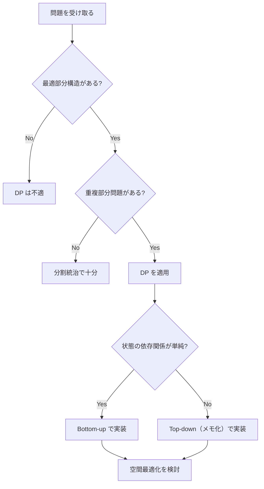

## 概要

Dynamic Programming（動的計画法、DP）は、問題を**重複する部分問題**に分割し、各部分問題の結果を保存して再利用することで、指数的な探索を多項式時間に落とす手法。

DP が適用できる問題には2つの性質がある:

1. **最適部分構造 (Optimal Substructure)**: 問題の最適解が、部分問題の最適解から構成できる
2. **重複部分問題 (Overlapping Subproblems)**: 同じ部分問題が何度も繰り返し現れる

DP のアプローチは2つ:

- **Top-down（メモ化再帰）**: 再帰で部分問題を解き、結果をキャッシュする
- **Bottom-up（テーブル法）**: 小さい部分問題から順に解き、テーブルを埋めていく

## 核となるアイデア

「この問題を、より小さい問題の答えを使って表現できるか?」を考える。表現できれば DP が使える。



## Top-down vs Bottom-up

| | Top-down（メモ化再帰） | Bottom-up（テーブル法） |
|---|---|---|
| 実装 | 再帰 + キャッシュ | ループ + テーブル |
| 部分問題の計算 | 必要なものだけ計算 | 全ての部分問題を計算 |
| スタック | 再帰の深さに依存（スタックオーバーフローのリスク） | なし |
| 空間最適化 | 困難 | 容易（前の状態のみ保持可能） |
| デバッグ | 再帰の追跡が難しい | ループなので比較的容易 |

**使い分け:**
- 全状態を使うなら **Bottom-up** が高速かつ省メモリ
- 状態空間が広いが実際に使う状態が少ないなら **Top-down** が有利
- 面接では Bottom-up を先に検討し、状態遷移が複雑なら Top-down にフォールバック

## パターン

### Linear DP（線形 DP）

1次元の配列上で、前の状態から現在の状態を計算する最も基本的なパターン。

**フィボナッチ数列:** $f(n) = f(n-1) + f(n-2)$

**Climbing Stairs:** 階段を1段または2段ずつ登る方法の数。フィボナッチと同じ漸化式。

```go
// Climbing Stairs: dp[i] = dp[i-1] + dp[i-2]
func climbStairs(n int) int {
	if n <= 2 {
		return n
	}
	prev2, prev1 := 1, 2
	for i := 3; i <= n; i++ {
		prev2, prev1 = prev1, prev2+prev1
	}
	return prev1
}
```

### Decision DP（選択 DP）

各要素について「取る or 取らない」を決める。取る場合は隣接要素をスキップするなどの制約が付く。

**House Robber:** 隣接する家を両方盗めない制約のもと、盗む金額を最大化。

漸化式: $dp[i] = \max(dp[i-1],\ dp[i-2] + nums[i])$

- $dp[i-1]$: 家 $i$ を**スキップ**（直前までの最大値を引き継ぐ）
- $dp[i-2] + nums[i]$: 家 $i$ を**取る**（1つ前をスキップ）

### String DP（文字列 DP）

2つの文字列を比較・変換する問題。2次元テーブルを使うことが多い。

- **Edit Distance（編集距離）**: 挿入・削除・置換の最小回数で文字列 A を B に変換
- **Longest Common Subsequence（LCS）**: 2つの文字列に共通する最長部分列

漸化式（LCS）:
$$
dp[i][j] = \begin{cases}
dp[i-1][j-1] + 1 & \text{if } s1[i] = s2[j] \\
\max(dp[i-1][j],\ dp[i][j-1]) & \text{otherwise}
\end{cases}
$$

### Grid DP（グリッド DP）

2次元グリッド上の経路数やコストを求める。右と下にのみ移動可能な場合が典型的。

**Unique Paths:** $m \times n$ グリッドの左上から右下への経路数。

漸化式: $dp[i][j] = dp[i-1][j] + dp[i][j-1]$

## テンプレート

Bottom-up 1D DP の基本形:

```go
func solve(nums []int) int {
	n := len(nums)
	if n == 0 {
		return 0
	}

	// Define DP table
	dp := make([]int, n)

	// Base case
	dp[0] = nums[0]

	// Fill table from small to large
	for i := 1; i < n; i++ {
		// State transition: dp[i] depends on dp[i-1], dp[i-2], etc.
		dp[i] = max(dp[i-1], dp[i-2]+nums[i])
	}

	return dp[n-1]
}
```

**空間最適化:** 現在の状態が直前の1～2個の状態にのみ依存する場合、テーブルを変数で置き換えられる（$O(n) \rightarrow O(1)$）。

## 計算量

DP の計算量は以下で決まる:

$$\text{計算量} = \text{状態数} \times \text{各状態の遷移コスト}$$

| パターン | 状態数 | 遷移 | 時間 | 空間（最適化後） |
|---|---|---|---|---|
| Linear DP | $O(n)$ | $O(1)$ | $O(n)$ | $O(1)$ |
| Decision DP | $O(n)$ | $O(1)$ | $O(n)$ | $O(1)$ |
| Coin Change | $O(n \times m)$ | $O(1)$ | $O(n \times m)$ | $O(n)$ |
| Grid DP | $O(n \times m)$ | $O(1)$ | $O(n \times m)$ | $O(m)$ |
| String DP | $O(n \times m)$ | $O(1)$ | $O(n \times m)$ | $O(m)$ |

## 実問題での適用

### [70. Climbing Stairs](https://leetcode.com/problems/climbing-stairs/) — 基本 1D DP

1段または2段ずつ登って $n$ 段の階段の頂上に到達する方法の数を求める。

**着眼点:** $n$ 段目に到達するには、$n-1$ 段目から1段登るか、$n-2$ 段目から2段登るかの2通り。

```go
func climbStairs(n int) int {
	if n <= 2 {
		return n
	}
	prev2, prev1 := 1, 2
	for i := 3; i <= n; i++ {
		prev2, prev1 = prev1, prev2+prev1
	}
	return prev1
}
```

**ポイント:** 変数2つで空間を $O(1)$ に最適化。テーブルを持つ必要はない。

### [198. House Robber](https://leetcode.com/problems/house-robber/) — Decision DP

隣接する家を両方盗めない制約のもと、盗む金額の最大値を求める。

**着眼点:** 各家について「盗む（2つ前 + 現在の金額）」と「盗まない（1つ前の最大値）」の大きい方を選ぶ。

```go
func rob(nums []int) int {
	n := len(nums)
	if n == 1 {
		return nums[0]
	}

	prev2, prev1 := 0, nums[0]
	for i := 1; i < n; i++ {
		prev2, prev1 = prev1, max(prev1, prev2+nums[i])
	}
	return prev1
}
```

**ポイント:** `prev2` は「2つ前までの最大値」、`prev1` は「1つ前までの最大値」。Go の多重代入で同時に更新できる。

### [322. Coin Change](https://leetcode.com/problems/coin-change/) — Unbounded Knapsack

コインの種類が与えられたとき、金額 `amount` を作るための最小枚数を求める。各コインは無制限に使える。

**着眼点:** $dp[i]$ = 金額 $i$ を作るための最小枚数。各コインについて $dp[i] = \min(dp[i],\ dp[i - coin] + 1)$。

```go
func coinChange(coins []int, amount int) int {
	dp := make([]int, amount+1)
	// Initialize with a value larger than any valid answer
	for i := 1; i <= amount; i++ {
		dp[i] = amount + 1
	}
	dp[0] = 0

	for i := 1; i <= amount; i++ {
		for _, coin := range coins {
			if coin <= i && dp[i-coin]+1 < dp[i] {
				dp[i] = dp[i-coin] + 1
			}
		}
	}

	if dp[amount] > amount {
		return -1
	}
	return dp[amount]
}
```

**ポイント:** 初期値を `amount + 1` にすることで「到達不可能」を表現。`math.MaxInt` を使うと加算時にオーバーフローするリスクがある。

## 見極めるためのシグナル

問題文に以下のキーワードがあれば DP を疑う:

- **最小コスト** / **最小回数** (minimum cost / minimum number of)
- **方法の数** (number of ways)
- **到達可能か** (can you reach / is it possible)
- **最大値・最小値を求めよ** (maximize / minimize)
- 選択に**制約**があり、全パターンを試す必要がある

**最適部分構造の確認:** 「問題を小さくしたバージョンを解けば、元の問題の解が構成できるか?」

## DP vs Greedy

| 判断基準 | DP | Greedy |
|---|---|---|
| 局所最適 → 全体最適 | 保証されない場合に使う | 保証される場合に使う |
| 全パターンの探索 | 必要 | 不要 |
| 計算量 | $O(n^2)$ 以上が多い | $O(n)$ ～ $O(n \log n)$ |

**Greedy が失敗する例:** Coin Change で `coins = [1, 3, 4]`, `amount = 6` のとき、Greedy は `4 + 1 + 1 = 3枚` を選ぶが、最適解は `3 + 3 = 2枚`。局所的に最大のコインを選ぶ戦略では最適解に到達できない。

## よくある間違い

1. **状態定義の誤り**: $dp[i]$ が何を表すのかを明確にしないまま実装を始める。状態の定義を最初に言語化すること
2. **ベースケースの漏れ**: $dp[0]$ や $dp[1]$ の初期値を忘れる。空の入力、要素1個のケースを必ず確認
3. **遷移の Off-by-one**: ループの開始位置やインデックスの境界を間違える。`dp[i-2]` にアクセスするなら `i >= 2` を保証する
4. **初期値のオーバーフロー**: `math.MaxInt` で初期化すると加算時にオーバーフローする。`amount + 1` のような「ありえない大きさだが安全な値」を使う

## 関連

- [Greedy](/wiki/algorithms/greedy/) — 局所最適が全体最適に直結する場合の手法
- [BFS (Breadth-First Search)](/wiki/algorithms/bfs/) — 最短経路探索の基本手法
- [DFS (Depth-First Search)](/wiki/algorithms/dfs/) — グラフ・グリッド探索の基本手法
- [Sliding Window](/wiki/algorithms/sliding-window/) — 連続部分列に対する効率的な探索手法
