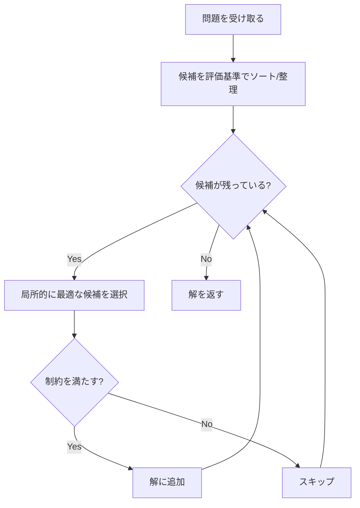
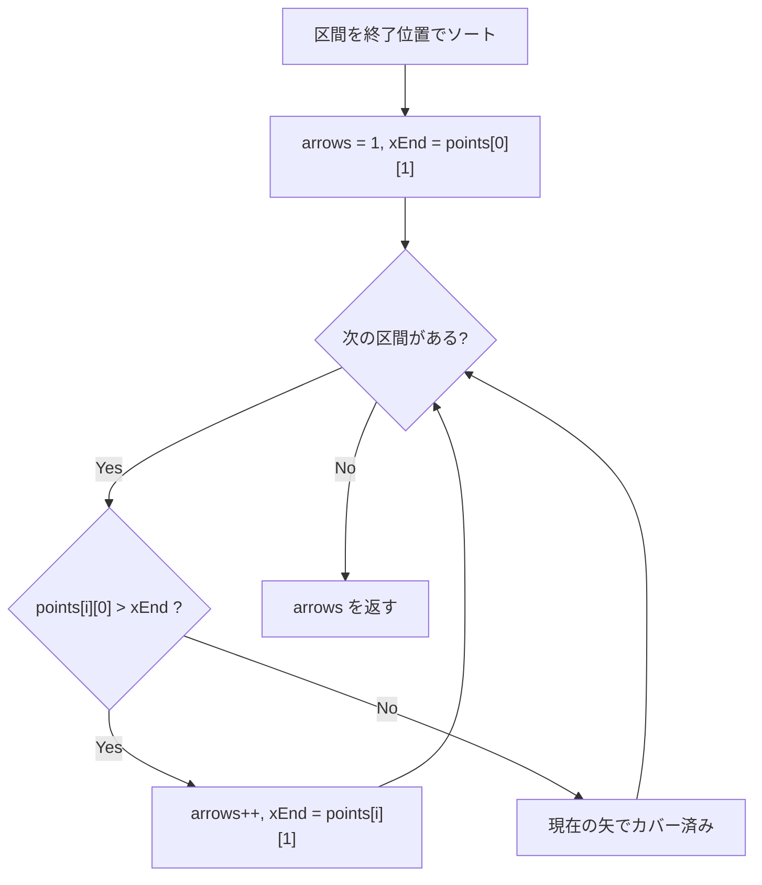

## 概要

Greedy（貪欲法）は、各ステップで**局所的に最適な選択**を行い、それを積み重ねることで全体の最適解に到達する手法。DP（動的計画法）と比べて実装がシンプルで計算量も小さいことが多い。

面接では DP を知っている候補者は多いが、貪欲法で解ける問題をわざわざ DP で解いてしまうケースが目立つ。貪欲法の難しさは「局所最適が本当に全体最適につながるか」を証明する点にある。正当性の直感を鍛えることが重要。

## 核となるアイデア

各ステップで**その時点で最も良い選択**をし、一度決めた選択を覆さない。将来の結果を考慮せず、現在の情報だけで判断する。



## 貪欲法が使える条件

貪欲法が正しく機能するには、以下の2つの性質が必要:

1. **Greedy-choice property（貪欲選択性）**: 局所的に最適な選択が、全体の最適解の一部になる。つまり「今の最善手を選んでも、最終的な最適解を逃さない」
2. **Optimal substructure（最適部分構造）**: 問題の最適解が、部分問題の最適解を含む

**DP との対比:**

| | 貪欲法 | DP |
|---|---|---|
| 選択 | 一度決めたら覆さない | 全ての部分問題を探索 |
| 計算量 | 一般に $O(n)$ ～ $O(n \log n)$ | 一般に $O(n^2)$ 以上 |
| 正当性 | 証明が必要 | 常に最適解を保証 |

## 典型パターン

### 区間スケジューリング / Interval Scheduling

区間の集合から、重ならない区間を最大数選ぶ（または最小のリソースでカバーする）パターン。**終了時刻でソート**し、貪欲に選択する。

### 状態変化の追跡 / State Change Tracking

現在の状態を追跡し、目標と異なるときだけ操作（フリップ、切り替え）を行うパターン。不要な操作を省くことで最小回数を達成する。

### 小さい順に選ぶ / Pick Smallest First

要素を昇順に走査し、制約を満たす限り貪欲に蓄積するパターン。小さい要素から選ぶことで、より多くの要素を選択できる。

## 計算量

| | 時間 | 空間 |
|---|---|---|
| ソートあり | $O(n \log n)$ | $O(1)$ ～ $O(n)$ |
| ソートなし | $O(n)$ | $O(1)$ ～ $O(n)$ |

多くの場合、ボトルネックはソートの $O(n \log n)$ であり、貪欲選択自体は $O(n)$ の線形走査。

## 実問題での適用

### [452. Minimum Number of Arrows to Burst Balloons](https://leetcode.com/problems/minimum-number-of-arrows-to-burst-balloons/) — 区間スケジューリング

風船が x 軸上の区間 `[start, end]` で表される。垂直に射る矢の最小本数を求める。

**着眼点:** 終了位置でソートし、現在の矢の位置を追跡する。次の風船の開始位置が現在の矢より後ろなら、新しい矢が必要。



```go
func findMinArrowShots(points [][]int) int {
	sort.Slice(points, func(i, j int) bool {
		return points[i][1] < points[j][1]
	})
	result := 1
	xEnd := points[0][1]
	for i := 1; i < len(points); i++ {
		if points[i][0] > xEnd {
			result++
			xEnd = points[i][1]
		}
	}
	return result
}
```

**ポイント:** 終了位置でソートするのが鍵。開始位置でソートすると、長い区間が後続の短い区間を不必要にブロックしてしまう。

### [1529. Minimum Suffix Flips](https://leetcode.com/problems/minimum-suffix-flips/) — 状態変化の追跡

全て `'0'` の文字列を `target` に変換するための最小フリップ回数。各フリップは位置 i 以降の全ビットを反転する。

**着眼点:** 現在の状態を `'0'` として追跡し、目標と異なる位置でのみフリップを行う。

```go
func minFlips(target string) int {
	flips := 0
	current := byte('0')
	for i := 0; i < len(target); i++ {
		if target[i] != current {
			flips++
			current = target[i]
		}
	}
	return flips
}
```

**ポイント:** サフィックス全体をフリップするという操作の複雑さに惑わされがちだが、左から順に見て「現在の状態と目標が違うなら切り替える」だけで最小回数になる。

### [2554. Maximum Number of Integers to Choose From a Range I](https://leetcode.com/problems/maximum-number-of-integers-to-choose-from-a-range-i/) — 小さい順に選ぶ

`1` から `n` の整数から、禁止リストを避けつつ合計が `maxSum` 以下になるよう最大個数を選ぶ。

**着眼点:** 小さい数から順に選ぶことで、同じ合計制約の下でより多くの数を選べる。

```go
func maxCount(banned []int, n int, maxSum int) int {
	mc := 0
	bannedSet := make(map[int]struct{})
	for _, b := range banned {
		bannedSet[b] = struct{}{}
	}
	sum := 0
	for i := 1; i <= n; i++ {
		_, banned := bannedSet[i]
		if !banned && sum+i <= maxSum {
			sum += i
			mc++
		}
	}
	return mc
}
```

**ポイント:** 1 から n まで昇順に走査するだけなのでソート不要。禁止リストの検索を $O(1)$ にするために Set を使う。

## 見極めるためのシグナル

以下のキーワードが問題文に含まれていたら貪欲法を疑う:

- **最小本数** / **最小回数** (minimum number of)
- **最大個数** (maximum number of)
- **区間** / **スケジューリング** (intervals, scheduling)
- 明らかに DP より効率的な解が存在しそうな場合（「DP より良くできるか?」）

## Greedy vs DP

| 判断基準 | Greedy | DP |
|---|---|---|
| 局所最適 → 全体最適が成り立つ | 貪欲法を使う | — |
| 局所最適では全体最適に到達しない | — | DP を使う |
| 計算量の要求 | $O(n)$ ～ $O(n \log n)$ | $O(n^2)$ 以上でも可 |

**原則:** 貪欲法が使えるなら貪欲法を優先する。実装がシンプルで高速。ただし正当性の確認を怠らないこと。

## よくある間違い

1. **正当性の未検証**: 貪欲法が最適解を出すと仮定して証明を省く。反例で確認する習慣をつける
2. **ソートキーの間違い**: 区間問題で開始位置と終了位置のどちらでソートすべきかを誤る。区間スケジューリングでは**終了位置**でソート
3. **Off-by-one（境界条件）**: 区間の重なり判定で `>` と `>=` を間違える。`points[i][0] > xEnd`（厳密に超える）なのか `>=`（以上）なのかは問題の定義による

## 関連

- [Sliding Window](/wiki/algorithms/sliding-window/) — 連続部分列に対する効率的な探索手法
- [DFS (Depth-First Search)](/wiki/algorithms/dfs/) — グラフ・グリッド探索の基本手法
- [BFS (Breadth-First Search)](/wiki/algorithms/bfs/) — 最短経路探索の基本手法
