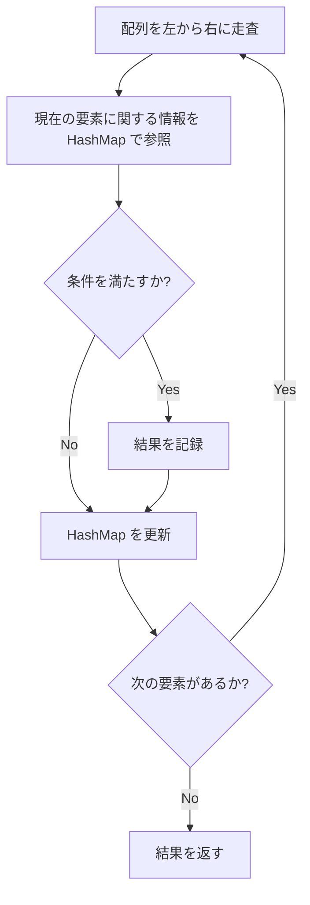
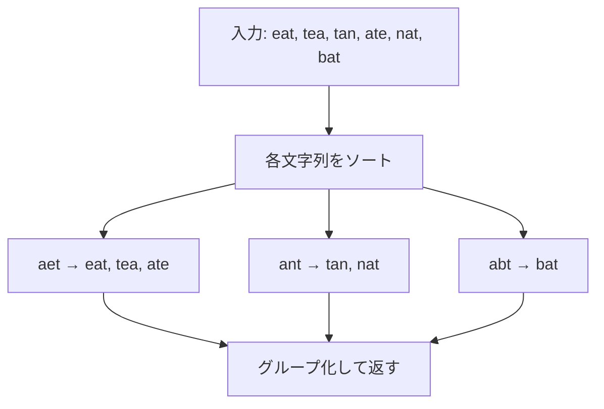
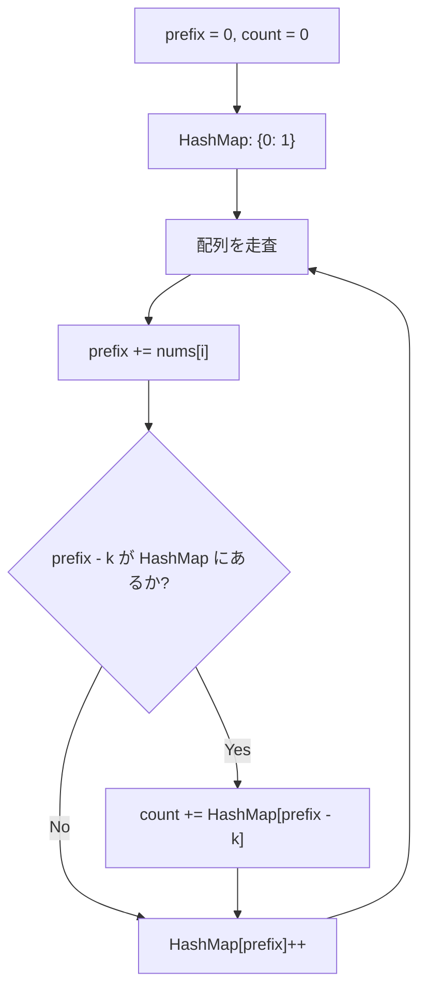

## 概要

HashMap（ハッシュマップ）パターンは、**キーと値の対応関係**を $O(1)$ で参照・更新できる性質を活かし、頻度カウント・存在チェック・グルーピングなどを効率的に行う手法。

ほぼ全てのアルゴリズム問題で補助的に使われるが、HashMap 自体が解法の中心になるパターンも多い。コーディング面接では Two Pointers や Sliding Window と並ぶ最頻出パターン。

## 核となるアイデア

1. 配列や文字列を1回走査しながら、HashMap に情報を蓄積する
2. 蓄積した情報を $O(1)$ で参照し、条件を判定する
3. ナイーブな二重ループ $O(n^2)$ を $O(n)$ に削減できることが多い



## パターン

### 頻度カウント（Frequency Count）

各要素の出現回数を数える。最も基本的で最も頻出するパターン。

**使い所**: アナグラム判定、最頻出要素、k 個以上/以下の要素を持つ部分列など。

**テンプレート:**

```go
func frequencyCount(arr []int) map[int]int {
    freq := make(map[int]int)
    for _, v := range arr {
        freq[v]++
    }
    return freq
}
```

:::caution
Go では `map[key]` がゼロ値を返すため、存在チェックなしで `freq[v]++` が安全に動作する。他言語では初期化が必要な場合がある。
:::

### ルックアップ（Complement Lookup）

「現在の要素と組み合わせて条件を満たす相方」を HashMap から $O(1)$ で探す。

**使い所**: Two Sum、ペア探索、差がちょうど k のペアなど。

**テンプレート:**

```go
func complementLookup(arr []int, target int) (int, int) {
    seen := make(map[int]int) // value -> index
    for i, v := range arr {
        complement := target - v
        if j, ok := seen[complement]; ok {
            return j, i
        }
        seen[v] = i
    }
    return -1, -1
}
```

### グルーピング（Grouping）

要素を特定のキーでグループ化する。キーの生成方法が問題の核心になることが多い。

**使い所**: アナグラムのグルーピング、パターン分類など。

**テンプレート:**

```go
func groupByKey(items []string, keyFn func(string) string) map[string][]string {
    groups := make(map[string][]string)
    for _, item := range items {
        key := keyFn(item)
        groups[key] = append(groups[key], item)
    }
    return groups
}
```

### Sliding Window + HashMap

[Sliding Window](/wiki/algorithms/sliding-window/) と組み合わせ、ウィンドウ内の要素の頻度を追跡する。ウィンドウの拡張・縮小に合わせて HashMap を差分更新する。

**使い所**: 「最大 k 種類の文字を含む最長部分文字列」「アナグラムの検出」など。

**テンプレート:**

```go
func slidingWindowWithMap(s string, k int) int {
    freq := make(map[byte]int)
    left, maxLen := 0, 0
    for right := 0; right < len(s); right++ {
        freq[s[right]]++
        for len(freq) > k {
            freq[s[left]]--
            if freq[s[left]] == 0 {
                delete(freq, s[left])
            }
            left++
        }
        if right-left+1 > maxLen {
            maxLen = right - left + 1
        }
    }
    return maxLen
}
```

## 計算量

| パターン | 時間 | 空間 |
|---|---|---|
| 頻度カウント | $O(n)$ | $O(k)$（$k$ = ユニーク要素数） |
| ルックアップ | $O(n)$ | $O(n)$ |
| グルーピング | $O(n \cdot m)$（$m$ = キー生成コスト） | $O(n)$ |
| Sliding Window + HashMap | $O(n)$ | $O(k)$ |

**なぜ $O(n)$ か:** 配列を1回走査し、各要素に対する HashMap 操作が平均 $O(1)$。合計で $O(n)$。

## 実問題での適用

### [1. Two Sum](https://leetcode.com/problems/two-sum/) — ルックアップ

配列から合計が `target` になるペアのインデックスを見つける。

**着眼点:** 各要素に対して `target - nums[i]` が既に見た要素の中にあるかを HashMap で $O(1)$ 判定。

```go
func twoSum(nums []int, target int) []int {
    seen := make(map[int]int)
    for i, v := range nums {
        if j, ok := seen[target-v]; ok {
            return []int{j, i}
        }
        seen[v] = i
    }
    return nil
}
```

**ポイント:** ソート済みなら [Two Pointers](/wiki/algorithms/two-pointers/) で $O(1)$ 空間で解けるが、未ソートの場合は HashMap が最適。

### [49. Group Anagrams](https://leetcode.com/problems/group-anagrams/) — グルーピング

文字列の配列をアナグラムごとにグループ化する。

**着眼点:** アナグラムは文字の出現頻度が同じ。ソートした文字列をキーにすれば同じグループに入る。



```go
func groupAnagrams(strs []string) [][]string {
    groups := make(map[string][]string)
    for _, s := range strs {
        key := sortString(s)
        groups[key] = append(groups[key], s)
    }
    result := make([][]string, 0, len(groups))
    for _, group := range groups {
        result = append(result, group)
    }
    return result
}

func sortString(s string) string {
    b := []byte(s)
    sort.Slice(b, func(i, j int) bool { return b[i] < b[j] })
    return string(b)
}
```

**別解:** ソートの代わりに `[26]int` の頻度配列をキーにすると $O(n \cdot m)$（$m$ = 文字列長）で、ソートの $O(n \cdot m \log m)$ より高速。

```go
func groupAnagrams(strs []string) [][]string {
    groups := make(map[[26]int][]string)
    for _, s := range strs {
        var key [26]int
        for i := 0; i < len(s); i++ {
            key[s[i]-'a']++
        }
        groups[key] = append(groups[key], s)
    }
    result := make([][]string, 0, len(groups))
    for _, group := range groups {
        result = append(result, group)
    }
    return result
}
```

### [560. Subarray Sum Equals K](https://leetcode.com/problems/subarray-sum-equals-k/) — Prefix Sum + HashMap

連続する部分配列の和がちょうど `k` になる個数を数える。

**着眼点:** Prefix Sum を使うと、部分配列の和は `prefixSum[j] - prefixSum[i]` で表現できる。「`prefixSum[j] - k` が過去に何回出現したか」を HashMap で追跡する。



```go
func subarraySum(nums []int, k int) int {
    count := 0
    prefix := 0
    seen := map[int]int{0: 1}
    for _, v := range nums {
        prefix += v
        if c, ok := seen[prefix-k]; ok {
            count += c
        }
        seen[prefix]++
    }
    return count
}
```

**ポイント:** `seen` の初期値 `{0: 1}` を忘れると、配列の先頭から始まる部分配列を見落とす。

## 見極めるためのシグナル

以下のキーワードが問題文に含まれていたら HashMap パターンを疑う:

- **頻度** / **出現回数** を数える
- **重複** の検出・排除
- 2つの要素の**和・差**が特定値（未ソートの場合）
- **アナグラム** / **順列** のグルーピング
- **部分配列の和**が特定値
- **最初に出現した位置** / **最後に出現した位置**
- **distinct** な要素数

## よくある間違い

1. **ゼロ値の扱い**: Go では `map[key]` が存在しないとき 0 を返す。存在チェックが必要な場合は `v, ok := map[key]` を使う
2. **Prefix Sum の初期値**: `{0: 1}` を入れ忘れると、配列先頭からの部分配列を見落とす
3. **キーの設計**: Group Anagrams で `string(sorted)` をキーにするのは正しいが、`[]byte` は直接 map のキーにできない（Go の仕様）
4. **削除忘れ**: Sliding Window と組み合わせるとき、頻度が 0 になったキーを `delete` しないと `len(map)` が正しくならない
5. **順序依存**: HashMap はキーの挿入順を保持しない。順序が必要なら別途スライスで管理する

## 関連

- [Sliding Window](/wiki/algorithms/sliding-window/) — 連続部分列の探索。HashMap と組み合わせてウィンドウ内の頻度を追跡する
- [Two Pointers](/wiki/algorithms/two-pointers/) — ソート済み配列でのペア探索。未ソートの場合は HashMap が適切
- [Binary Search](/wiki/algorithms/binary-search/) — ソート済みデータの探索。HashMap は未ソートデータに対する $O(1)$ ルックアップ
