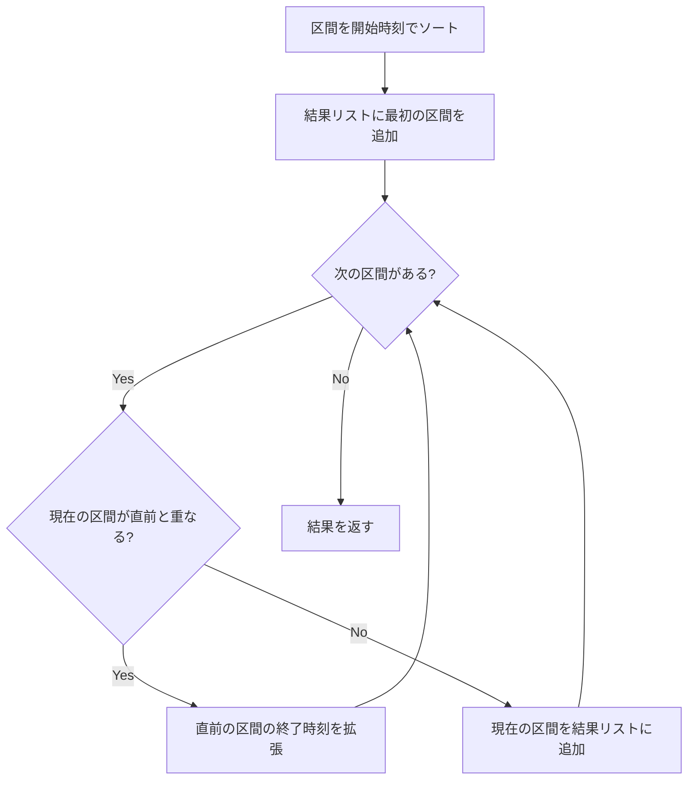

## 概要

区間（interval）問題はアルゴリズム面接で頻出するカテゴリ。会議室のスケジュール、時間帯の統合、リソースの競合検出など、現実世界の問題に直結する。核となるテクニックは **ソート + スイープ**（走査）であり、これを押さえれば大半の区間問題に対応できる。

## 核となるアイデア

区間を**開始時刻でソート**し、先頭から順に走査しながら重なりを検出・処理する。直前の区間の終了時刻と現在の区間の開始時刻を比較することで、重なりの有無を判定する。



## パターン

### 重なる区間のマージ

ソート済みの区間を走査し、重なりがあれば終了時刻を `max` で更新してマージする。最も基本的なパターン。

### ソート済み区間への挿入

新しい区間を適切な位置に挿入し、重なる区間をマージする。挿入位置の前・重なり部分・挿入位置の後の3フェーズに分けて処理する。

### 重なりを除去する最小削除数（貪欲法）

重ならないようにするために削除する区間の最小数を求める。**終了時刻でソート**し、貪欲に重ならない区間を選択する。これは [Greedy](/wiki/algorithms/greedy/) パターンの典型例。

## テンプレート

マージパターンの基本テンプレート:

```go
func merge(intervals [][]int) [][]int {
	sort.Slice(intervals, func(i, j int) bool {
		return intervals[i][0] < intervals[j][0]
	})
	merged := [][]int{intervals[0]}
	for i := 1; i < len(intervals); i++ {
		last := merged[len(merged)-1]
		if intervals[i][0] <= last[1] {
			// Overlapping — extend the end time
			last[1] = max(last[1], intervals[i][1])
		} else {
			merged = append(merged, intervals[i])
		}
	}
	return merged
}
```

## 計算量

| | 時間 | 空間 |
|---|---|---|
| マージ | $O(n \log n)$ | $O(n)$ |
| 挿入 | $O(n)$（ソート済みの場合） | $O(n)$ |
| 最小削除 | $O(n \log n)$ | $O(1)$ |

ほとんどの区間問題では**ソートの $O(n \log n)$** がボトルネックとなり、走査自体は $O(n)$。

## 実問題での適用

### [56. Merge Intervals](https://leetcode.com/problems/merge-intervals/)

重なる区間をすべてマージして、重ならない区間の配列を返す。

**着眼点:** 開始時刻でソートし、直前の区間の終了時刻 $\geq$ 現在の区間の開始時刻なら重なり。

```go
func merge(intervals [][]int) [][]int {
	sort.Slice(intervals, func(i, j int) bool {
		return intervals[i][0] < intervals[j][0]
	})
	merged := [][]int{intervals[0]}
	for i := 1; i < len(intervals); i++ {
		last := merged[len(merged)-1]
		if intervals[i][0] <= last[1] {
			last[1] = max(last[1], intervals[i][1])
		} else {
			merged = append(merged, intervals[i])
		}
	}
	return merged
}
```

### [57. Insert Interval](https://leetcode.com/problems/insert-interval/)

ソート済みの重ならない区間リストに新しい区間を挿入し、必要に応じてマージする。

**着眼点:** 3フェーズに分ける — (1) 新区間より前の区間をそのまま追加、(2) 重なる区間をマージ、(3) 新区間より後の区間をそのまま追加。

```go
func insert(intervals [][]int, newInterval []int) [][]int {
	result := [][]int{}
	i := 0
	n := len(intervals)

	// Phase 1: add intervals that end before newInterval starts
	for i < n && intervals[i][1] < newInterval[0] {
		result = append(result, intervals[i])
		i++
	}

	// Phase 2: merge overlapping intervals
	for i < n && intervals[i][0] <= newInterval[1] {
		newInterval[0] = min(newInterval[0], intervals[i][0])
		newInterval[1] = max(newInterval[1], intervals[i][1])
		i++
	}
	result = append(result, newInterval)

	// Phase 3: add remaining intervals
	for i < n {
		result = append(result, intervals[i])
		i++
	}

	return result
}
```

### [435. Non-overlapping Intervals](https://leetcode.com/problems/non-overlapping-intervals/)

重ならないようにするために削除する区間の最小数を求める。

**着眼点:** 終了時刻でソートし、貪欲に「終了が早い区間」を残す。これは区間スケジューリング問題の裏返し — 残せる最大数を求めて全体から引く。

```go
func eraseOverlapIntervals(intervals [][]int) int {
	sort.Slice(intervals, func(i, j int) bool {
		return intervals[i][1] < intervals[j][1]
	})
	keep := 1
	end := intervals[0][1]
	for i := 1; i < len(intervals); i++ {
		if intervals[i][0] >= end {
			keep++
			end = intervals[i][1]
		}
	}
	return len(intervals) - keep
}
```

**ポイント:** 開始時刻ではなく**終了時刻**でソートする。終了が早い区間を優先的に残すことで、後続の区間との衝突を最小化する。

## 見極めるためのシグナル

以下のキーワードが問題文に含まれていたら区間問題を疑う:

- **区間** / **intervals** / **ranges**
- **重なり** / **overlapping**
- **会議** / **meetings**
- **マージ** / **merge**
- **スケジュール** / **schedule**
- 入力が `[start, end]` のペアの配列

## よくある間違い

1. **ソートキーの混同**: マージでは開始時刻、最小削除では終了時刻でソート。問題によって使い分ける
2. **境界条件の `<` vs `<=`**: `[1,3]` と `[3,5]` は重なるのか? 問題定義を確認する。56番では重なり（`<=`）、435番では重ならない（`>=`）
3. **元の配列の変更**: マージ時に `last[1] = max(...)` で結果配列内のスライスを直接更新する点に注意。Go ではスライスが参照型なのでこれが正しく動作する
4. **空配列のハンドリング**: `intervals` が空の場合のエッジケースを忘れる

## 関連

- [Greedy](/wiki/algorithms/greedy/) — 区間の最小削除問題は貪欲法の典型例
- [Sliding Window](/wiki/algorithms/sliding-window/) — 連続部分列に対する効率的な走査手法
- [Binary Search](/wiki/algorithms/binary-search/) — ソート済み区間での挿入位置検索に応用可能
