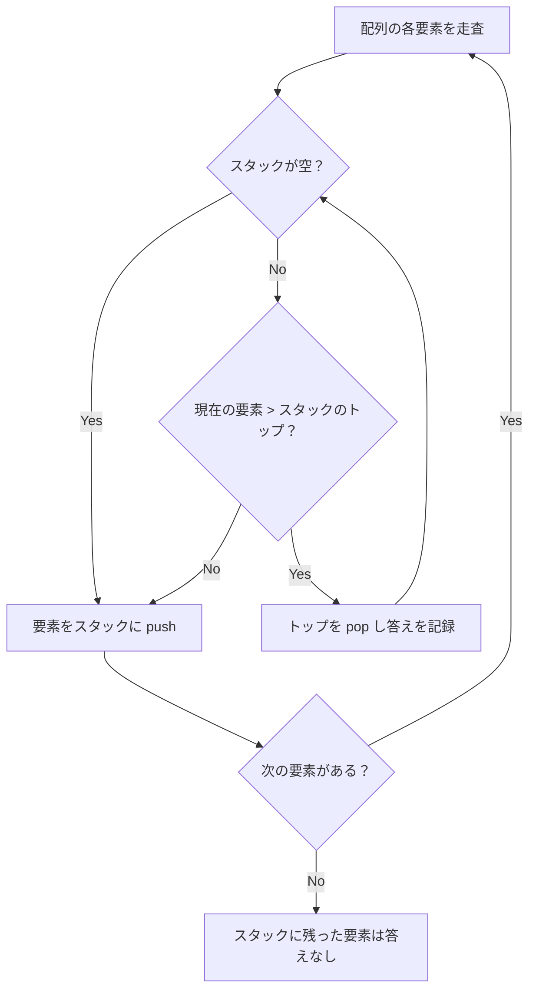

## 概要

Monotonic Stack（単調スタック）は、スタックの中身を**単調増加**または**単調減少**の順序に保つことで、配列中の各要素に対して「次に大きい要素」「前の小さい要素」などを効率的に求める手法。

ナイーブに各要素について右方向を線形探索すると $O(n^2)$ かかる問題を、$O(n)$ に削減できる。

コーディング面接やコンテストで頻出するパターンの一つ。

## 核となるアイデア

1. 配列を左から右へ走査し、各要素をスタックに積む
2. 新しい要素がスタックのトップとの**単調性を破る**場合、条件を満たすまでポップする
3. ポップされた要素にとって、現在の要素が「次に大きい（または小さい）要素」になる
4. ポップ後、現在の要素をスタックに積む

各要素はスタックに**最大1回 push され、最大1回 pop される**ため、全体で $O(n)$ 回の操作になる。



> 上記は単調減少スタック（Next Greater Element）のフロー。

## Monotonic Decreasing vs Increasing

| 種類 | スタックの順序 | 用途 |
|------|---------------|------|
| **単調減少スタック** | トップが最小（底→頂: 大→小） | Next Greater Element, Daily Temperatures |
| **単調増加スタック** | トップが最大（底→頂: 小→大） | Next Smaller Element, Largest Rectangle in Histogram |

**使い分けの原則**: 「次に**大きい**要素」を求めるなら**減少**スタック、「次に**小さい**要素」を求めるなら**増加**スタックを使う。

## テンプレート

Next Greater Element パターンの汎用テンプレート:

```go
// nextGreaterElements returns the next greater element for each index.
// If none exists, the value is -1.
func nextGreaterElements(nums []int) []int {
 n := len(nums)
 result := make([]int, n)
 for i := range result {
  result[i] = -1
 }

 stack := []int{} // stores indices

 for i := 0; i < n; i++ {
  // Pop while current element is greater than stack top
  for len(stack) > 0 && nums[i] > nums[stack[len(stack)-1]] {
   top := stack[len(stack)-1]
   stack = stack[:len(stack)-1]
   result[top] = nums[i]
  }
  stack = append(stack, i)
 }

 return result
}
```

## 計算量

| | 計算量 | 説明 |
|---|---|---|
| **時間** | $O(n)$ | 各要素は最大1回 push・最大1回 pop される |
| **空間** | $O(n)$ | スタックに最大 $n$ 要素が入る |

## 実問題

### 496. Next Greater Element I

[496. Next Greater Element I](https://leetcode.com/problems/next-greater-element-i/)

`nums1` が `nums2` の部分集合として与えられ、`nums1` の各要素について `nums2` 中での Next Greater Element を求める。

```go
func nextGreaterElement(nums1, nums2 []int) []int {
 // Precompute next greater for every element in nums2
 nge := map[int]int{}
 stack := []int{}

 for _, num := range nums2 {
  for len(stack) > 0 && num > stack[len(stack)-1] {
   nge[stack[len(stack)-1]] = num
   stack = stack[:len(stack)-1]
  }
  stack = append(stack, num)
 }

 result := make([]int, len(nums1))
 for i, num := range nums1 {
  if v, ok := nge[num]; ok {
   result[i] = v
  } else {
   result[i] = -1
  }
 }
 return result
}
```

### 739. Daily Temperatures

[739. Daily Temperatures](https://leetcode.com/problems/daily-temperatures/)

各日の気温について、それより暖かい日が何日後に来るかを求める。

```go
func dailyTemperatures(temperatures []int) []int {
 n := len(temperatures)
 answer := make([]int, n)
 stack := []int{} // stores indices

 for i := 0; i < n; i++ {
  for len(stack) > 0 && temperatures[i] > temperatures[stack[len(stack)-1]] {
   prev := stack[len(stack)-1]
   stack = stack[:len(stack)-1]
   answer[prev] = i - prev
  }
  stack = append(stack, i)
 }

 return answer
}
```

### 84. Largest Rectangle in Histogram

[84. Largest Rectangle in Histogram](https://leetcode.com/problems/largest-rectangle-in-histogram/)

ヒストグラムの棒の配列が与えられ、その中に含まれる最大の長方形の面積を求める。Hard 問題の典型。

単調**増加**スタックを使い、ポップ時にそのバーを高さとする長方形の幅を計算する。

```go
func largestRectangleArea(heights []int) int {
 stack := []int{}
 maxArea := 0
 n := len(heights)

 for i := 0; i <= n; i++ {
  // Use 0 as sentinel for the final flush
  h := 0
  if i < n {
   h = heights[i]
  }

  for len(stack) > 0 && h < heights[stack[len(stack)-1]] {
   top := stack[len(stack)-1]
   stack = stack[:len(stack)-1]

   width := i
   if len(stack) > 0 {
    width = i - stack[len(stack)-1] - 1
   }
   area := heights[top] * width
   if area > maxArea {
    maxArea = area
   }
  }
  stack = append(stack, i)
 }

 return maxArea
}
```

## 見極めるためのシグナル

以下のキーワードやパターンが問題文に現れたら単調スタックを疑う:

- 「次に大きい / 小さい要素」
- 「最も近い大きい / 小さい要素」
- 温度・株価など時系列で「次にXを超える日」
- ヒストグラム・建物のスカイラインなど**高さの範囲**を扱う問題
- スタック + 配列の組み合わせで $O(n)$ が求められる場面

## よくある間違い

1. **インデックスではなく値を積む**: スタックには**インデックス**を積むのが基本。値だけだと距離や幅の計算ができない
2. **等号の扱い**: `>` と `>=` の違いで結果が変わる。重複がある場合は特に注意
3. **残った要素の処理忘れ**: 走査後にスタックに残った要素は「答えなし（-1）」。番兵（sentinel）を使うと処理を統一できる
4. **単調の方向を逆にする**: 「次に大きい」なのに増加スタックを使ってしまう。ポップ条件を冷静に確認する

## 関連

- [Sliding Window](/wiki/algorithms/sliding-window/) - 連続部分列を効率的に探索する手法
- [Binary Search](/wiki/algorithms/binary-search/) - ソート済みデータの探索
- [Greedy](/wiki/algorithms/greedy/) - 局所最適の積み重ねで全体最適を求める手法
