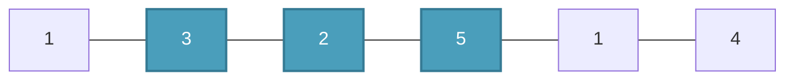
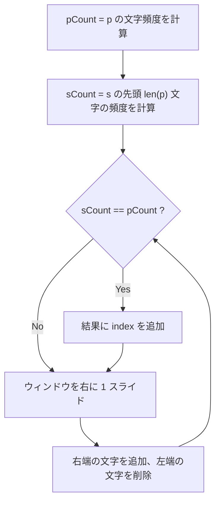

## 概要

Sliding Window（スライディングウィンドウ）[^1] は、配列や文字列の**連続する部分列**に対して条件を満たす解を効率的に探索する手法。ナイーブな二重ループ $O(n^2)$ を $O(n)$ に削減できることが多い。

[^1]: 日本の競技プログラミングでは特に可変幅パターンを**尺取り法**と呼ぶ。尺取虫が前端を伸ばし後端を引き寄せる動きに由来。

コーディング面接では最も頻出するパターンの一つ。

## 核となるアイデア

1. 左端 `left` と右端 `right` の2つのポインタでウィンドウを定義する
2. `right` を右に拡張してウィンドウに要素を追加する
3. 条件に応じて `left` を右に縮小して要素を除外する
4. 各ステップでウィンドウ内の状態（合計値、文字頻度など）を更新する

各要素がウィンドウに「入る」「出る」のそれぞれ最大1回ずつなので、全体で $O(n)$ になる。

```moonmaid
array { [1, 3, 2, 5, 1, 4] highlight(1..3, color=blue, label="window") }
```



> 青いノード（3, 2, 5）が現在のウィンドウ。`left = 1`, `right = 3`。

## 2つのパターン

### 固定幅ウィンドウ（Fixed-size）

ウィンドウのサイズが事前に決まっている場合。`right` が進むたびに `left` も同じだけ進む。

**使い所**: 「長さ k の部分配列の最大和」「長さ k のアナグラム検出」など。

**テンプレート:**

```go
// k: window size
for right := 0; right < len(arr); right++ {
    // add arr[right] to window state
    if right >= k {
        // remove arr[right-k] from window state
    }
    if right >= k-1 {
        // window is full — record result
    }
}
```

### 可変幅ウィンドウ（Variable-size）

条件を満たす最長 or 最短のウィンドウを探す場合。`left` は条件違反時にのみ進む。

**使い所**: 「条件を満たす最長部分配列」「合計が target 以上の最短部分配列」など。

**テンプレート:**

```go
left := 0
for right := 0; right < len(arr); right++ {
    // add arr[right] to window state
    for /* window violates condition */ {
        // remove arr[left] from window state
        left++
    }
    // update result (e.g., max length = right - left + 1)
}
```

## 計算量

| | 時間 | 空間 |
|---|---|---|
| 固定幅 | $O(n)$ | $O(1)$ ～ $O(k)$ |
| 可変幅 | $O(n)$ | $O(1)$ ～ $O(n)$ |

**なぜ $O(n)$ か:** `left` と `right` はそれぞれ最大 $n$ 回しか動かない。内側の `for` ループがあっても、`left` の合計移動回数は $n$ 以下なので、**償却 $O(n)$**（amortized $O(n)$）になる。

## 実問題での適用

### [438. Find All Anagrams in a String](https://leetcode.com/problems/find-all-anagrams-in-a-string/) — 固定幅

文字列 `s` の中から、文字列 `p` のアナグラムの開始インデックスを全て見つける。

**着眼点:** アナグラム ＝ 文字の出現頻度が同じ。ウィンドウサイズは `len(p)` で固定。



```go
func findAnagrams(s string, p string) []int {
    if len(s) < len(p) {
        return nil
    }

    result := []int{}
    var sCount, pCount [26]int
    for i := 0; i < len(p); i++ {
        pCount[p[i]-'a']++
        sCount[s[i]-'a']++
    }
    if sCount == pCount {
        result = append(result, 0)
    }

    for i := len(p); i < len(s); i++ {
        sCount[s[i]-'a']++
        sCount[s[i-len(p)]-'a']--
        if sCount == pCount {
            result = append(result, i-len(p)+1)
        }
    }
    return result
}
```

**ポイント:** Go では固定長配列 `[26]int` の比較が `==` で可能。HashMap を使う言語では毎回比較に $O(26)$ かかるが、アルファベットサイズは定数なので全体は $O(n)$。

### [1151. Minimum Swaps to Group All 1's Together](https://leetcode.com/problems/minimum-swaps-to-group-all-1s-together/) — 固定幅

配列中の全ての 1 を隣接させるために必要な最小スワップ回数。

**着眼点:** 1 の総数 = ウィンドウサイズ。ウィンドウ内の 0 の数 = 必要なスワップ回数。

```go
func minSwaps(data []int) int {
    ones := 0
    for _, v := range data {
        ones += v
    }
    if ones <= 1 {
        return 0
    }

    // Count zeros in the initial window [0..ones-1]
    zeros := 0
    for i := 0; i < ones; i++ {
        if data[i] == 0 {
            zeros++
        }
    }
    minZeros := zeros

    // Slide the window: add right end, remove left end
    for i := ones; i < len(data); i++ {
        if data[i] == 0 {
            zeros++
        }
        if data[i-ones] == 0 {
            zeros--
        }
        if zeros < minZeros {
            minZeros = zeros
        }
    }
    return minZeros
}
```

### [2134. Minimum Swaps to Group All 1's Together II](https://leetcode.com/problems/minimum-swaps-to-group-all-1s-together-ii/) — 円形配列

1151 の拡張。配列が**円形**になる。

**着眼点:** 円形配列はインデックスを `% n` でラップすることで線形配列と同じように扱える。ウィンドウの考え方は 1151 と同じ。

```go
func minSwaps(nums []int) int {
    ones := 0
    for _, v := range nums {
        ones += v
    }
    if ones <= 1 {
        return 0
    }

    n := len(nums)

    // Count zeros in the initial window [0..ones-1]
    zeros := 0
    for i := 0; i < ones; i++ {
        if nums[i] == 0 {
            zeros++
        }
    }
    minZeros := zeros

    // Slide the window with circular indexing
    for i := ones; i < ones+n; i++ {
        if nums[i%n] == 0 {
            zeros++
        }
        if nums[(i-ones)%n] == 0 {
            zeros--
        }
        if zeros < minZeros {
            minZeros = zeros
        }
    }
    return minZeros
}
```

**1151 との違い:** ループが `for i := ones; i < ones+n` になり `% n` で循環する。構造は 1151 と同じ「右端追加→左端削除」のパターン。

## 見極めるためのシグナル

以下のキーワードが問題文に含まれていたら Sliding Window を疑う:

- **連続** (contiguous) な部分配列 / 部分文字列
- **最長** / **最短** の条件付き部分列
- **固定長 k** の部分列に対する最大・最小
- **アナグラム** / **順列** の検出
- **ウィンドウ** という言葉そのもの

逆に、部分列が連続でなくてよい場合（subsequence）は Sliding Window ではなく DP や Two Pointers を検討する。

## よくある間違い

1. **`left` の進め方**: `if` ではなく `for` で縮小すること。1回の `right` 移動で `left` が複数回動く場合がある
2. **Off-by-one**: ウィンドウが「満杯になるタイミング」を間違えやすい。固定幅なら `right >= k-1` で初めて結果を記録
3. **円形配列**: `% n` を忘れるとインデックス範囲外エラー

## 関連

- [Two Pointers](/wiki/algorithms/two-pointers/) — ソート済み配列の探索やリンクリストのサイクル検出に使う汎用的な手法
- [DFS (Depth-First Search)](/wiki/algorithms/dfs/) — グラフ・グリッド探索の基本手法
