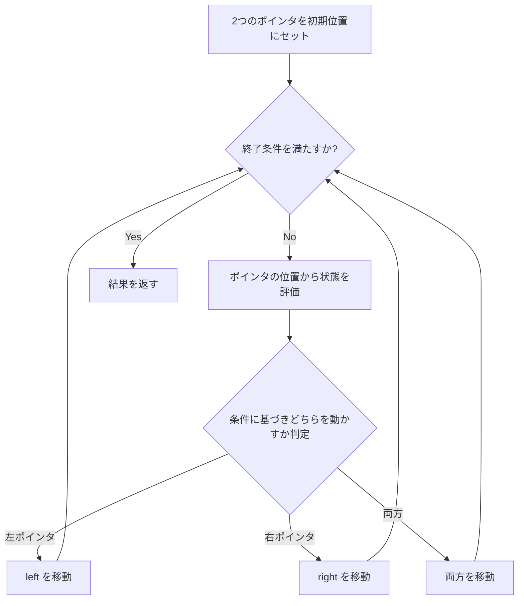
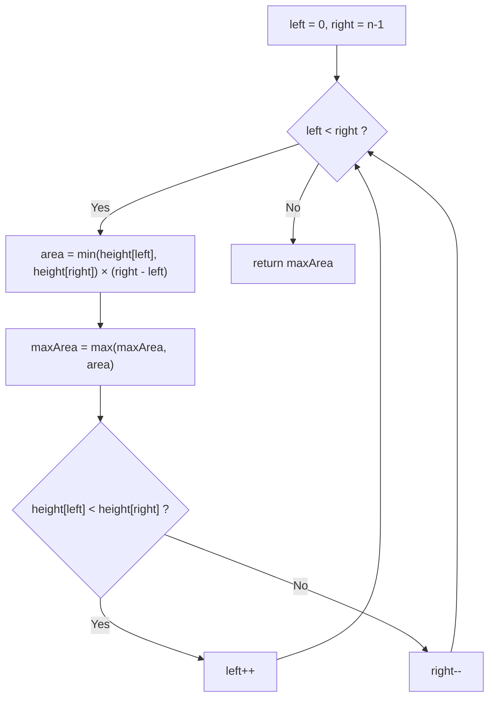

## 概要

Two Pointers（二つのポインタ）は、配列やリンクリスト上で**2つのインデックス（ポインタ）**を同時に操作して解を探索する手法。ナイーブな二重ループ $O(n^2)$ を $O(n)$ に削減できる場合が多い。

Sliding Window が「連続する部分列」に特化しているのに対し、Two Pointers はより汎用的で、**ソート済み配列の探索**や**リンクリストのサイクル検出**など幅広い場面で活用される。

## 核となるアイデア

配列の状態に応じてポインタの移動方向を決定し、不要な探索を枝刈りすることで計算量を削減する。



## パターン

### 逆方向（Opposite Direction）

ソート済み配列の**両端**からポインタを中央に向かって収束させる。条件に応じて左端を右に、右端を左に動かす。

**使い所**: ソート済み配列でのペア探索、面積の最大化など。

**テンプレート:**

```go
func oppositeDirection(arr []int) {
    left, right := 0, len(arr)-1
    for left < right {
        // evaluate condition using arr[left] and arr[right]
        if /* need larger value */ {
            left++
        } else if /* need smaller value */ {
            right--
        } else {
            // found target
            break
        }
    }
}
```

### 同方向（Same Direction / Fast-Slow）

2つのポインタが**同じ方向**に進むが、速度が異なる。slow ポインタは条件を満たしたときだけ進み、fast ポインタは毎回進む。

**使い所**: 重複除去、特定要素の移動、リンクリストのサイクル検出など。

**テンプレート:**

```go
func sameDirection(arr []int) int {
    slow := 0
    for fast := 0; fast < len(arr); fast++ {
        if /* arr[fast] satisfies condition */ {
            arr[slow] = arr[fast]
            slow++
        }
    }
    return slow // new length
}
```

### 分割（Partitioning / Dutch National Flag）

配列を**3つの領域**に分割する。3つのポインタ（low, mid, high）を使い、要素を適切な領域に振り分ける。

**使い所**: 3値ソート、ピボットによる配列分割など。

**テンプレート:**

```go
func partition(arr []int, pivot int) {
    low, mid, high := 0, 0, len(arr)-1
    for mid <= high {
        switch {
        case arr[mid] < pivot:
            arr[low], arr[mid] = arr[mid], arr[low]
            low++
            mid++
        case arr[mid] > pivot:
            arr[mid], arr[high] = arr[high], arr[mid]
            high--
        default:
            mid++
        }
    }
}
```

## 計算量

| パターン | 時間 | 空間 |
|---|---|---|
| 逆方向 | $O(n)$ | $O(1)$ |
| 同方向 | $O(n)$ | $O(1)$ |
| 分割 | $O(n)$ | $O(1)$ |

**なぜ $O(n)$ か:** 各ポインタは配列を最大1回走査する。逆方向パターンでは `left` と `right` の合計移動回数が $n$ 以下、同方向パターンでは `fast` が $n$ 回移動し `slow` はそれ以下。いずれの場合も**全体で $O(n)$** となる。

## 実問題での適用

### [167. Two Sum II – Input Array Is Sorted](https://leetcode.com/problems/two-sum-ii-input-array-is-sorted/) — 逆方向

ソート済み配列から合計が `target` になるペアのインデックスを見つける（1-indexed）。

**着眼点:** ソート済みなので、合計が大きすぎれば `right--`、小さすぎれば `left++` で探索空間を狭められる。

```go
func twoSum(numbers []int, target int) []int {
    left, right := 0, len(numbers)-1
    for left < right {
        sum := numbers[left] + numbers[right]
        switch {
        case sum < target:
            left++
        case sum > target:
            right--
        default:
            return []int{left + 1, right + 1}
        }
    }
    return nil
}
```

### [11. Container With Most Water](https://leetcode.com/problems/container-with-most-water/) — 逆方向

高さの配列が与えられ、2本の線で作れる容器の最大水量を求める。

**着眼点:** 幅を最大から始めて、短い方の線を内側に移動させる。短い方を動かさないと面積が増える可能性がない。



```go
func maxArea(height []int) int {
    left, right := 0, len(height)-1
    maxWater := 0
    for left < right {
        h := min(height[left], height[right])
        water := h * (right - left)
        if water > maxWater {
            maxWater = water
        }
        if height[left] < height[right] {
            left++
        } else {
            right--
        }
    }
    return maxWater
}
```

### [283. Move Zeroes](https://leetcode.com/problems/move-zeroes/) — 同方向

配列内の 0 を末尾に移動し、非ゼロ要素の相対順序を維持する（in-place）。

**着眼点:** `slow` は次に非ゼロ要素を書き込む位置を指す。`fast` が非ゼロ要素を見つけたら `slow` の位置にスワップする。

```go
func moveZeroes(nums []int) {
    slow := 0
    for fast := 0; fast < len(nums); fast++ {
        if nums[fast] != 0 {
            nums[slow], nums[fast] = nums[fast], nums[slow]
            slow++
        }
    }
}
```

## 見極めるためのシグナル

以下のキーワードが問題文に含まれていたら Two Pointers を疑う:

- **ソート済み**配列でのペア・トリプレット探索
- **in-place** での要素削除・移動
- **サイクル検出**（リンクリスト）
- 2つの値の**和・差**が特定の条件を満たす
- 配列の**分割**・**パーティション**
- **回文**判定

逆に、部分列が**連続**でなければならない場合は [Sliding Window](/wiki/algorithms/sliding-window/) を優先的に検討する。

## よくある間違い

1. **ソート済みの前提を忘れる**: 逆方向パターンは配列がソート済みであることが前提。未ソートの場合は先にソートするか、別の手法を使う
2. **ポインタの更新漏れ**: `else` 分岐でポインタを動かし忘れると無限ループになる
3. **境界条件**: `left < right` と `left <= right` の使い分けを間違えると、同じ要素を2回使ったり、要素を見落としたりする
4. **スワップの順序**: 分割パターンで `mid` と `high` をスワップした後、`mid` を進めてはいけない（新しく来た要素の検査が必要）

## 関連

- [Sliding Window](/wiki/algorithms/sliding-window/) — 連続部分列に特化した Two Pointers の派生パターン
- [DFS (Depth-First Search)](/wiki/algorithms/dfs/) — グラフ・グリッド探索の基本手法
- [BFS (Breadth-First Search)](/wiki/algorithms/bfs/) — 最短経路探索の基本手法
