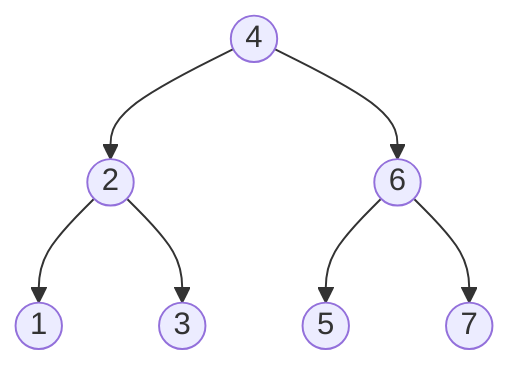

## 概要

**二分木（Binary Tree）** は各ノードが最大 2 つの子（左・右）を持つ木構造。**二分探索木（BST）** は「左部分木のすべての値 < ノードの値 < 右部分木のすべての値」という不変条件を追加で満たす二分木。

基本用語:

| 用語 | 説明 |
|---|---|
| 根 (root) | 親を持たない最上位ノード |
| 葉 (leaf) | 子を持たないノード |
| 高さ (height) | ノードから最も遠い葉までの辺の数。木の高さは根の高さ |
| 深さ (depth) | 根からそのノードまでの辺の数 |

コーディング面接では、再帰的な分割統治の考え方を問う問題として頻出する。

```moonmaid
tree bst { insert(4, 2, 6, 1, 3, 5, 7) }
```

```go
type TreeNode struct {
    Val         int
    Left, Right *TreeNode
}
```

## 走査

以下のサンプル木で各走査順を確認する。



| 走査 | 順序 | 結果 | 用途 |
|---|---|---|---|
| Inorder | 左 → 根 → 右 | 1, 2, 3, 4, 5, 6, 7 | BST ではソート順になる |
| Preorder | 根 → 左 → 右 | 4, 2, 1, 3, 6, 5, 7 | 木のシリアライズ |
| Postorder | 左 → 右 → 根 | 1, 3, 2, 5, 7, 6, 4 | 部分木の削除・集約 |
| Level-order | 幅優先 (BFS) | 4, 2, 6, 1, 3, 5, 7 | [BFS](/wiki/algorithms/bfs/) を参照 |

> Preorder / Inorder / Postorder は全て [DFS](/wiki/algorithms/dfs/) の一種で、ノードを処理するタイミングが異なるだけ。Level-order だけが [BFS](/wiki/algorithms/bfs/)。

## テンプレート

### 再帰（Inorder）

```go
func inorder(root *TreeNode) []int {
    if root == nil {
        return nil
    }
    var result []int
    result = append(result, inorder(root.Left)...)
    result = append(result, root.Val)
    result = append(result, inorder(root.Right)...)
    return result
}
```

### 反復 — スタックによる Inorder

```go
func inorderIterative(root *TreeNode) []int {
    var result []int
    var stack []*TreeNode
    curr := root
    for curr != nil || len(stack) > 0 {
        // go as far left as possible
        for curr != nil {
            stack = append(stack, curr)
            curr = curr.Left
        }
        curr = stack[len(stack)-1]
        stack = stack[:len(stack)-1]
        result = append(result, curr.Val)
        curr = curr.Right
    }
    return result
}
```

:::tip
Preorder は `stack` に push する順序を **右 → 左** にするだけで実装できる。Postorder は Preorder（根→右→左）の結果を反転させるのが最も簡潔。
:::

## パターン

### 高さ・深さの計算

木の高さは再帰で $O(n)$ で求まる。

```go
func maxDepth(root *TreeNode) int {
    if root == nil {
        return 0
    }
    left := maxDepth(root.Left)
    right := maxDepth(root.Right)
    return max(left, right) + 1
}
```

### LCA（Lowest Common Ancestor）

BST では値の大小比較だけで $O(h)$ で求まる。一般の二分木では左右の部分木を再帰探索し、両方から見つかったノードが LCA。

```go
// LCA for a general binary tree
func lowestCommonAncestor(root, p, q *TreeNode) *TreeNode {
    if root == nil || root == p || root == q {
        return root
    }
    left := lowestCommonAncestor(root.Left, p, q)
    right := lowestCommonAncestor(root.Right, p, q)
    if left != nil && right != nil {
        return root // current node is the LCA
    }
    if left != nil {
        return left
    }
    return right
}
```

### Path Sum 系

根からの累積和を引数で渡しながら再帰するパターン。バックトラックが必要な場合はスライスの pop を忘れないこと。

### BST の検証

中間順走査がソート済みであることを確認するか、各ノードに有効範囲 $(min, max)$ を持たせて再帰する。

```go
func isValidBST(root *TreeNode) bool {
    return validate(root, math.MinInt64, math.MaxInt64)
}

func validate(node *TreeNode, lo, hi int) bool {
    if node == nil {
        return true
    }
    if node.Val <= lo || node.Val >= hi {
        return false
    }
    return validate(node.Left, lo, node.Val) &&
        validate(node.Right, node.Val, hi)
}
```

## 計算量

| 操作 | 時間 | 空間 |
|---|---|---|
| 走査（全ノード訪問） | $O(n)$ | $O(h)$（再帰スタック） |
| BST 検索・挿入・削除 | 平均 $O(\log n)$、最悪 $O(n)$ | $O(h)$ |
| BST バランス保証時 | $O(\log n)$ | $O(\log n)$ |

ここで $h$ は木の高さ。バランス木なら $h = O(\log n)$、偏った木なら $h = O(n)$。

## 実問題での適用

### [104. Maximum Depth of Binary Tree](https://leetcode.com/problems/maximum-depth-of-binary-tree/) — Easy

二分木の最大の深さを求める。

**着眼点**: 左右の部分木の深さの最大値 + 1 を返す再帰。ベースケースは `nil` で 0。

```go
func maxDepth(root *TreeNode) int {
    if root == nil {
        return 0
    }
    return max(maxDepth(root.Left), maxDepth(root.Right)) + 1
}
```

---

### [226. Invert Binary Tree](https://leetcode.com/problems/invert-binary-tree/) — Easy

二分木を左右反転する。

**着眼点**: 各ノードで左右の子を交換し、再帰的に部分木を反転する。

```go
func invertTree(root *TreeNode) *TreeNode {
    if root == nil {
        return nil
    }
    root.Left, root.Right = root.Right, root.Left
    invertTree(root.Left)
    invertTree(root.Right)
    return root
}
```

---

### [98. Validate Binary Search Tree](https://leetcode.com/problems/validate-binary-search-tree/) — Medium

与えられた二分木が BST であるかを判定する。

**着眼点**: 各ノードに有効範囲 $(lo, hi)$ を持たせて再帰する。左の子には上限を、右の子には下限を伝播させる。

```go
func isValidBST(root *TreeNode) bool {
    return validate(root, math.MinInt64, math.MaxInt64)
}

func validate(node *TreeNode, lo, hi int) bool {
    if node == nil {
        return true
    }
    if node.Val <= lo || node.Val >= hi {
        return false
    }
    return validate(node.Left, lo, node.Val) &&
        validate(node.Right, node.Val, hi)
}
```

**ポイント:**

- `<=` / `>=` で境界値自体も排除する（BST は厳密な不等号）
- `math.MinInt64` / `math.MaxInt64` を初期範囲にすることで、int 型の全範囲をカバー

## 見極めるためのシグナル

- 「木の高さ・深さ」を求める
- 「左右対称か判定」
- 「パスの合計値」
- 「BST のバリデーション・変換」
- 「二分木のシリアライズ / デシリアライズ」
- 再帰的な分割統治が自然に適用できる構造

## よくある間違い

1. **ベースケースの欠落**: `root == nil` のチェックを忘れると nil ポインタ参照でパニックする
2. **BST の条件を局所的にしか見ない**: 「左の子 < 親 < 右の子」だけでは不十分。部分木全体に対する制約を伝播させる必要がある
3. **再帰の戻り値を無視**: 左右の再帰結果を組み合わせずに片方だけ返してしまう
4. **反復走査でのスタック管理ミス**: `curr` と `stack` の状態遷移を正しく追わないと無限ループや要素の欠落が起こる

## 関連

- [DFS](/wiki/algorithms/dfs/) — 深さ優先探索。木の走査は DFS の特殊ケース
- [BFS](/wiki/algorithms/bfs/) — Level-order 走査で使用
- [Heap / Priority Queue](/wiki/data-structures/heap/) — 完全二分木によるヒープ
