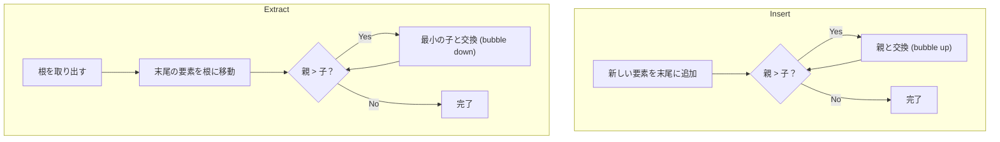
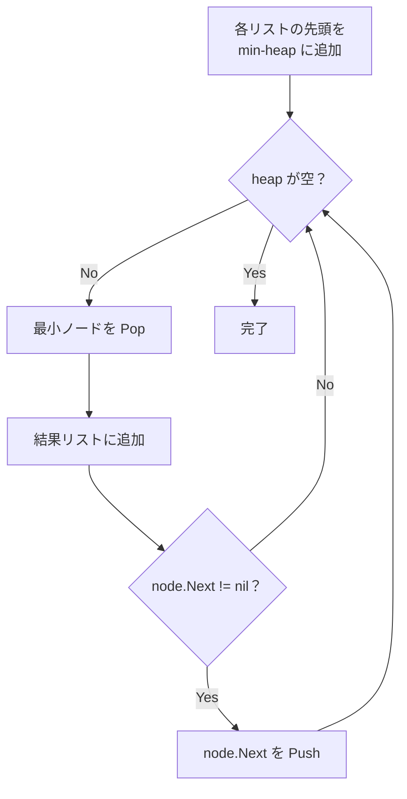
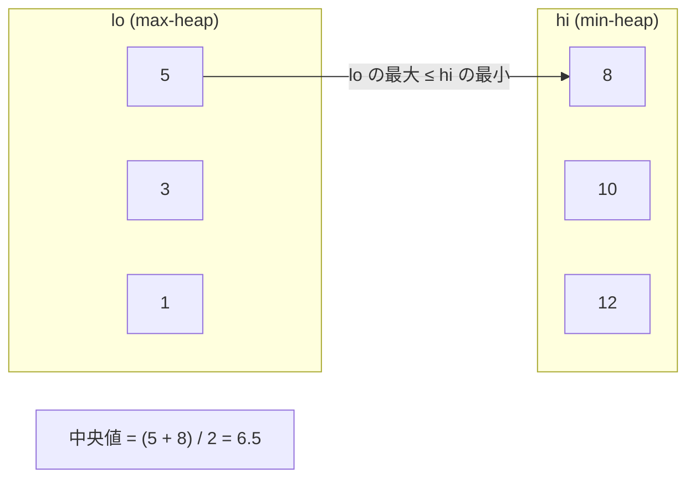

## 概要

ヒープ（Heap）は**ヒープ条件を満たす完全二分木**。最小ヒープでは親ノードが常に子以下の値を持ち、根が最小値となる。Priority Queue（優先度付きキュー）は「最も優先度の高い要素を効率的に取得する」という**抽象データ型**であり、ヒープはその代表的な実装。

Go では `container/heap` パッケージが提供するインターフェースを実装することでヒープを使う。

コーディング面接では、**動的に追加されるデータから最小値・最大値を効率的に取得する**必要がある場面で出題される。

## 核となるアイデア

- **Insert**: 末尾に追加し、親と比較しながら上方向に交換（bubble up）— $O(\log n)$
- **Extract min/max**: 根を取り出し、末尾の要素を根に移動して下方向に交換（bubble down）— $O(\log n)$
- **Peek**: 根を参照するだけ — $O(1)$



## Go の container/heap

`container/heap` を使うには、以下の 5 つのメソッドを実装する。

```go
type Interface interface {
    sort.Interface          // Len, Less, Swap
    Push(x any)             // add element
    Pop() any               // remove and return the last element
}
```

**再利用可能な IntHeap テンプレート:**

```go
type IntHeap []int

func (h IntHeap) Len() int            { return len(h) }
func (h IntHeap) Less(i, j int) bool  { return h[i] < h[j] } // min-heap
func (h IntHeap) Swap(i, j int)       { h[i], h[j] = h[j], h[i] }
func (h *IntHeap) Push(x any)         { *h = append(*h, x.(int)) }
func (h *IntHeap) Pop() any {
    old := *h
    n := len(old)
    x := old[n-1]
    *h = old[:n-1]
    return x
}
```

:::caution
`Push` / `Pop` は**ポインタレシーバ**で実装する。値レシーバにするとスライスの変更が呼び出し元に反映されない。
:::

## 計算量

| 操作 | 時間 |
|---|---|
| Insert | $O(\log n)$ |
| Extract min/max | $O(\log n)$ |
| Peek | $O(1)$ |
| Build heap | $O(n)$ |

## 実問題での適用

### [23. Merge K Sorted Lists](https://leetcode.com/problems/merge-k-sorted-lists/) — Hard

k 個のソート済み連結リストを 1 つのソート済みリストにマージする。

**着眼点**: サイズ k の最小ヒープを使い、常に最小のノードを取り出す。取り出したノードに `Next` があればヒープに追加する。全ノード数を $N$ とすると、各ノードのヒープ操作は $O(\log k)$ なので全体で $O(N \log k)$。



```go
// Definition for singly-linked list.
// type ListNode struct {
//     Val  int
//     Next *ListNode
// }

type ListNodeHeap []*ListNode

func (h ListNodeHeap) Len() int            { return len(h) }
func (h ListNodeHeap) Less(i, j int) bool  { return h[i].Val < h[j].Val }
func (h ListNodeHeap) Swap(i, j int)       { h[i], h[j] = h[j], h[i] }
func (h *ListNodeHeap) Push(x any)         { *h = append(*h, x.(*ListNode)) }
func (h *ListNodeHeap) Pop() any {
    old := *h
    n := len(old)
    x := old[n-1]
    *h = old[:n-1]
    return x
}

func mergeKLists(lists []*ListNode) *ListNode {
    h := &ListNodeHeap{}
    for _, l := range lists {
        if l != nil {
            heap.Push(h, l)
        }
    }
    dummy := &ListNode{}
    curr := dummy
    for h.Len() > 0 {
        node := heap.Pop(h).(*ListNode)
        curr.Next = node
        curr = curr.Next
        if node.Next != nil {
            heap.Push(h, node.Next)
        }
    }
    return dummy.Next
}
```

**ポイント:**
- ヒープのサイズは常に最大 $k$ なので、各 Push/Pop は $O(\log k)$
- `nil` のリストをヒープに入れないようガードする
- ダミーヘッドを使うと結果リストの組み立てが簡潔になる

---

### [295. Find Median from Data Stream](https://leetcode.com/problems/find-median-from-data-stream/) — Hard

データストリームから中央値をリアルタイムに求める。

**着眼点 — Dual Heap**: 下位半分を格納する**最大ヒープ** (`lo`) と上位半分を格納する**最小ヒープ** (`hi`) の 2 つを使う。サイズの差を最大 1 に保つことで、中央値はヒープの根から $O(1)$ で取得できる。



```go
type MaxHeap []int

func (h MaxHeap) Len() int            { return len(h) }
func (h MaxHeap) Less(i, j int) bool  { return h[i] > h[j] }
func (h MaxHeap) Swap(i, j int)       { h[i], h[j] = h[j], h[i] }
func (h *MaxHeap) Push(x any)         { *h = append(*h, x.(int)) }
func (h *MaxHeap) Pop() any {
    old := *h
    n := len(old)
    x := old[n-1]
    *h = old[:n-1]
    return x
}

type MinHeap []int

func (h MinHeap) Len() int            { return len(h) }
func (h MinHeap) Less(i, j int) bool  { return h[i] < h[j] }
func (h MinHeap) Swap(i, j int)       { h[i], h[j] = h[j], h[i] }
func (h *MinHeap) Push(x any)         { *h = append(*h, x.(int)) }
func (h *MinHeap) Pop() any {
    old := *h
    n := len(old)
    x := old[n-1]
    *h = old[:n-1]
    return x
}

type MedianFinder struct {
    lo *MaxHeap // max-heap: lower half
    hi *MinHeap // min-heap: upper half
}

func Constructor() MedianFinder {
    return MedianFinder{lo: &MaxHeap{}, hi: &MinHeap{}}
}

func (mf *MedianFinder) AddNum(num int) {
    heap.Push(mf.lo, num)
    // move max of lower half to upper half
    heap.Push(mf.hi, heap.Pop(mf.lo))
    // balance: lower half should be >= upper half in size
    if mf.lo.Len() < mf.hi.Len() {
        heap.Push(mf.lo, heap.Pop(mf.hi))
    }
}

func (mf *MedianFinder) FindMedian() float64 {
    if mf.lo.Len() > mf.hi.Len() {
        return float64((*mf.lo)[0])
    }
    return float64((*mf.lo)[0]+(*mf.hi)[0]) / 2.0
}
```

**ポイント:**
- `AddNum` は常に `lo` → `hi` → バランス調整の順で要素を流す。これにより `lo` の最大値 ≤ `hi` の最小値が保証される
- `lo.Len() >= hi.Len()` を維持するため、要素数が奇数のときは `lo` の根が中央値
- 各 `AddNum` は最大 3 回のヒープ操作で $O(\log n)$、`FindMedian` は $O(1)$

## 見極めるためのシグナル

- 「k 番目に大きい / 小さい」
- 「k 個のソート済みリストをマージ」
- 動的データからの「中央値」
- 「頻度の高い上位 k 個」
- ストリームからの逐次的な最小値・最大値

## よくある間違い

1. **Go の `container/heap`**: `Push` / `Pop` を値レシーバで実装してしまい、スライスの変更が反映されない
2. **Dual Heap のバランス方向**: どちらのヒープを大きく保つかを間違えると中央値の取得ロジックが壊れる
3. **Heap vs ソート**: top-k を一度だけ求めるならソートの方がシンプルな場合がある。ヒープはデータが動的に追加される場面で威力を発揮する

## 関連

- [LRU Cache](/wiki/data-structures/lru-cache/) — HashMap + 双方向連結リストによるキャッシュ設計
- [Greedy](/wiki/algorithms/greedy/) — 局所最適を積み重ねる戦略
- [Sliding Window](/wiki/algorithms/sliding-window/) — 配列上の探索パターン
