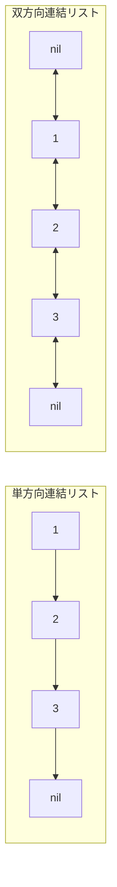
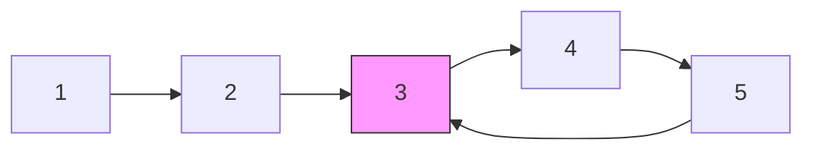

## 概要

Linked List（連結リスト）は、各ノードがデータと次のノードへのポインタを持つ線形データ構造。配列と異なり、メモリ上で連続している必要がなく、**先頭・中間への挿入・削除が $O(1)$** で行える（位置が既知の場合）。

| 特性 | 配列 | 単方向連結リスト | 双方向連結リスト |
|---|---|---|---|
| インデックスアクセス | $O(1)$ | $O(n)$ | $O(n)$ |
| 先頭挿入/削除 | $O(n)$ | $O(1)$ | $O(1)$ |
| 末尾挿入/削除 | $O(1)$（償却） | $O(n)$ / $O(1)$[^1] | $O(1)$ |
| 任意位置の挿入/削除 | $O(n)$ | $O(1)$（参照あり） | $O(1)$（参照あり） |
| メモリ | 連続 | 非連続 | 非連続 |

[^1]: tail ポインタを保持すれば末尾挿入は $O(1)$、ただし末尾削除は前のノードを辿る必要があるため $O(n)$。

**使い分け**: ランダムアクセスが不要で、頻繁な挿入・削除が必要な場面（キュー、LRU Cache など）では連結リストが有利。

## 核となるアイデア

連結リストの問題はポインタ操作が核。ノード間のリンクを付け替えることで、追加メモリなしに構造を変更できる。



面接で頻出するパターンは**反転**、**Fast & Slow ポインタ**、**マージ**、**ダミーヘッド**の4つ。

## パターン

### 反転（Reversal）

リストの各ノードの `Next` ポインタを逆方向に付け替える。

**反復版（Iterative）:**

```go
func reverseList(head *ListNode) *ListNode {
    var prev *ListNode
    curr := head
    for curr != nil {
        next := curr.Next   // save next
        curr.Next = prev     // reverse link
        prev = curr          // advance prev
        curr = next          // advance curr
    }
    return prev
}
```

**再帰版（Recursive）:**

```go
func reverseList(head *ListNode) *ListNode {
    if head == nil || head.Next == nil {
        return head
    }
    newHead := reverseList(head.Next)
    head.Next.Next = head  // reverse link
    head.Next = nil        // break old link
    return newHead
}
```

**ポイント:** 反復版は $O(1)$ 空間、再帰版は $O(n)$ スタック空間。面接では反復版が求められることが多い。

### Two-Pointer / Fast & Slow

速度の異なる2つのポインタを使う手法。slow は1ステップ、fast は2ステップ進む。

**サイクル検出（Floyd's Algorithm）:**



サイクルがあれば fast と slow は必ず出会う。サイクルがなければ fast が `nil` に到達する。

**中間ノードの取得:** fast がリスト末尾に到達したとき、slow は中間ノードを指している。

### ソート済みリストのマージ

2つのソート済みリストを1つのソート済みリストに統合する。ダミーヘッドを使うとコードが簡潔になる。

### ダミーヘッド（Dummy Head）

リストの先頭ノードが変わる可能性がある操作（削除、マージなど）では、ダミーの先頭ノードを作成し `dummy.Next` を最終的な先頭として返す。これにより先頭の特別扱いが不要になる。

```go
dummy := &ListNode{}
curr := dummy
// ... build or modify list using curr ...
return dummy.Next
```

## 実問題での適用

### [206. Reverse Linked List](https://leetcode.com/problems/reverse-linked-list/)

単方向連結リストを反転させる。

```go
// iterative approach: O(n) time, O(1) space
func reverseList(head *ListNode) *ListNode {
    var prev *ListNode
    curr := head
    for curr != nil {
        next := curr.Next
        curr.Next = prev
        prev = curr
        curr = next
    }
    return prev
}
```

### [21. Merge Two Sorted Lists](https://leetcode.com/problems/merge-two-sorted-lists/)

2つのソート済み連結リストを1つのソート済みリストにマージする。

```go
func mergeTwoLists(list1 *ListNode, list2 *ListNode) *ListNode {
    dummy := &ListNode{}
    curr := dummy
    for list1 != nil && list2 != nil {
        if list1.Val <= list2.Val {
            curr.Next = list1
            list1 = list1.Next
        } else {
            curr.Next = list2
            list2 = list2.Next
        }
        curr = curr.Next
    }
    // attach remaining nodes
    if list1 != nil {
        curr.Next = list1
    } else {
        curr.Next = list2
    }
    return dummy.Next
}
```

### [141. Linked List Cycle](https://leetcode.com/problems/linked-list-cycle/)

連結リストにサイクルがあるか判定する。Floyd's Cycle Detection を使う。

```go
func hasCycle(head *ListNode) bool {
    slow, fast := head, head
    for fast != nil && fast.Next != nil {
        slow = slow.Next
        fast = fast.Next.Next
        if slow == fast {
            return true
        }
    }
    return false
}
```

**発展: [142. Linked List Cycle II](https://leetcode.com/problems/linked-list-cycle-ii/)** — サイクルの開始ノードを見つける。slow と fast が出会った後、一方を head に戻して両方1ステップずつ進めると、サイクル開始点で再び出会う。

```go
func detectCycle(head *ListNode) *ListNode {
    slow, fast := head, head
    for fast != nil && fast.Next != nil {
        slow = slow.Next
        fast = fast.Next.Next
        if slow == fast {
            // reset one pointer to head
            slow = head
            for slow != fast {
                slow = slow.Next
                fast = fast.Next
            }
            return slow
        }
    }
    return nil
}
```

## 見極めるためのシグナル

- 「連結リストを反転せよ」「リストをマージせよ」
- 「サイクルがあるか判定」「サイクルの開始点を見つけよ」
- 「リストの中間ノードを求めよ」
- 先頭ノードが変わる操作 → ダミーヘッドを検討
- $O(1)$ 空間で in-place 操作が求められる

## よくある間違い

1. **`nil` チェック漏れ**: `curr.Next` にアクセスする前に `curr != nil` を確認しないと panic になる
2. **ポインタ更新順序の誤り**: 反転時に `next` を保存する前に `curr.Next` を上書きすると、リストの残りを見失う
3. **ダミーヘッドを使わない**: 先頭ノードの削除やマージで、先頭の特別扱いが必要になりコードが複雑化する
4. **fast ポインタの境界条件**: `fast != nil && fast.Next != nil` の両方をチェックしないと、奇数長リストで panic になる
5. **サイクル開始点の数学を誤解**: Floyd's Algorithm でなぜ head から再スタートすると開始点で出会うのか、証明を理解しておくこと

## 関連

- [LRU Cache](/wiki/data-structures/lru-cache/) — 双方向連結リスト + HashMap による $O(1)$ キャッシュ
- [Heap](/wiki/data-structures/heap/) — 優先度付きキュー
- [Two Pointers](/wiki/algorithms/two-pointers/) — 配列・リスト上の二つのポインタ手法
