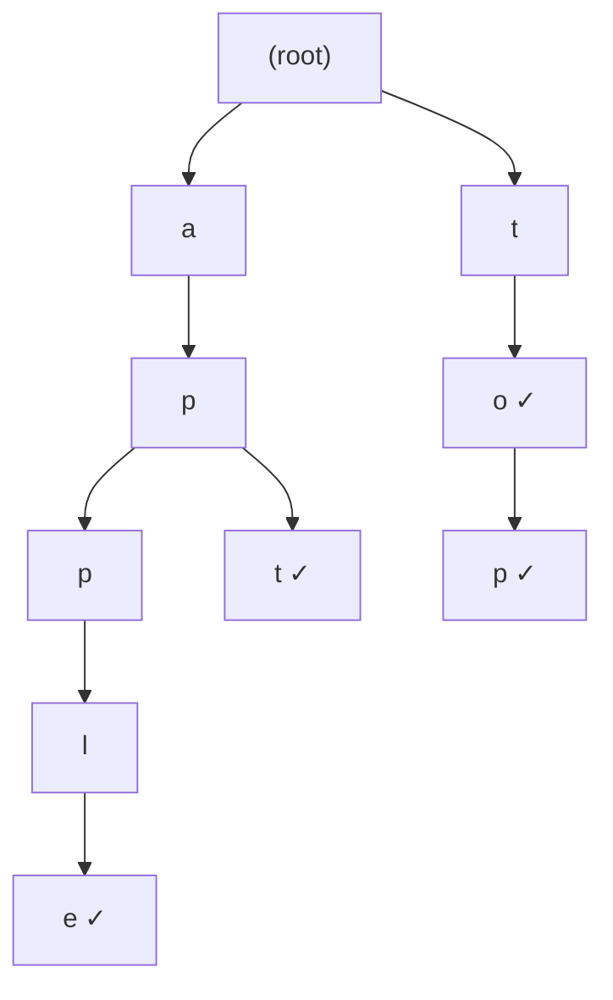

## 概要

Trie（トライ、接頭辞木）は文字列の集合を効率的に格納・検索するための木構造。各ノードが1文字を表し、ルートから葉へのパスが1つの単語に対応する。

**主な用途:**

- **オートコンプリート**: 入力中の接頭辞に一致する候補を高速に取得
- **スペルチェック**: 辞書に単語が存在するかの判定
- **IP ルーティング**: 最長接頭辞マッチング
- **文字列検索問題**: 接頭辞ベースの問い合わせが頻出する場面

**計算量**: 単語の長さを $m$ とすると、挿入・検索・接頭辞検索すべて $O(m)$。HashMap を使った場合と同じ時間計算量だが、Trie は**共通の接頭辞を共有する**ためメモリ効率が良く、接頭辞に基づく操作（前方一致検索など）が自然にサポートされる。

## 核となるアイデア

Trie は各ノードが子ノードへのマッピング（文字 → ノード）を持つ木構造。ルートは空で、各辺が1文字に対応する。



上図は `"apple"`, `"apt"`, `"to"`, `"top"` を格納した Trie。`✓` は単語の終端を示す `isEnd` フラグ。

**ポイント:**

- `"apple"` と `"apt"` は接頭辞 `"ap"` を共有している
- 接頭辞 `"ap"` で検索すれば、その配下のすべての単語を効率的に列挙できる
- 各ノードの子は最大26個（英小文字のみの場合）

## テンプレート

英小文字のみを扱う標準的な Trie 実装:

```go
type TrieNode struct {
    children [26]*TrieNode
    isEnd    bool
}

type Trie struct {
    root *TrieNode
}

func NewTrie() *Trie {
    return &Trie{root: &TrieNode{}}
}

func (t *Trie) Insert(word string) {
    node := t.root
    for _, ch := range word {
        idx := ch - 'a'
        if node.children[idx] == nil {
            node.children[idx] = &TrieNode{}
        }
        node = node.children[idx]
    }
    node.isEnd = true
}

func (t *Trie) Search(word string) bool {
    node := t.find(word)
    return node != nil && node.isEnd
}

func (t *Trie) StartsWith(prefix string) bool {
    return t.find(prefix) != nil
}

// find traverses the trie following the given key and returns the terminal node
func (t *Trie) find(key string) *TrieNode {
    node := t.root
    for _, ch := range key {
        idx := ch - 'a'
        if node.children[idx] == nil {
            return nil
        }
        node = node.children[idx]
    }
    return node
}
```

## 計算量

| 操作 | 時間 | 空間 |
|---|---|---|
| Insert | $O(m)$ | $O(m)$（最悪、新規パス全体を作成） |
| Search | $O(m)$ | $O(1)$ |
| StartsWith | $O(m)$ | $O(1)$ |
| 全体の空間 | — | $O(N \cdot m)$（$N$ = 単語数） |

$m$ は操作対象の単語（またはプレフィックス）の長さ。ハッシュテーブルと異なり、Trie は共通接頭辞を共有するため、実際のメモリ使用量は最悪ケースより大幅に小さくなることが多い。

## 実問題での適用

### [208. Implement Trie](https://leetcode.com/problems/implement-trie-prefix-tree/)

`insert`, `search`, `startsWith` を持つ Trie を実装する。上のテンプレートがそのまま解答になる。

```go
type Trie struct {
    children [26]*Trie
    isEnd    bool
}

func Constructor() Trie {
    return Trie{}
}

func (t *Trie) Insert(word string) {
    node := t
    for _, ch := range word {
        idx := ch - 'a'
        if node.children[idx] == nil {
            node.children[idx] = &Trie{}
        }
        node = node.children[idx]
    }
    node.isEnd = true
}

func (t *Trie) Search(word string) bool {
    node := t.find(word)
    return node != nil && node.isEnd
}

func (t *Trie) StartsWith(prefix string) bool {
    return t.find(prefix) != nil
}

func (t *Trie) find(key string) *Trie {
    node := t
    for _, ch := range key {
        idx := ch - 'a'
        if node.children[idx] == nil {
            return nil
        }
        node = node.children[idx]
    }
    return node
}
```

### [211. Design Add and Search Words Data Structure](https://leetcode.com/problems/design-add-and-search-words-data-structure/)

`.` がワイルドカードとして任意の1文字にマッチする検索をサポートする。`.` に遭遇したら全子ノードに対して再帰的に探索する。

```go
type WordDictionary struct {
    children [26]*WordDictionary
    isEnd    bool
}

func Constructor() WordDictionary {
    return WordDictionary{}
}

func (wd *WordDictionary) AddWord(word string) {
    node := wd
    for _, ch := range word {
        idx := ch - 'a'
        if node.children[idx] == nil {
            node.children[idx] = &WordDictionary{}
        }
        node = node.children[idx]
    }
    node.isEnd = true
}

func (wd *WordDictionary) Search(word string) bool {
    return wd.dfs(word, 0)
}

func (wd *WordDictionary) dfs(word string, i int) bool {
    if i == len(word) {
        return wd.isEnd
    }
    ch := word[i]
    if ch == '.' {
        // wildcard: try all children
        for _, child := range wd.children {
            if child != nil && child.dfs(word, i+1) {
                return true
            }
        }
        return false
    }
    idx := ch - 'a'
    if wd.children[idx] == nil {
        return false
    }
    return wd.children[idx].dfs(word, i+1)
}
```

**補足:** [212. Word Search II](https://leetcode.com/problems/word-search-ii/) は Trie + バックトラッキングの応用問題。ボード上の DFS と Trie を組み合わせて複数の単語を同時に探索する。

## 見極めるためのシグナル

- 「接頭辞（プレフィックス）で検索」「前方一致」
- 「オートコンプリートを実装せよ」
- 「辞書に含まれる単語かどうか」
- 複数の文字列に対して共通接頭辞を利用する操作
- ワイルドカード検索（`.` や `*`）

## よくある間違い

1. **`isEnd` フラグの設定忘れ**: Insert の最後で `isEnd = true` にしないと、Search が正しく動作しない
2. **Search と StartsWith の混同**: Search は完全一致（`isEnd == true`）、StartsWith は接頭辞の存在確認（ノードが存在すればよい）
3. **配列サイズの固定**: 英小文字のみの前提で `[26]` としているが、問題の文字セットを確認すること。大文字やその他の文字が含まれる場合は `map[rune]*TrieNode` を使う
4. **ワイルドカード探索の打ち切り忘れ**: `.` のマッチで1つの子が `true` を返したら即座に `true` を返す。全子ノードを探索し続けると TLE になる

## 関連

- [Binary Tree / BST](/wiki/data-structures/binary-tree/) — 木構造の基本
- [Backtracking](/wiki/algorithms/backtracking/) — Trie + DFS の組み合わせで頻出
- [DFS (Depth-First Search)](/wiki/algorithms/dfs/) — 木・グラフの深さ優先探索
