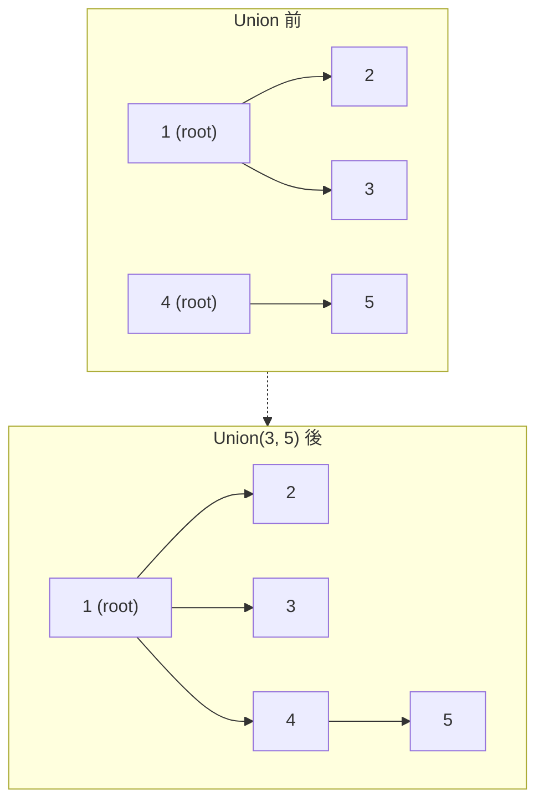

## 概要

Union-Find（素集合データ構造、DSU とも呼ばれる）は、要素の集合を**互いに素な部分集合**に分割して管理するデータ構造。主に 2 つの操作を提供する。

- **Find**: 要素がどの集合に属するか（根を返す）
- **Union**: 2 つの集合を統合する

辺が動的に追加されるグラフで「2 つのノードは同じ連結成分か？」を高速に判定できる。

## 核となるアイデア

各集合を**木**で表現し、木の根がその集合の代表元となる。

- **Find**: 親ポインタを根まで辿る
- **Union**: 2 つの根を見つけ、片方をもう片方の子にする



## 最適化

### 経路圧縮（Path Compression）

Find の際、辿った全ノードを**直接根に繋ぎ直す**。次回以降の Find が $O(1)$ に近づく。

```go
// Path compression: flatten tree during Find
func (uf *UnionFind) Find(x int) int {
    if uf.parent[x] != x {
        uf.parent[x] = uf.Find(uf.parent[x])
    }
    return uf.parent[x]
}
```

### ランクによる統合（Union by Rank）

Union の際、**ランク（木の高さの上界）が低い方を高い方の下に**つなぐ。木が深くなるのを防ぐ。

```go
// Union by rank: attach shorter tree under taller tree
func (uf *UnionFind) Union(x, y int) bool {
    rx, ry := uf.Find(x), uf.Find(y)
    if rx == ry {
        return false // already in the same set
    }
    if uf.rank[rx] < uf.rank[ry] {
        rx, ry = ry, rx
    }
    uf.parent[ry] = rx
    if uf.rank[rx] == uf.rank[ry] {
        uf.rank[rx]++
    }
    return true
}
```

### 両方を組み合わせると

1 操作あたり **$O(\alpha(n))$** — $\alpha$ は逆アッカーマン関数で、実用上は $O(1)$ と見なせるほど遅い成長率を持つ。

## テンプレート

```go
type UnionFind struct {
    parent []int
    rank   []int
    count  int // number of disjoint sets
}

func NewUnionFind(n int) *UnionFind {
    parent := make([]int, n)
    rank := make([]int, n)
    for i := range parent {
        parent[i] = i
    }
    return &UnionFind{parent: parent, rank: rank, count: n}
}

func (uf *UnionFind) Find(x int) int {
    if uf.parent[x] != x {
        uf.parent[x] = uf.Find(uf.parent[x]) // path compression
    }
    return uf.parent[x]
}

func (uf *UnionFind) Union(x, y int) bool {
    rx, ry := uf.Find(x), uf.Find(y)
    if rx == ry {
        return false
    }
    // union by rank
    if uf.rank[rx] < uf.rank[ry] {
        rx, ry = ry, rx
    }
    uf.parent[ry] = rx
    if uf.rank[rx] == uf.rank[ry] {
        uf.rank[rx]++
    }
    uf.count--
    return true
}

func (uf *UnionFind) Connected(x, y int) bool {
    return uf.Find(x) == uf.Find(y)
}
```

## 計算量

| 操作 | 時間 | 備考 |
|---|---|---|
| Find | $O(\alpha(n))$ | 経路圧縮 + ランクによる統合 |
| Union | $O(\alpha(n))$ | 同上 |
| 初期化 | $O(n)$ | |
| 空間 | $O(n)$ | parent + rank 配列 |

$\alpha(n)$ は逆アッカーマン関数。$n < 2^{65536}$ で $\alpha(n) \le 4$ なので、実用上は定数時間。

## Union-Find vs DFS/BFS

| | Union-Find | DFS/BFS |
|---|---|---|
| グラフの形式 | 辺のリスト | 隣接リスト / グリッド |
| 辺が動的に追加 | **得意** | 毎回再探索が必要 |
| 連結成分の数 | `count` フィールドで $O(1)$ | 毎回 $O(V+E)$ |
| 最短経路 | 不可 | BFS で可能 |
| サイクル検出 | Union が `false` を返す | DFS で可能 |
| 実装の簡潔さ | テンプレ化しやすい | グリッド問題は DFS が直感的 |

**使い分け:** 辺が動的に追加される、またはオフラインで辺をまとめて処理する場合は Union-Find。グリッド探索や最短経路が必要なら DFS/BFS。

## 実問題での適用

### [547. Number of Provinces](https://leetcode.com/problems/number-of-provinces/)

$n$ 個の都市と隣接行列 `isConnected` が与えられる。直接または間接的に繋がっている都市の集合が「州」。州の数を求める。

**着眼点:** 各都市をノード、繋がりを辺として Union-Find に追加。最終的な集合の数が答え。

```go
func findCircleNum(isConnected [][]int) int {
    n := len(isConnected)
    uf := NewUnionFind(n)
    for i := 0; i < n; i++ {
        for j := i + 1; j < n; j++ {
            if isConnected[i][j] == 1 {
                uf.Union(i, j)
            }
        }
    }
    return uf.count
}
```

### [684. Redundant Connection](https://leetcode.com/problems/redundant-connection/)

木に辺を 1 本追加してサイクルが生じたグラフが与えられる。削除すべき辺（サイクルを作った辺）を返す。

**着眼点:** 辺を順に Union していき、Union が `false`（既に同じ集合）を返した辺がサイクルを作った冗長な辺。

```go
func findRedundantConnection(edges [][]int) []int {
    n := len(edges)
    uf := NewUnionFind(n + 1) // nodes are 1-indexed
    for _, e := range edges {
        if !uf.Union(e[0], e[1]) {
            return e
        }
    }
    return nil
}
```

**ポイント:**
- ノードが 1-indexed のため `NewUnionFind(n + 1)` とする
- 問題の制約上、冗長な辺は必ず 1 つ存在するので `return nil` には到達しない

## 見極めるためのシグナル

- 「**連結成分**」「**グループ分け**」「**統合**」「**同じ集合か判定**」
- 辺が**動的に追加**される
- 「サイクルを作る辺を見つける」
- 「最小全域木」（Kruskal のアルゴリズムの内部で使用）
- DFS/BFS でも解けるが、辺リスト形式で与えられている場合は Union-Find の方が自然

## よくある間違い

1. **初期化忘れ**: `parent[i] = i` を設定しないと Find が壊れる
2. **1-indexed ノード**: 問題のノード番号が 1 始まりの場合、配列サイズを `n+1` にする
3. **Find を呼ばずに parent を直接参照**: 経路圧縮前の `parent[x]` は根とは限らない。必ず `Find(x)` を使う
4. **Union の戻り値を無視**: サイクル検出では `false` が重要な情報

## 関連

- [DFS (Depth-First Search)](/wiki/algorithms/dfs/) — グリッド探索や連結成分の別解法
- [BFS (Breadth-First Search)](/wiki/algorithms/bfs/) — 最短経路が必要な場合はこちら
- [Binary Tree / BST](/wiki/data-structures/binary-tree/) — 木構造の基礎
