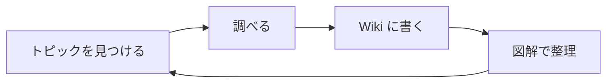

## この Wiki について

個人的な学習ノート・ナレッジベースです。興味のある技術トピックを調べ、理解を整理して蓄積しています。

## 学習サイクル


```mermaid
graph LR
    A["トピックを見つける"] --> B["調べる"]
    B --> C["Wiki に書く"]
    C --> D["図解で整理"]
    D --> A
```

## moonmaid テスト

```moonmaid
array { [3, 1, 4, 1, 5, 9] }
```

```moonmaid
tree bst { insert(5, 3, 7, 1, 4) }
```
